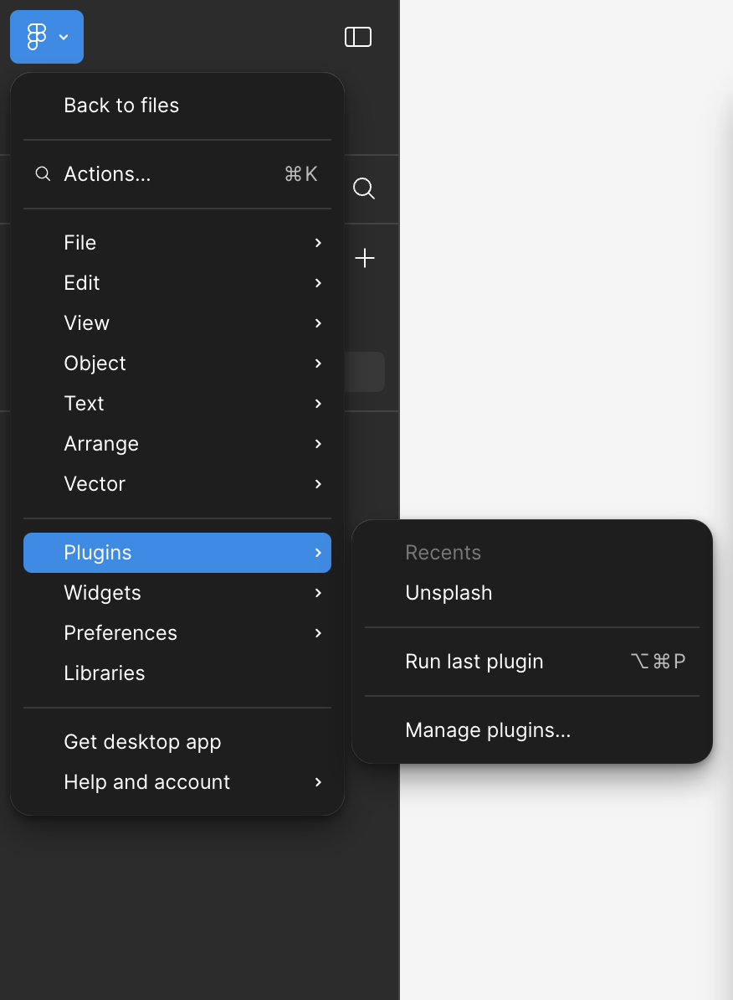

```{r setup, include=FALSE}
options(htmltools.dir.version = FALSE)
knitr::opts_chunk$set(
  fig.width=9, fig.height=3.5, fig.retina=3,
  out.width = "100%",
  cache = TRUE,
  dev = "svg",      
  echo = TRUE,
  message = FALSE, 
  warning = FALSE,
  fig.show = TRUE,
  hiline = TRUE      
)

knitr::opts_chunk$set(echo = TRUE, message = FALSE, warning = FALSE,
                      comment = "#>", highlight = TRUE,
                      fig.align = "center")
library(fontawesome)
library(icons)
```

```{r xaringan-themer, include=FALSE, warning=FALSE}
library(xaringanthemer)
style_duo_accent(
  primary_color = "#3d3d3d",
  secondary_color = "black",
  inverse_header_color = "#e0e0e0",
  base_font_size = "18px",
  code_font_size = ".8rem",
  header_font_google = google_font("Poppins"),
  text_font_google   = google_font("Roboto", "300", "300i"),
  code_font_google   = google_font("Fira Mono"),
  link_color = "#007acc", 
  extra_css = list(
    ".small" = list("font-size" = ".78rem"),
    ".big"  = list("font-size" = "1.2rem"),
    ".small-code pre code" = list("font-size" = ".7rem"),
    ".tiny-code pre code" = list("font-size" = ".5rem"),
    "li" = list("padding" = "8px 0px 0px"),
    "table th, table td" = list("padding" = "8px"),
    "h1" = list("line-height" = "1.3", "margin-bottom" = "15px"), 
    "h2" = list("line-height" = "1.25", "margin-bottom" = "12px"), 
    "h3" = list("line-height" = "1.2", "margin-bottom" = "10px")
  )
)
```

```{r xaringan-extra, echo=FALSE, include=FALSE}
xaringanExtra::use_clipboard(button_text = "Copy")
xaringanExtra::use_search(show_icon = TRUE, case_sensitive = FALSE)
xaringanExtra::style_search(match_background = "#264653")
```

<style>
  table {
    font-size: 10px; /* Adjust this value to make the font smaller or larger */
  }
</style>

## Figma

- You can get a free Figma Professional Account as a student
- Go to Prices ---> Under professional account find Free Student & Educators
- Create an account!


<br>


---

### 1\. Wireframe 

- Very similar to box layout in CSS we first put shapes!


---

### Low-Fidelity vs. High-Fidelity Wireframes

- Low-fidelity wireframes focus on layout and functionality.
- High-fidelity wireframes include visual details like colors, fonts, and detailed components.

---

### Some standard practices

- Use one frame for each of your pages/scenarios
   - e.g., Loading page, login page, menu page, main page, pop ups etc
- Figma has automatic frame sizes for different screens, so you also should do a frame for each screensize
- **16px margin and gutter is considered standard**
- I use 4 columns (depends on the screen size but for mobiles it works well)


---

### Some standard practices continued

Effective organization is key to a clean, manageable design file.

- Layer Naming & Organization - group and name your layers consistently. It’s easier to find and modify elements when they’re labeled logically.
- Order Matters - figma layers work from foreground to background. This order can affect visibility and interactions.
- Shortcut Tip: Use `Cmd + G` (Mac) or `Ctrl + G` (Windows) to group elements quickly.
- For images at a two diagonals inside the shape <mark>X</mark> inside rectangle or circle


---

### 2\. Mockup

- Add visual elements to your wireframe, bringing it closer to the final design.
- Create reusable text styles for headings, body text, and buttons (again just like CSS)
   - Style title, paragraph, header, header 2, etc...
   - For fonts it has [Google Fonts](https://fonts.google.com/)!!
    - Define color styles to keep your palette consistent across pages.
- Pro Tip: Maintain accessibility by checking text contrast. Figma plugins like Contrast can help ensure readability.

---

### Defining a Design System
- Colors: 
   - Set up a color palette by defining global colors in the Styles panel. Create primary, secondary, and neutral tones.
- Typography: 
   - Create text styles for consistent typography (e.g., headers, subheaders, body text).
- Iconography and Visual Elements: 
   - Use icons as part of your visual language. Plugins like Feather Icons and Iconify can be helpful.

---

### 3\. Images

.pull-left[

- Add images from shape's icon
- Use the Image Fill option to fit images into shapes seamlessly.
- Mask images to a shape (e.g., circles for profile photos) by placing images inside shapes and using Mask options.


]


.pull-right[
- A good plugin is 
   - Unsplash - photographs donated by photographers (so no copyright issue)
   - Iconify - icons like envelope, question mark, etc.


]

---

### 4\.Effects

- Background Blur: 
   - Great for overlay screens or modal windows, creating focus on the foreground.
- Drop Shadows & Layer Effects: 
   - Use subtle shadows to add depth, but avoid overusing for a clean, modern look.
   - Drop Shadows: Used to give buttons or modals a sense of elevation.
- Opacity: Adjust opacity levels for overlays or emphasis.


---

### 5\. Components

Build reusable components to streamline your design and ensure consistency.

- Making a Component - Right-click an element and choose Create Component. You can update it once, and all instances will follow.
- Assets Panel: Find your saved components under Assets --> Local Components.

.pull-right[]
.pull-left[
]

---

### 6\. Variants

- Variants allow you to create different states for a component, like hover effects or button states.
- Setting Up Variants: 
   - Create a base component, then add variants for each state (e.g., hover, disabled, active).


---

###  7\. Instances and Overrides

- Instances allow you to use and modify components across your design.
- Use instances of components in your design to make scalable changes quickly.

- Overriding Instances
   - Customize instances of a component (e.g., change button text or color) without altering the main component.
- Global Changes: Update the original component to apply changes to all instances simultaneously.


---

### 8\.Prototype

- You can set it to interact and flow 

.pull-right[]

.pull-left[]

---

### 9\. Collaborative Design and Commenting

- Figma supports real-time collaboration, making it easy to get feedback and work with teammates.
- Inviting Collaborators
   - Use Share options to invite teammates to view, comment, or edit the design.
   - Comments: Add comments directly on frames to ask for feedback or note design considerations.
- Presenting Your Design
   - Use Presentation Mode to show designs without the Figma interface.
   - Prototype Presentation: In Prototype Mode, guide viewers through user flows to give a complete sense of interactivity.

---

### 10\. Exporting Assets

- Prepare your design assets for development handoff or external use (such as wordpress).
- Export Options
   - Export individual elements as PNG, JPEG, SVG, or PDF files.
   - Use slices to define specific areas to export (useful for UI elements).

---

### 11\. Figma Plugins for Enhanced Workflow

Some suggestions:
- [Autoflow](https://www.figma.com/community/plugin/733902567457592893/autoflow): Quickly create flow arrows between frames.
- [Content Reel](https://www.figma.com/community/plugin/731627216655469013/content-reel): Generate placeholder text, images, and icons.
- [Stark](https://www.figma.com/community/plugin/732603254453395948/stark-contrast-accessibility-checker): Check color contrast and ensure accessibility compliance.
- [Blush](https://www.figma.com/community/plugin/838959511417581040/blush): Add illustrations from a diverse set of customizable characters.