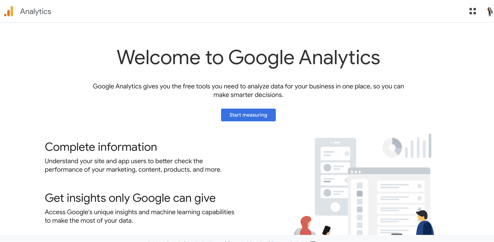

```{r setup, include=FALSE}
options(htmltools.dir.version = FALSE)
knitr::opts_chunk$set(
  fig.width=9, fig.height=3.5, fig.retina=3,
  out.width = "100%",
  cache = TRUE,
  dev = "svg",      
  echo = TRUE,
  message = FALSE, 
  warning = FALSE,
  fig.show = TRUE,
  hiline = TRUE      
)

knitr::opts_chunk$set(echo = TRUE, message = FALSE, warning = FALSE,
                      comment = "#>", highlight = TRUE,
                      fig.align = "center")
library(fontawesome)
library(icons)
```

```{r xaringan-themer, include=FALSE, warning=FALSE}
library(xaringanthemer)
style_duo_accent(
  primary_color = "#3d3d3d",
  secondary_color = "black",
  inverse_header_color = "#e0e0e0",
  base_font_size = "18px",
  code_font_size = ".8rem",
  header_font_google = google_font("Poppins"),
  text_font_google   = google_font("Roboto", "300", "300i"),
  code_font_google   = google_font("Fira Mono"),
  link_color = "#007acc", 
  extra_css = list(
    ".small" = list("font-size" = ".78rem"),
    ".big"  = list("font-size" = "1.2rem"),
    ".small-code pre code" = list("font-size" = ".7rem"),
    ".tiny-code pre code" = list("font-size" = ".5rem"),
    "li" = list("padding" = "8px 0px 0px"),
    "table th, table td" = list("padding" = "8px"),
    "h1" = list("line-height" = "1.3", "margin-bottom" = "15px"), 
    "h2" = list("line-height" = "1.25", "margin-bottom" = "12px"), 
    "h3" = list("line-height" = "1.2", "margin-bottom" = "10px")
  )
)
```

```{r xaringan-extra, echo=FALSE, include=FALSE}
xaringanExtra::use_clipboard(button_text = "Copy")
xaringanExtra::use_search(show_icon = TRUE, case_sensitive = FALSE)
xaringanExtra::style_search(match_background = "#264653")
```

<style>
  table {
    font-size: 15px; /* Adjust this value to make the font smaller or larger */
  }
</style>

## What is Online Audience Metrics?

**Quantitative data that measures website user engagement and behavior.**
- Improves user experience, informs design decisions, increases site effectiveness.

Tool examples:
- [Google Analytics (GA)](https://developers.google.com/analytics) - popular tool for tracking and analyzing web metrics.
- [Meta Audience Measure](https://www.facebook.com/business/help/1665333080167380?id=176276233019487)
- [Twitter Audience Insights](https://blog.x.com/en_us/a/2015/introducing-audience-insights)

---

## Key Features of Google Analytics

1. **User Demographics and Behavior**  
   - Who are the users? What do they engage with?
2. **Visitor Loyalty and Bounce Rates**  
   - Are users returning? Are they leaving quickly?
3. **Traffic Sources**  
   - Search engines, direct traffic, and referrals.
   


---

## Website Metrics

| **Metric**                              | **Description**                                                                                          |
|-----------------------------------------|----------------------------------------------------------------------------------------------------------|
| **Visits**                               | Basic measure of traffic (e.g., visits per day).                                                         |
| **Unique Visitors vs. Returning Visitors** | - **Unique Visitors**: New to the site.<br> - **Returning Visitors**: Previously visited, a sign of loyalty. |
| **Bounce Rate**                          | Percentage of users who leave without engaging further.                                                  |
| **Average Time on Site and Page Views**  | Higher numbers suggest user interest and engagement.                                                     |

  
---

## How do we track popular content?

- **Most Viewed Pages** - which pages attract the most attention?
- **Time Spent per Page** - indicates content relevance.
  
E.g., from Pakkala et al. (2012):
- Users spent more time on pages about "Food" and "Nutrient Composition".

---

## How to improve usability?

1. **Data-Driven Design**  
   - Use GA data to make informed design improvements.

2. **Page Tagging**  
   - Track specific interactions, e.g., clicks, scrolls.

3. **Visitor Flow Visualization**  
   - Identify popular navigation paths and bottlenecks.

---

## Which devices do our users use?

- **Device Types**: Desktop, mobile, tablet
  - Tailor content to device type and user behavior.
- **Location**: Where users are coming from (country, city).
  - Use to adapt content for target audience.

E.g., Pakkala et al. (2012) used device tracking to understand different user needs across countries.

---

## Key Performance Indicators (KPIs) for Usability

1. **Goal Completions**
   - Specific actions, e.g., sign-ups. (REMEMBER from our Goal Driven Design!!)
   
2. **Conversion Rate**
   - Percentage achieving desired actions.

3. **Visitor Recency**
   - How often users return.
  
.center[

] 


---

## How do we use Google Analytics

[Video](https://youtu.be/UuE37-MM1ws?si=wIteHZia3PxKolz-)

<iframe width="560" height="315" src="https://www.youtube.com/embed/UuE37-MM1ws?si=wIteHZia3PxKolz-" title="YouTube video player" frameborder="0" allow="accelerometer; autoplay; clipboard-write; encrypted-media; gyroscope; picture-in-picture; web-share" referrerpolicy="strict-origin-when-cross-origin" allowfullscreen></iframe>

---

## Set up a property 

.pull-left[

### Step 1


]

.pull-right[

### Step 2


]

---

## Step 3 Setup an analytic for your website

[Link](https://support.google.com/analytics/answer/9304153)




---

### Step 4

<mark>**Save Measurement ID***</mark>


---

### Step 5 Add your tag to your wordpress or other website


---

### Add to wordpress

Either manually:

[Wordpress link](https://wordpress.com/support/wordpress-editor/blocks/custom-html-block/)

Or using plugins suggested by GA


---

## Usability Testing

### A test to understand how real users interact with a website.

- Identify usability problems to improve design and user experience.

.center[

]


---

## Types of Usability Tests

1. **Moderated vs. Unmoderated**
   - With a facilitator vs. self-guided.
   
2. **Remote vs. In-Person**
   - Online vs. face-to-face testing.

3. **Explorative vs. Comparative**
   - Exploring user needs vs. comparing design alternatives.
   
---

## Notes on last Assignment Requirements for Usability Testing
- **Recruit Users** - at least 2 participants.
- **Task Scenarios** - create 2 actionable tasks, e.g., "Find the About Us page."
- **Observation and Feedback** - watch and record user interactions, ask follow-up questions.

**Conducting a Usability Test**
1. Create a distraction-free environment (especially important remotely).
2. Task Scenario Formulation - write clear tasks for users to complete.
3. Observing and Recording - take notes, record if possible **(with consent)**.


