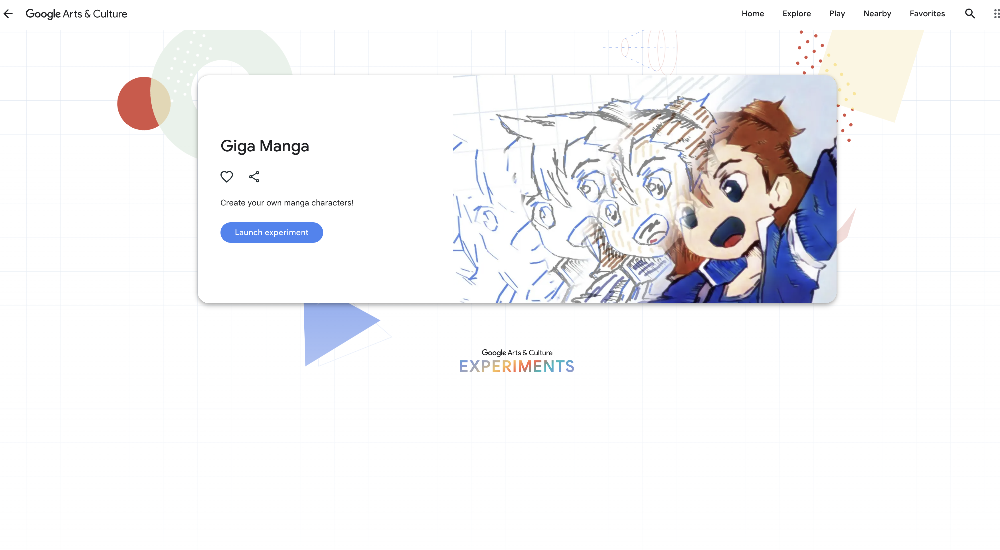

```{r setup, include=FALSE}
options(htmltools.dir.version = FALSE)
knitr::opts_chunk$set(
  fig.width = 5,    # Further reduce width
  fig.height = 3,   # Further reduce height
  fig.retina = 2,   
  out.width = "70%", # Adjust width to a smaller percentage
  out.height = "auto",
  dev = "svg",      
  echo = TRUE,
  message = FALSE, 
  warning = FALSE,
  fig.align = "center"
)
knitr::opts_chunk$set(echo = TRUE, message = FALSE, warning = FALSE,
                      comment = "#>", highlight = TRUE,
                      fig.align = "center")
library(fontawesome)
library(icons)
```

```{r xaringan-themer, include=FALSE, warning=FALSE}
library(xaringanthemer)
style_duo_accent(
  primary_color = "#264653",
  secondary_color = "#2A9D8F",
  inverse_header_color = "#F4A261",
  base_font_size = "20px",
  code_font_size = ".8rem",
  header_font_google = google_font("Josefin Sans"),
  text_font_google   = google_font("Montserrat", "300", "300i"),
  code_font_google   = google_font("Fira Mono"),
  extra_css = list(
    ".small" = list("font-size" = ".78rem"),
    ".big"  = list("font-size" = "1.2rem"),
    ".tiny" = list("font-size" = "0.5rem"),
    ".small-code pre code" = list("font-size" = ".72rem"),
    ".tiny-code pre code" = list("font-size" = ".6rem"),
    "li" = list("padding" = "8px 0px 0px"),
    "table th, table td" = list("padding" = "8px")
  )
)
```

```{r xaringan-extra, echo=FALSE, include=FALSE}
xaringanExtra::use_clipboard(button_text = "Copy")
xaringanExtra::use_search(show_icon = TRUE, case_sensitive = FALSE)
xaringanExtra::style_search(match_background = "#264653")
```


## What is Interactivity?

--

Interactivity refers to the ways in which users can participate in and influence the media they engage with.

--

Types of Interactivity: 

1. Reactive (simple feedback mechanisms)

--

2. Proactive (user-initiated interactions)

--

3. Mutual (two-way communication)

---

### Examples? 

[Google Arts & Culture](https://artsandculture.google.com/)

--

5 minutes in pairs, what do we like about the Google Arts and Culture page? 

--

- Virtually visit artworks, museums, cultural landmarks

--

- Personalized: Connects with google maps to give you exhibitions and museums nearby 

--

- Interactive games with artwork 

.center[
]

---

Let's look at these and talk about what we like and what we don't like about them:


.center[

[World Bee Project](https://worldbeeproject.org/)


[Every Last Drop](http://everylastdrop.co.uk/)

]

---

## Evolution of Media


Is the term **Mass Communication** still relevant?

--

- What is mass communication? 

--

1. "a set of media institutions"

2. "a societal problem"

3. "an academic field of study."

(Chaffee & Metzger, 2001, pg. 366)

--

- What is not mass communication? 

<iframe src="https://giphy.com/embed/ZXwdJuk172dQwAqMGv" width="250" height="100" style="" frameBorder="0" class="giphy-embed" allowFullScreen></iframe><p><a href="https://giphy.com/gifs/originals-doxie-maia-dachsund-ZXwdJuk172dQwAqMGv">via GIPHY</a></p>

---

As **Media Institutions**: 

Traditionally seen as institutions like newspapers, radio, TV, and film that reach large, geographically dispersed audiences.

--

As a **Societal Problem**: 

Concerns about the concentration of power and influence in the hands of a few media gatekeepers, with fears of mass persuasion and the homogenization of content.

--

As an **Academic Field**: 

Focused on media institutions and their societal impacts, initially through empirical research into the effects of mass communication on audiences.


---

.pull-left[
Traditional Media

<iframe src="https://giphy.com/embed/39wBBqmsPOQVLf8paS" width="150" height="150" style="" frameBorder="0" class="giphy-embed" allowFullScreen></iframe><p><a href="https://giphy.com/gifs/latenightseth-trump-bad-39wBBqmsPOQVLf8paS">via GIPHY</a></p>

<iframe src="https://giphy.com/embed/Lpw1K9zETuh7KFFjQX" width="150" height="100" style="" frameBorder="0" class="giphy-embed" allowFullScreen></iframe><p><a href="https://giphy.com/gifs/eternalfamilytv-eternal-family-tv-99ers-Lpw1K9zETuh7KFFjQX">via GIPHY</a></p>

* One-way communication, passive consumption

]

--

.pull-right[
New Media?

<iframe src="https://giphy.com/embed/h8yhqgovaZ5z58j7hg" width="150" height="100" style="" frameBorder="0" class="giphy-embed" allowFullScreen></iframe><p><a href="https://giphy.com/gifs/thegoodplace-nbc-the-good-place-tgp-h8yhqgovaZ5z58j7hg">via GIPHY</a></p>

<iframe src="https://giphy.com/embed/VexALdlUa8TPl8yUFl" width="150" height="150" style="" frameBorder="0" class="giphy-embed" allowFullScreen></iframe><p><a href="https://giphy.com/gifs/schittscreek-schitts-creek-pop-tv-poptv-VexALdlUa8TPl8yUFl">via GIPHY</a></p>

* Interactive, user-driven, real-time feedback

]

---

## Class Discussion

How has the evolution from traditional to new media impacted your media consumption habits?

--

Can you think of an example where new media has significantly improved user engagement?

---

## Challenges to Media

Demassification of Media:
- New media, especially Internet-based communication, enable narrowcasting to smaller, specialized audiences, diffusing the mass audience.

--

Shift in Control: 
- Power over content creation and selection is increasingly in the hands of individual users, reducing the influence of traditional gatekeepers.

--

Challenges for Research: 
- The vastness and interactivity of new media make traditional content analyses and audience studies more complex.

---

## Let's visit our theories

**Agenda-Seting Theory**

--

- More news sources and personalization of news complicates the idea of an *unified media agenda*

--

**Cultivation Theory**

--

- The more diversity of content and user control = diminishing homogenizing effects of media.

--

**Critical Theory and Cultural Studies**

--

- New media *can* empower individuals and reduce dominance of elites

but 

we still have concerns about control and access (e.g., gate-keeping). 

---


# Is it the end of Mass Communication? 

<div class="tenor-gif-embed" data-postid="5187386" data-share-method="host" data-aspect-ratio="1.33136" data-width="80%"><a href="https://tenor.com/view/the-end-is-near-simpsons-warning-gif-5187386">The End GIF</a>from <a href="https://tenor.com/search/the+end+is+near-gifs">The End Is Near GIFs</a></div> <script type="text/javascript" async src="https://tenor.com/embed.js"></script>

---

## Technology

* Internet 

--

* Mobile devices

--

* Seamless access to content

--

* User-generated content & participation 

--

What role do mobile devices play in your daily media consumption?

---

## McLuhan (1964) - Medium is Message

Theory! 

<br>
<br>
<br>
<br>
<br>


.center[
***The medium through which content is delivered is as significant as the content itself.***
]

---

### Light Bulb 

.center[

<iframe src="https://giphy.com/embed/TaC6gXdan989My4Eub" width="200" height="200" style="" frameBorder="0" class="giphy-embed" allowFullScreen></iframe><p><a href="https://giphy.com/gifs/art-idea-luz-TaC6gXdan989My4Eub">via GIPHY</a></p>


]

- Electric light is just pure information. It doesn’t have a message by itself, unless it's used to show something like an advertisement or a name. (McLuhan, 1964, pg. 1)

--

- It doesn’t matter if the light is being used for brain surgery or night baseball. You could say these activities are the 'content' of the light, because they wouldn’t happen without it. (McLuhan, 1964, pg. 2)
--

- We don't think of electric light as a way of communicating because it has no 'content.' This is why people often overlook it when studying media. (McLuhan, 1964, pg. 2)

---

## So what is the content? 

--

- Electric light isn't noticed as a medium until it's used to display something like a brand name, but even then, it's the content that's noticed, not the light itself, which—like electric power—radically changes society by eliminating time and space barriers, much like radio, telegraph, telephone, and TV.(McLuhan, 1964, pg. 2)

--
<br>
<br>
.center[
### The content of any medium is always another medium (e.g., writing is the content of speech)
<iframe src="https://giphy.com/embed/FBRMZluqZxyUmbpIN0" width="150" height="200" style="" frameBorder="0" class="giphy-embed" allowFullScreen></iframe><p><a href="https://giphy.com/gifs/dog-doggy-cluelesss-FBRMZluqZxyUmbpIN0">via GIPHY</a></p>
]

---

## Medium matters....

#### People often overlook the medium's impact because they focus on content rather than the form, which controls societal patterns.

#### **Media's effects** are subliminal and pervasive, altering perception and behavior without conscious awareness.


##### The influence of electric media (e.g., TV, radio) is comparable to the transformative power of the printing press in reshaping human society.

##### New technologies eliminate time and space barriers, enabling deeper involvement and engagement across societies.

---

## Class Discussion

Questions from McLuhan:

--

* Hot and cool media? 

--

* Are distances irrelevant - global village? 

---

## Interactivity v New Media v Communication Theory

--

1.More personalized & user-participated/controlled content

e.g.? 
--
Memes

--

2.New ways of engaging with audiences

--

* Demassification

--

* Asynchronicity


---

## Media Convergence

- Media is changing b/c
--
new technologies that provide more **choice, control, and interactivity** for **audiences**.
<iframe src="https://giphy.com/embed/P07JtCEMQF9N6" width="150" height="100" style="" frameBorder="0" class="giphy-embed" allowFullScreen></iframe><p><a href="https://giphy.com/gifs/control-P07JtCEMQF9N6">via GIPHY</a></p>

--

- Media fragmentation is characterized by both **inter-media** (new delivery platforms) and **intra-media** (subdivision of content into smaller parts) fragmentation.

---

## Audiences: more than consumers....

#### Producers and distributors of content, not just consumers

<blockquote class="tiktok-embed" cite="https://www.tiktok.com/@hereinnyc/video/7410889679509261599" data-video-id="7410889679509261599" style="max-width: 500px;min-width: 250px;" > <section> <a target="_blank" title="@hereinnyc" href="https://www.tiktok.com/@hereinnyc?refer=embed">@hereinnyc</a> Did you know about the WetLab at Hudson River Park’s Pier 40? <a title="nyc" target="_blank" href="https://www.tiktok.com/tag/nyc?refer=embed">#nyc</a> <a title="hudsonriver" target="_blank" href="https://www.tiktok.com/tag/hudsonriver?refer=embed">#hudsonriver</a> <a title="nycparks" target="_blank" href="https://www.tiktok.com/tag/nycparks?refer=embed">#nycparks</a> <a title="newyorkcity" target="_blank" href="https://www.tiktok.com/tag/newyorkcity?refer=embed">#newyorkcity</a> <a title="fish" target="_blank" href="https://www.tiktok.com/tag/fish?refer=embed">#fish</a> <a title="thingstodoinnyc" target="_blank" href="https://www.tiktok.com/tag/thingstodoinnyc?refer=embed">#thingstodoinnyc</a> <a target="_blank" title="♬ original sound - John Friia | Here In NYC" href="https://www.tiktok.com/music/original-sound-7410889627499875102?refer=embed">♬ original sound - John Friia | Here In NYC</a> </section> </blockquote> <script async src="https://www.tiktok.com/embed.js"></script>

---

***Blending of multiple media forms into one***

from Napoli (2011). 

--


e.g. 
--
Facebook Messenger to post photos, send text, video call, buy AC

--

Users participate more! 

--

Democratization of content creation and distribution. 

--

e.g. TikTok

---

## What does audience fragmentation mean?

- Audience fragmentation refers to the distribution of attention across a vast array of content, leading to smaller, niche audiences.

<br>
<br>

--

- In ad-supported media, fragmentation leads to declining audience shares and programming budgets, with smaller networks spending significantly less on content.

<br>
<br>

--

- User-generated content has become central to media organizations, with consumers creating, sharing, and distributing content through platforms like YouTube, social media, and blogs.

<br>
<br>

---

### Same creator different platforms with paid partnership e.g., Justine Snacks
#### Tiktok
<blockquote class="tiktok-embed" cite="https://www.tiktok.com/@justine_snacks/video/7402436568142728494" data-video-id="7402436568142728494" style="max-width: 450px;min-width: 200px;" > <section> <a target="_blank" title="@justine_snacks" href="https://www.tiktok.com/@justine_snacks?refer=embed">@justine_snacks</a> It’s the most wonderful time of the year! Single Tomato Tart season, and I wayyy simplified the recipe from last year, and made a version that’s plant-based friendly thanks to @The Laughing Cow new plant-based cheese alternative wedges <a title="ad" target="_blank" href="https://www.tiktok.com/tag/ad?refer=embed">#ad</a>      Made with almond milk and now available in Garlic &#38; Herb and Original flavors, these wedges melt and bubble AND make this plant-based version of my favorite summer brunch food extra delicious and easy to make. I’ll have both versions written on the blog, and it’s always a crowd pleaser if you’re looking for a dinner party contribution or a brunch staple. Plus, it’s a great way to use all these summer tomatoes.       <a title="thelaughingcowpartner" target="_blank" href="https://www.tiktok.com/tag/thelaughingcowpartner?refer=embed">#TheLaughingCowPartner</a> <a target="_blank" title="♬ Summer Time - Syafeea library" href="https://www.tiktok.com/music/Summer-Time-7243639648799279105?refer=embed">♬ Summer Time - Syafeea library</a> </section> </blockquote> <script async src="https://www.tiktok.com/embed.js"></script>

---

#### Instagram


## Why is interactivity important?

---

## What does this mean for measuring users and audiences?


- Advertisers face challenges with fragmented audiences, making traditional ad models less effective.
<br>
<br>

--

- Measuring audience attention across fragmented platforms is becoming increasingly difficult.
<br>
<br>

--

- Media companies rely more on user-generated content and repurposing to address fragmentation.
<br>
<br>

--

- Interactive media allow for better audience engagement tracking and personalized content recommendations.

<br>
<br>

---

From Rafaeli & Ariel (2007):

.pull-left[
* User Engagement

   * Enhances user experience
   * Increases engagement and retention
   ]

--

.pull-right[
* Feedback Mechanism:
   * Allows for immediate user feedback
   * Improves content through user input
   ]

---

## Let's talk about the internet

<iframe src="https://giphy.com/embed/VbnUQpnihPSIgIXuZv" width="384" height="480" style="" frameBorder="0" class="giphy-embed" allowFullScreen></iframe><p><a href="https://giphy.com/gifs/computer-cat-wearing-glasses-VbnUQpnihPSIgIXuZv">via GIPHY</a></p>

---

#### What is the internet?


[Wikipedia](https://en.wikipedia.org/wiki/Internet)

"The Internet (or internet)[a] is the global system of interconnected computer networks that uses the Internet protocol suite (TCP/IP)[b] to communicate between networks and devices. It is a network of networks that consists of private, public, academic, business, and government networks of local to global scope, linked by a broad array of electronic, wireless, and optical networking technologies. The Internet carries a vast range of information resources and services, such as the interlinked hypertext documents and applications of the World Wide Web (WWW), electronic mail, telephony, and file sharing."

--

Internet Protocol (IP)

* Every computer has an IP address

You can find yours [WhatsMyIp](https://www.whatsmyip.org/)

--

Wikipedia notes: "This article is about the worldwide computer network. For the global system of pages accessed through URLs via the Internet, see World Wide Web."


---

## So... What is World Wide Web (WWW?)

--

Some quotes from the WWW: 

"is a standardized system for accessing and navigating the internet" (Google Gemini accessed on 7/31/2024)

--

"are the pages you see when you're at a device and you're online" [(BBC Bitesize, 2019)](https://www.bbc.co.uk/newsround/av/47523993)

---

## Internet vs. WWW

From [GeeksforGeeks.org](https://www.geeksforgeeks.org/difference-between-internet-and-www/) (GeeksforGeeks, 2020, accessed on 7/31/2024)

---

.tiny-code[
```{r, echo=FALSE, results='asis'}
library(knitr)

data <- data.frame(
  S.No. = 1:10,
  INTERNET = c("Internet is a global network of networks.",
               "Internet is a means of connecting a computer to any other computer anywhere in the world.",
               "Internet is infrastructure.",
               "Internet can be viewed as a big book-store.",
               "At some advanced level, to understand we can think of the Internet as hardware.",
               "Internet is primarily hardware-based.",
               "It originated sometime in the late 1960s.",
               "Internet is a superset of WWW.",
               "The first version of the Internet was known as ARPANET.",
               "Internet uses IP addresses."),
  WWW = c("WWW stands for World Wide Web.",
          "World Wide Web which is a collection of information which is accessed via the Internet.",
          "WWW is service on top of that infrastructure.",
          "Web can be viewed as collection of books on that store.",
          "At some advanced level, to understand we can think of the WWW as software.",
          "WWW is more software-oriented as compared to the Internet.",
          "English scientist Tim Berners-Lee invented the World Wide Web in 1989.",
          "WWW is a subset of the Internet.",
          "In the beginning, WWW was known as NSFNET.",
          "WWW uses HTTP.")
)

kable(data, align = "l")

cat('<div style="font-size: 7px;">')
kable(data, align = "l")
cat('</div>')
```
]

---

## Deconstruct WWW and Internet

.big[
URL - Uniform Resource Locator
*or more commonly known as web address*
]

#### IP's are numbers for internet (cause internet knows numbers)

#### Domain Name System (DNS) - translates IP's to names for us humans

This is how we ask for a webpage:

| Protocol | Host               | Path    |
|----------|--------------------|---------|
| https    | 2024.philemerge.com | /demo2/ |

.center[
**Protocol or HTTP (HyperText Transfer Protocol)**
how to communicate with the web

**Host**
who hosts the website

**Path**
what do we want from the server/host? 
]

---

## So what are we going to learn this semester for a webpage?
.center[
]


from: https://studio.code.org/docs/csd/style_sheets/index.html

---

## Content

.center[
#### Is all yours 
]

<br>
<br>

--

Any ideas??


---

## Wednesday's Class

### We will start learning how to use these tools

Then we will learn!!! 

--

## HTML & CSS

--

## Wordpress

 <iframe src="https://giphy.com/embed/3o7ZetIsjtbkgNE1I4" width="200" height="150" style="" frameBorder="0" class="giphy-embed" allowFullScreen></iframe><p><a href="https://giphy.com/gifs/justin-g-run-away-fast-3o7ZetIsjtbkgNE1I4">via GIPHY</a></p>


