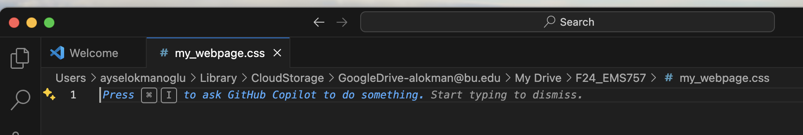

```{r setup, include=FALSE}
options(htmltools.dir.version = FALSE)
knitr::opts_chunk$set(
  fig.width = 5,    # Further reduce width
  fig.height = 3,   # Further reduce height
  fig.retina = 2,   
  out.width = "70%", # Adjust width to a smaller percentage
  out.height = "auto",
  dev = "svg",      
  echo = TRUE,
  message = FALSE, 
  warning = FALSE,
  fig.align = "center"
)
knitr::opts_chunk$set(echo = TRUE, message = FALSE, warning = FALSE,
                      comment = "#>", highlight = TRUE,
                      fig.align = "center")
library(fontawesome)
library(icons)
```

```{r xaringan-themer, include=FALSE, warning=FALSE}
library(xaringanthemer)
style_duo_accent(
  primary_color = "#264653",
  secondary_color = "#2A9D8F",
  inverse_header_color = "#F4A261",
  base_font_size = "20px",
  code_font_size = ".8rem",
  header_font_google = google_font("Josefin Sans"),
  text_font_google   = google_font("Montserrat", "300", "300i"),
  code_font_google   = google_font("Fira Mono"),
  extra_css = list(
    ".small" = list("font-size" = ".78rem"),
    ".big"  = list("font-size" = "1.2rem"),
    ".small-code pre code" = list("font-size" = ".72rem"),
    ".tiny-code pre code" = list("font-size" = ".6rem"),
    "li" = list("padding" = "8px 0px 0px"),
    "table th, table td" = list("padding" = "8px")
  )
)
```

```{r xaringan-extra, echo=FALSE, include=FALSE}
xaringanExtra::use_clipboard(button_text = "Copy")
xaringanExtra::use_search(show_icon = TRUE, case_sensitive = FALSE)
xaringanExtra::style_search(match_background = "#264653")
```

## VS Code!

### To download go to https://code.visualstudio.com/download


---

### Let's set it up, customize! 


---

#### You can choose a theme but most importantly add languages


---

### To add extensions go the left column and click on extensions


---

### I recommend 'Open in Browsers'


---

### And 'Trailing Spaces'


---

### And 'Live Server'


---
#### Add more extensions if needed


---

### First let's open our working space

Open Folder


---

### Now you see your folder on the left hand side


---

### Let's open a text file


---

#### Select text file


---

#### Cool function of VS Code is when you save a file with whatever extension you want it will assist you with that! 


---

## Open a file

1. Click on File -> New File in VS Code.
<br>
<br>
<br>
2. Save the file with an appropriate extension (e.g., my_webpage.html).
<br>
<br>
<br>
3. Saving the file with .html triggers VS Code to assist with syntax highlighting and basic structure generation for HTML.

---

## Let's write an Hello World! 

```html
<!DOCTYPE html>
<html lang="en">
<head>
  <meta charset="UTF-8">
  <meta http-equiv="X-UA-Compatible" content="IE=edge">
  <meta name="viewport" content="width=device-width, initial-scale=1.0">
  <title>Document</title>
</head>
<body>
  <h1>Hello, World!</h1>
</body>
</html>
```


#### We will do much more later!!! 

---

#### Also CSS




---

## Now let's move to Chrome features

Go to our Demo Page:
https://2024.philemerge.com/section_a/assignment/Demo/index.html

---

### Chrome Page Source


---

##### Output


---

### Chrome Inspector


---

##### Output


---

#### Lastly, Chrome Inspector Element Selector


---

##### All of these tools can be helpful for getting inspirations from other websites! 

---

## Individual Assignment 1: Ethnographic Interview Project

### Due: Sept 23rd, 2024, Monday 11:59 pm

1. Conduct an interview with a user of any mobile app.
<br>

2. Have the user walk you through their experience using the app.
<br>

3. Compile your findings into a report, including the app's features, user feedback, and potential improvements.
<br>

---

### Assignment Components:

#### Introduction

- Introduce the chosen app: Describe its main functions, features, and design.

- Hypothesize the app's target audience based on its design.

- Reflect on how the interviewee’s usage aligns with the app’s intended design.

--

#### Findings

- Identify key features that make the app appealing, compared to similar apps.

- Highlight features the user thinks could be improved or redesigned.

- Propose **3 new features** that could enhance the app.

- Summarize the most significant insights from the interview.

---

### Formatting! 

<br>
<br>
<br>

.center[

Follow APA style:
<br>

Times New Roman, size 12
<br>

Double-spaced, indent first line of paragraphs
<br>

Use headings to organize sections.
<br>

Submit the report as a Word document, 2 pages in length.
<br>

- **Acknowledge/cite AI tool usage if there is any** 
*Including Grammarly*
]

---

### Submission!!!!

<br>
<br>
<br>

#### Name your file as “YourLastName_interview report.”

<br>

#### Submit on Blackboard by 9/23/2024 at 11:59 pm.