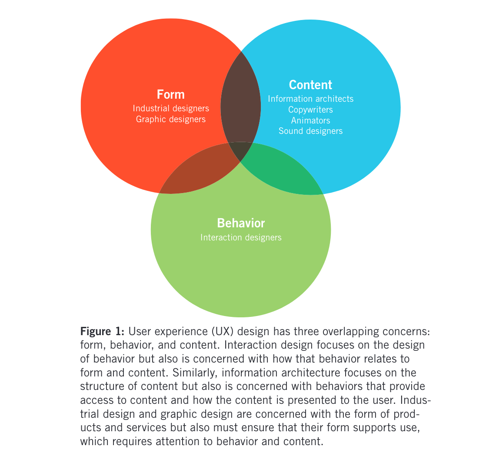

```{r setup, include=FALSE}
options(htmltools.dir.version = FALSE)
knitr::opts_chunk$set(
  fig.width=9, fig.height=3.5, fig.retina=3,
  out.width = "100%",
  cache = TRUE,
  dev = "svg",      
  echo = TRUE,
  message = FALSE, 
  warning = FALSE,
  fig.show = TRUE,
  hiline = TRUE      
)

knitr::opts_chunk$set(echo = TRUE, message = FALSE, warning = FALSE,
                      comment = "#>", highlight = TRUE,
                      fig.align = "center")
library(fontawesome)
library(icons)
```

```{r xaringan-themer, include=FALSE, warning=FALSE}
library(xaringanthemer)
style_duo_accent(
  primary_color = "#264653",
  secondary_color = "#2A9D8F",
  inverse_header_color = "#F4A261",
  base_font_size = "20px",
  code_font_size = ".8rem",
  header_font_google = google_font("Merriweather"),
  text_font_google   = google_font("Noto Serif", "300", "300i"),
  code_font_google   = google_font("Fira Mono"),
  extra_css = list(
    ".small" = list("font-size" = ".78rem"),
    ".big"  = list("font-size" = "1.2rem"),
    ".small-code pre code" = list("font-size" = ".72rem"),
    ".tiny-code pre code" = list("font-size" = ".6rem"),
    "li" = list("padding" = "8px 0px 0px"),
    "table th, table td" = list("padding" = "8px")
  )
)
```

```{r xaringan-extra, echo=FALSE, include=FALSE}
xaringanExtra::use_clipboard(button_text = "Copy")
xaringanExtra::use_search(show_icon = TRUE, case_sensitive = FALSE)
xaringanExtra::style_search(match_background = "#264653")
```

## Recap from last week

- Interactivity is important

- We will learn how to communicate with the WWW!

- Glimpse to HTML & CSS

--

### Today 

We will talk about design concepts & process

---

### Key Principles of Interaction Design

.center[

]

Cooper et al., 2014, pg. xxiii


---

## Let's talk history

- Desing: *"the conscious and intuitive effort to impose meaningful order"* (Cooper et al., 2014, pg. 3)
- The term "interaction design" - by Bill Moggridge and Bill Verplank in the 1980s.

.pull-left[

]

.pull-right[

]


- While working on the first laptop computer, the GRiD Compass.

.center[

]

--

- The field remained relatively obscure until the late 1990s when digital product design gained prominence.

---

<br>
<br>
<br>

- The 1990s web boom drove user-centered design adoption.
<br>
<br>
<br>
- New roles like **interaction designer** and **information architect** emerged.
<br>
<br>
<br>
- "UX" became a key focus as usability gained importance.
<br>
<br>
<br>

---

## Let's go back to complexity 


<br>
<br>

- Interactive products manage thousands of states, unlike mechanical ones.
<br>
<br>

--

- Designers must create intuitive systems.
<br>
<br>

--

- A structured design process simplifies user interactions.

---

## Humanistic Approach

<br>
<br>
<br>
<br>

.center[
<iframe src="https://giphy.com/embed/ZaR2nkOBo7WRS6Wt7G" width="450" height="250" style="" frameBorder="0" class="giphy-embed" allowFullScreen></iframe><p><a href="https://giphy.com/gifs/disneystudios-maleficent-mistressofevil-maleficentmistressofevil-ZaR2nkOBo7WRS6Wt7G">via GIPHY</a></p>

]

---

### Needs, desires, emotions & design

- Interaction design focuses on users' **needs and desires**.
<br>
<br>
<br>
--

- Designers must understand both logical and emotional user narratives.
<br>
<br>
<br>
--

- Success depends on meeting functional and emotional needs.
<br>
<br>
<br>

.center[
<iframe src="https://giphy.com/embed/yoJC2D22ruCQKUM1bi" width="300" height="150" style="" frameBorder="0" class="giphy-embed" allowFullScreen></iframe><p><a href="https://giphy.com/gifs/wetv-feelings-yoJC2D22ruCQKUM1bi">via GIPHY</a></p>
]

---

## Consequences of Poor Product Behavior

#### Digital products are rude


#### DP need you to think like compters

- They assume people are **technology literate**
e.g., Save As....

#### DP have sloppy habbits

e.g., Printing as changing a document? 

#### DP's NEED humans to do the work

e.g., Talking between softwares

---

<blockquote class="tiktok-embed" cite="https://www.tiktok.com/@yallwatchthis/video/7407266420184075562" data-video-id="7407266420184075562" style="max-width: 605px;min-width: 325px;" > <section> <a target="_blank" title="@yallwatchthis" href="https://www.tiktok.com/@yallwatchthis?refer=embed">@yallwatchthis</a> I asked ChatGPT how many Rs are in the word Strawberry  <a title="chatgpt" target="_blank" href="https://www.tiktok.com/tag/chatgpt?refer=embed">#chatgpt</a> <a title="ai" target="_blank" href="https://www.tiktok.com/tag/ai?refer=embed">#ai</a> <a title="strawberry" target="_blank" href="https://www.tiktok.com/tag/strawberry?refer=embed">#strawberry</a> <a target="_blank" title="♬ original sound - YallWatchThis" href="https://www.tiktok.com/music/original-sound-7407266264001645358?refer=embed">♬ original sound - YallWatchThis</a> </section> </blockquote> <script async src="https://www.tiktok.com/embed.js"></script>

---

<br>
<br>
<br>
<br>
<br>
<br>

# Why do digital products fail?
<br>
<br>
<br>

---

### 1.Misplaced priorities

.center[
#### Not taking in account users' **goals, needs or motivations**.
]

--

Any examples? 

--

e.g., Nike fuel band


Launched in 2012, discontinued in 2014

- Provided users with abundant data on calories burned and steps taken, 
- But its limited features failed to help them understand how those numbers fit into the bigger picture of their overall goals.

---

#### What succeeded? 

Apple watch? Fitbit? 

.pull-left[

]

.pull-right[


]

In pairs let's discuss why they succeeded? 

5 minute timer

---

### 2.Ignorance about real users

.center[
**Understand your users**
]

--

e.g., Google Glass 

Launched in 2013, stopped production in 2015.


- Users were uncomfortable with privacy concerns, feeling uneasy about being recorded without consent.

- The design was seen as intrusive and geeky.

- Google failed to consider how Glass would fit into daily life, with most users lacking a reason to wear it regularly.

---

### 3.Conflicts of interest

.center[

People designing a product should not the same people building it.

]

--

e.g., Windows Vista

Launched in 2007, fully discontinued in 2017.


- Windows Vista was developed with a focus on technical implementation over user experience, prioritizing features like enhanced security and graphical upgrades.

- These technical choices made the system slow, resource-heavy, and difficult to navigate, negatively impacting user experience.

- Developers’ control over both design and implementation led to a bloated, user-unfriendly product, resulting in widespread frustration and making Vista one of Microsoft’s most notable failures.

---

### 4.Lack of a design process

.center[

The product should follow a reliable process that combines technical feasibility, commercial viability, and user-centered design to meet professional, personal, and emotional needs.

]

--

e.g., Google+

Launched in 2011, discontinued in 2019.


- The platform was designed with features like "Circles" for managing friend groups, but it failed to resonate with users due to its confusing interface and lack of clear advantages over established networks.

- Google focused more on integrating the platform across its services rather than understanding what users wanted from a social network, leading to poor adoption.

---

## Summary - why do DP fail

.pull-left[
1. Misplaced priorities

<br>

2. Ignorance about real users

<br>

3. Conflicts of interest

<br>

4. Lack of a design process

]

.pull-right[

Cooper et al., 2014, pg. 8

]


---

### Behavior

<br>
<br>
<br>
<br>

- Unlike traditional design disciplines, interaction design is centered on the **behavior of digital products**.
<br>
<br>
<br>
<br>

--

- It addresses how products respond to **user inputs**, considering both user needs and system responses.
<br>
<br>
<br>
<br>

--

- Interaction design deals with **designing the user’s experience** while **interacting** with a product, emphasizing usability and ease.
<br>
<br>
<br>
<br>

---

.center[


]


Cooper et al., 2014, pg. 12

---

### Complex Behaviors

- Modern digital products - have unpredictable behaviors due to complex internal logic.
<br>
<br>

--

- e.g., modern ovens with buttons for multiple functions versus the simpler behavior of older mechanical ovens.
<br>
<br>


--


--

- The shift from physical to digital controls in devices has increased the complexity users must navigate.
<br>
<br>

---

### Recognizing User Goals

- products designed and built for business goals **FAIL**
<br>
<br>

--

Cooper et al., 2014, pg. 13:
<br>
<br>
Most commercially available software, websites, and digital products often fail to meet user goals by:
<br>
<br>
- Making users feel frustrated
<br>
<br>
- Leading to significant mistakes
<br>
<br>
- Requiring excessive effort to operate
<br>
<br>
- Lacking an engaging or enjoyable experience

---

## Goals vs tasks & activities

| **Goals**                                       | **Tasks and Activities**                               |
|-------------------------------------------------|-------------------------------------------------------|
| Desired end state or outcome                    | Intermediate steps toward achieving a goal            |
| Change slowly over time                         | Transient and often dependent on available technology |
| Driven by human motivations                     | Defined by the tools or technology at hand             |
| Focus on user expectations and aspirations      | Focus on the specific actions users take              |
| Provide insight into the meaning of activities  | Are steps composed of actions and operations          |
| Help eliminate unnecessary tasks with better technology | May become irrelevant with advancements in technology |
| Essential for creating designs that satisfy users | Risk limiting designs if focused only on outdated methods |

---


Image from Dermot. (2020, February 20). Activity Centred Design. Dermot Holmes. https://medium.com/dermot-holmes/activity-centred-design-dd28ed1eec59

---

### *A good design makes users more effective*

Cooper et al., 2014, pg. 17

#### Who?

--

Most important users.

--

#### What?

--

Their goals are

--

#### Why?


---

## Implementation Models

#### The implementation model describes how software is built in code, often reflected in the design.

Machines, have mechanisms with moving parts to achieve their purpose, e.g., projector.

- Developers may design interfaces based on this model, creating buttons, fields, and pages for each function.
<br>
<br>

- This approach, while **logical for developers**, often confuses users and hinders their ability to achieve their goals.

---

## Mental Models

#### Mental models allow users to interact with technology without needing to understand its inner workings, but discrepancies with implementation models are common, especially in software.

--

People create cognitive shortcuts, or mental models, to explain how things work without understanding their inner mechanics.

--

- e.g,, many imagine electricity flows like water through cords, even though this doesn’t reflect the actual process.
<br>
<br>

--
- In the digital world, mental models often differ greatly from implementation models, as seen with cell phones, which function as radio transceivers.
<br>
<br>

--
- The complexity of software makes it difficult for users to connect their actions to the application’s internal processes.

---

### e.g. Search Engines

#### Implemented Model: Search Engine Algorithm
- In a search engine like Google, the implemented model is the complex system of algorithms and indexing processes that retrieve and rank web pages. This includes crawling websites, storing data in massive databases, and applying algorithms like PageRank to sort search results based on relevance, backlinks, user engagement, and hundreds of other factors. This technical system is highly complex and operates behind the scenes.

#### Mental Model: User's View of a Search Engine
- From the user's perspective, the mental model is much simpler. They believe that typing a query into a search bar retrieves the most relevant websites almost instantaneously. The user is unaware of the crawling, indexing, and ranking algorithms; they assume the search engine just *finds* the best information quickly, almost as if it’s pulling directly from a database of perfect answers.

--

The implemented model (complex algorithmic processes) is **hidden from the user**, while the mental model (simple search-and-find process) makes **interacting with the system intuitive and easy**.

---

## Represented Models

#### The "represented model" is how designers choose to present the software’s operation to users, which can differ from the actual processing structure.

--


.center[
***"User interfaces should be based on user mental models rather than implementation models."***

]

Cooper et al., 2014, pg. 19

---

### Behavior, models, needs, motivations and goals
<br>
<br>

- Software has a "behavioral face" shown to users, often different from how the program truly functions.
<br>
<br>
--

- Aligning the represented model with the user's simpler mental model makes the software easier to use and understand.
<br>
<br>
--

- A represented model closely following the implementation model can confuse users, as their mental model is typically much simpler than the underlying technical structure.
<br>
<br>
--

- Effective software design simplifies complex data and operations into a form that aligns with users’ mental models.

---

<br>
<br>
<br>
<br>
#### In pairs let's think about another example than Adobe that is a good example of a represented model. 

--

e.g., Apple's iOS calculator

- Users see buttons for numbers and basic operations, which align with their mental model of how a calculator should work.
<br>
- Behind the scenes, the calculator is performing complex computations, but the user only interacts with a clean, intuitive interface that hides unnecessary technical details.
<br>
- By aligning the represented model with the user’s mental model, Apple makes the calculator easy to use, even for people who are not familiar with advanced mathematical operations or computing processes.

---

### ***"Goal-directed interactions reflect user mental models."*** (Cooper et al., 2014, pg. 20)

--

#### Why? 
--
<br>

- Many tech companies lack a formal design process.
<br>
<br>

--

- Even established processes struggle with research-to-design gaps.
<br>
<br>

--

- Market research helps sales but doesn’t reveal user behavior with complex products.
<br>
<br>

--

- Traditional methods fail to translate research into design solutions.
<br>
<br>

--

- Goal-Directed methods address the gap between user research and product design.

---

## Goal-Directed Design (GDD) method

- Goal-Directed Design focuses on users' goals, expectations, and skills.
<br>
<br>
<br>
--

- It aims to create **powerful, effective, and enjoyable** solutions.
<br>
<br>
<br>
--

- GDD aligns product design with both **user** and **business** goals.
<br>
<br>
<br>

---
<br>
<br>

| **Concept**                           | **Key Points**                                                                 | **Goal-Directed Design Approach**                                                                                          |
|---------------------------------------|-------------------------------------------------------------------------------|--------------------------------------------------------------------------------------------------------------------------|
| **Design as Product Definition**      | Design should define both behavior and appearance, aligning with user goals, business needs, and technology constraints. | Goes beyond a visual facelift to provide true product definition, focusing on user-centered requirements.                 |
| **Designers as Researchers**          | Designers should engage in research to build empathy and ensure their designs meet real user needs.                     | Involving designers in research closes the gap between user behavior and design, preventing isolation from users.         |
| **Bridging the Gap**                  | Traditional methods fail to translate research into actionable design, focusing too much on tasks rather than user goals. | Goal-Directed Design creates systematic processes that translate user research into design specifications and frameworks. |


---

## 6 Phases

.center[


1.Research, 
<br>
<br>
2.Modeling, 
<br>
<br>
3.Requirements Definition, 
<br>
<br>
4.Framework Definition, 
<br>
<br>
5.Refinement, and 
<br>
<br>
6.Support.
]

---

## 1.Research

- Research phase uses ethnographic studies, competitive audits, market research, and interviews with stakeholders, developers, and experts.
<br>
<br>

- Field observations and interviews identify behavior patterns, which are linked to goals and motivations, and inform persona creation in the Modeling phase.
<br>
<br>

- Market research filters personas, aligning them with business models, while stakeholder interviews and product audits reveal business goals and technical constraints.

---

## 2.Modeling

- Synthesizes behavior and workflow patterns into domain and user models (personas).
<br>
<br>

- **Personas**: Detailed user archetypes representing behaviors, attitudes, and goals, used for scenario-based design.
<br>
<br>

- Personas help define and iterate on design concepts, ensuring coherence and alignment with user needs.
<br>
<br>

- Designers prioritize personas by comparing their goals, ensuring no gaps or duplications.
<br>
<br>

- Personas guide design targets and influence the final product form and behavior.
<br>
<br>

---

## 3.Requirements

- Connects user models to design frameworks using scenario-based methods focused on persona goals.
<br>
<br>

- Personas drive the identification of key tasks and inform interface design to minimize effort and maximize return.
<br>
<br>

- The design process involves analyzing persona data, functional needs, and interactions via iterative context scenarios.
<br>
<br>

- Considers personas’ skills, physical capabilities, and environment, along with business goals and technical constraints.
<br>
<br>

- Output: A requirements definition balancing user, business, and technical needs.
<br>
<br>

---

## 4.Framework

- Defines the overall product concept, including behavior, visual design, and physical form (if applicable).
<br>
- Interaction Framework: Synthesized using interaction principles and design patterns.
<br>
- Interaction design principles guide appropriate system behavior across contexts.
<br>
- Interaction patterns provide general solutions to recurring problems, based on proven design knowledge.
<br>
- Translates functional needs into design elements, organized into sketches and behavior descriptions.
<br>
- Iterative scenarios refine details in the Refinement phase, balancing top-down (pattern) and bottom-up (principle) design.
<br>
- Collaboration with industrial designers ensures interaction concepts work with physical prototypes.
<br>
- Collaboration with service designers drafts service maps and blueprints for both user and provider experiences.
<br>
- Visual designers develop visual frameworks (visual language strategy) based on brand attributes and interface structure.
<br>

---

## 5.Refinement

- Interaction Designers: 
  - Ensure task coherence through key path and validation scenarios, using detailed storyboards.
<br>
<br>
- Visual Designers: 
  - Define a system of type styles, icons, and visual elements, ensuring clear **affordances and hierarchy**.
<br>
<br>
- Industrial Designers: 
  - Finalize materials and collaborate with engineers on assembly and technical issues.
<br>
<br>
- The outcome is a form and behavior specification or blueprint, delivered in paper or interactive media as needed.
<br>
<br>

---

## 6.Support

- Interaction designers must remain available to assist developers during the construction process.
<br>
<br>
- Development challenges or timeline pressures may require scaled-down design solutions.
<br>
<br>
- Without design team input, developers may compromise design integrity when making trade-offs.
<br>
<br>
- Ongoing collaboration ensures the design’s integrity is preserved throughout development.
<br>
<br>

<iframe src="https://giphy.com/embed/o7BebTgj44jmw" width="250" height="150" style="" frameBorder="0" class="giphy-embed" allowFullScreen></iframe><p><a href="https://giphy.com/gifs/afvpets-dogs-afv-o7BebTgj44jmw">via GIPHY</a></p>

---

### Goal-Directed Design Process Overview (Cooper et al., 2014, pg. 25)

<style>
  table {
    font-size: 10px; /* Adjust this value to make the font smaller or larger */
  }
</style>

```{r echo=FALSE, message=FALSE}
library(knitr)
df <- data.frame(
  Phase = c("Research", "", "", "", 
            "Modeling", "", 
            "Requirements Definition", "", 
            "Design Framework", "", "", 
            "Design Refinement", 
            "Support"),
  Activity = c("Scope", "Audit", "Stakeholder Interviews", "User Interviews & Observations", 
               "Personas", "Other Models", 
               "Context Scenarios", "Requirements", 
               "Elements", "Framework", "Key Path & Validation Scenarios", 
               "Detailed Design", 
               "Design Modification"),
  Concerns = c("Objectives, timelines, financial constraints, process", 
               "Branding strategy, market research, competitors", 
               "Product vision, risks, constraints, users", 
               "Understand user needs and behavior", 
               "User behavior patterns, attitudes, goals", 
               "Workflows among users and environments", 
               "Ideal user experiences, aligning with user goals", 
               "Necessary product capabilities", 
               "Manifestation of functionality and information", 
               "Object relationships, flow, navigation", 
               "Interaction sequence and user behavior", 
               "Interface details, visualization, experience, behavior", 
               "Accommodating new constraints"),
  `Stakeholder Collaboration` = c("Meetings (Capabilities & Scoping)", "Interviews (Stakeholders & Users)", 
                                  "Interviews (Stakeholders & Users)", "Check-in (Preliminary Research)", 
                                  "Check-in (Personas)", "Check-in (Models)", 
                                  "Check-in (Scenarios)", "Presentation (User & Domain)", 
                                  "Check-in (Framework)", "Presentation (Design Vision)", 
                                  "Check-in (Validation Scenarios)", 
                                  "Check-in (Design Refinement)", 
                                  "Collaborative Design"),
  Deliverable = c("Statement of Work", 
                  "Market Research Review", 
                  "Stakeholder Insights", 
                  "Research Findings", 
                  "Persona Development", 
                  "User and Environment Models", 
                  "Scenarios and Requirements", 
                  "User and Domain Analysis", 
                  "Design Framework", 
                  "Design Vision", 
                  "Design Specification", 
                  "Form and Behavior Specification", 
                  "Revision of Specifications")
)

kable(df, format = "html", col.names = c("Phase", "Activity", "Concerns", "Stakeholder Collaboration", "Deliverable"))
```


---

<br>
<br>
<br>
<br>
<br>
<br>
## 5 minutes in paris let's discuss GDD and try to come up with examples.
<br>
<br>
<br>
<br>
<br>
<br>

---

## Let's return to Interaction Design vs. UX Design

.pull-left[
### Interaction Design

- Focuses on behavior
<br>
<br>

- Emphasizes behavior
<br>
<br>

- Crucial role in creating the experience
<br>
<br>

]

--

.pull-right[
### UX Design

- Covers the whole experience
<br>
<br>

- Includes form, function, content
<br>
<br>

- Interrelated with interaction design
<br>
<br>

]


