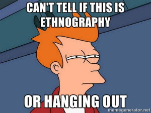

```{r setup, include=FALSE}
options(htmltools.dir.version = FALSE)
knitr::opts_chunk$set(
  fig.width=9, fig.height=3.5, fig.retina=3,
  out.width = "100%",
  cache = TRUE,
  dev = "svg",      
  echo = TRUE,
  message = FALSE, 
  warning = FALSE,
  fig.show = TRUE,
  hiline = TRUE      
)

knitr::opts_chunk$set(echo = TRUE, message = FALSE, warning = FALSE,
                      comment = "#>", highlight = TRUE,
                      fig.align = "center")
library(fontawesome)
library(icons)
```

```{r xaringan-themer, include=FALSE, warning=FALSE}
library(xaringanthemer)
style_duo_accent(
  primary_color = "#264653",
  secondary_color = "#2A9D8F",
  inverse_header_color = "#F4A261",
  base_font_size = "20px",
  code_font_size = ".8rem",
  header_font_google = google_font("Merriweather"),
  text_font_google   = google_font("Noto Merriweather", "300", "300i"),
  code_font_google   = google_font("Fira Mono"),
  extra_css = list(
    ".small" = list("font-size" = ".78rem"),
    ".big"  = list("font-size" = "1.2rem"),
    ".small-code pre code" = list("font-size" = ".72rem"),
    ".tiny-code pre code" = list("font-size" = ".6rem"),
    "li" = list("padding" = "8px 0px 0px"),
    "table th, table td" = list("padding" = "8px")
  )
)
```

```{r xaringan-extra, echo=FALSE, include=FALSE}
xaringanExtra::use_clipboard(button_text = "Copy")
xaringanExtra::use_search(show_icon = TRUE, case_sensitive = FALSE)
xaringanExtra::style_search(match_background = "#264653")
```

<style>
  table {
    font-size: 10px; /* Adjust this value to make the font smaller or larger */
  }
</style>

## 1. Recap from Last Week
- **Goal Directed Design** focuses on understanding **user needs**.


### Benefits of Goal-Directed Research

- **Heavy lifting** is done **early in the process**, leading to more efficient usability testing.
- Research-driven design concepts help ensure usability testing **validates** the right design choices.
- Aligns design with **user needs** and **motivations** from the beginning.

---

## 2. Today's Focus
- We will cover:
  - **Research methods** (Quantitative and Qualitative)
  - How research informs **design decisions**.

.center[

]

---

## Research Is Critical to Good Design

- **User research** forms the foundation of good design.
- Plan your research carefully and use the **appropriate techniques** at the right stages of the development cycle.
- Putting a product through a **pass/fail lab test** may yield data but not necessarily **valuable insights**.


---

## 3. What is Quantitative Research?
- **Numerical data** collection through:
  - Surveys
  - Structured observations
  - Experiments

---

## 4. Quantitative Research: Techniques
- Statistical analyses include:
  - **Aggregating data** (e.g., averages)
  - **Comparing relationships** (e.g., correlation between variables)

---

## 5. Quantitative Research: Examples
- Example: **Market segmentation** based on income, age, etc.
- Example: **Comparing** product usage across demographics.

.center[
<iframe width="500" height="250" src="https://www.youtube.com/embed/10nMNh3RMp0?si=x3HX54t3S7NIEe7Q" title="YouTube video player" frameborder="0" allow="accelerometer; autoplay; clipboard-write; encrypted-media; gyroscope; picture-in-picture; web-share" referrerpolicy="strict-origin-when-cross-origin" allowfullscreen></iframe>
]

---

## 6. What is Qualitative Research?
- Focuses on **understanding behaviors** in natural settings.
- Emphasizes **why** people behave the way they do.

---

## 7. Qualitative Research: Methods
- **Multiple approaches**:
  - Case studies
  - Ethnography
  - Discourse analysis

.center[
<iframe width="560" height="315" src="https://www.youtube.com/embed/wbdN_sLWl88?si=GkyF4_HmMD2sIvzd" title="YouTube video player" frameborder="0" allow="accelerometer; autoplay; clipboard-write; encrypted-media; gyroscope; picture-in-picture; web-share" referrerpolicy="strict-origin-when-cross-origin" allowfullscreen></iframe>
]

---

## 8. Key Benefits of Qualitative Research
1. Understand **domain** and **context** deeply.
2. Identify **behavior patterns** among users.
3. Explore **attitudes**, **vocabularies**, and **social aspects**.

---

### Help's us answer these questions...

- How does the product fit into users' lives?
<br>

- What motivates users, and what tasks help them achieve their goals?
<br>

- What experiences do users find compelling?
<br>

- What problems do users face with their current solutions?

---

## 9. Quantitative vs. Qualitative Research
- **Quantitative**: Measures and analyzes data statistically.
- **Qualitative**: Provides rich insights into **behaviors** and **motivations**.

---

<br>
<br>
## In pair's 5 minutes think of other real world examples, without asking ChatGpt!


---

## 10. How They Complement Each Other
- **Quantitative** provides data context.
- **Qualitative** uncovers **motivations** and **meaning** behind the data.

.center[

]

---

## 11. Example of Quantitative Data
- Market segmentation identifies **potential customers**.
- Helps predict **purchasing behavior**.

---

## 12. Example of Qualitative Insights
- Understanding **how a product fits** into users' lives.
- Identifies **problems** users face with current solutions.

---

## 13. Combining Methods
- **Triangulation**: Using both methods for deeper insights.
- Ensures **comprehensive understanding** of user needs.


```{r, echo=FALSE}
library(knitr)

data <- data.frame(
  "Point" = c("Supports Qualitative Research", "Market Forecasting", "Starting Point for Funding", "Targeting Interviews", "Web & Usage Analytics", "Ideal for Existing Products"),
  "Description" = c(
    "While qualitative insights are key, quantitative data can provide valuable context.",
    "Helps predict product acceptance and assess viability. Useful for justifying investments and calculating potential ROI.",
    "Identifies business opportunities and is often the first step in securing funding for design projects.",
    "Use market data to choose participants based on lifestyle and life stage.",
    "Highlights design issues like user behavior on websites. Needs qualitative research to find root causes and solutions.",
    "Analytics help improve or redesign existing products by revealing usage patterns."
  )
)

kable(data, col.names = c("Point", "Description"), caption = "Quantitative Research in Design")
```

---

## 14. Goal-Directed Design Research
- **Practical focus**: Employs proven techniques from social sciences and usability.
- **Wide Range of Methods**: Numerous approaches from social science and usability fields.
- **Proven Techniques**: Focus on methods effective in design practice over the past decade.
- **Overlap with Other Fields**: Some techniques align with broader design and usability practices.

.center[

]

---

## 1.Kickoff Meeting in Design Research
- **Purpose**: Gather insights from **key stakeholders**.
- Questions to ask:
  - What is the product?
  - Who are the users?
  - What are the main challenges?

---

## 2.Literature Review
- Collect **domain knowledge** from:
  - Internal documents
  - Industry reports
  - Competitor analysis

---


## 3.Product/prototype and competitive audits
- **Purpose**: Evaluate the current product and its competitors.
- Helps identify **strengths** and **limitations**.

---

## 4.Stakeholder Interviews
- **Understand business and technical context**.
- Clarify **business goals** and **constraints**.

---

## 5.Subject matter expert (SME) interviews

- SMEs are domain experts, often former users who are now trainers, managers, or consultants, particularly in complex fields.

### Important Considerations
- **Expert Bias**: SMEs may be accustomed to current systems and prefer expert-level controls.
- **Not Designers**: SMEs are valuable for identifying problems, not necessarily for suggesting solutions.
- **Domain Knowledge**: Critical in fields like healthcare, finance, or science to gather best practices and regulations.

### Key Points When Working with SMEs
- SMEs offer valuable insights, but their perspective may be influenced by familiarity with existing systems.
- Use SMEs to understand user roles, best practices, and industry standards.
- Ensure ongoing access to SMEs throughout the design process for continuous feedback.

---

<br>
<br>
<br>
<br>
.center[
# 6 User and Customer Interviews/Observations 
]

---

## 6.User Research: Interviews
- Conduct **in-depth interviews** with:
  - Users
  - Customers
  - Subject Matter Experts (SMEs)

---

## 6.User Observation
- **Observe real-world behavior** to avoid relying on self-reported data.
- **Contextual observation** provides a more accurate picture.

---

##### Key Information to Gather from Users  
- **Context**: How the product (or similar system) fits into their **lives** or **workflows** (when, why, and how it's used).  
- **Domain knowledge**: What users need to know to **do their jobs**.  
- **Tasks & Activities**:  
  - Current tasks the product supports.  
  - Tasks the product **doesn’t** support but users still need.  
- **Goals & Motivations**: Why users are motivated to use the product.  
- **Mental Model**:  
  - How users think about their **jobs** and **activities**.  
  - What **expectations** users have about the product.  
- **Problems & Frustrations**: Issues with the current product or an analogous system.  

---

#### Behavioral and Demographic Variables
- Identify user types through variables like:
<br>
  - **Frequency of use**
<br>
  - **Desire to use** the product
<br>
  - **Motivation** (e.g., bargain hunting vs. precise searching)
<br>

##### Combine **behavioral** and **demographic** variables for a clearer user picture.

---


## 6.Focus Groups: Overview
- Group discussions to understand participants' **meanings** and **perspectives**.

---

## Focus Groups in Media Research
- **Traditional**: Hypothesis generation for quantitative follow-up.
- **Modern**: Exploring **social communication**.

---

## Conducting a Focus Group
- Moderator facilitates discussion while managing group dynamics.
- Recording and transcription are essential.

---

## Pros and Cons of Focus Groups
- **Pros**:
  - Uncover **collective meaning-making**.
  - Stimulate interaction.
- **Cons**:
  - Not suitable for **statistical generalization**.

---

### Interviewing and Observing Users

- Combining observation and one-on-one interviews is one of the most effective tools for gathering qualitative data.

--

.pull-left[
- **Ethnographic interviews** blend immersive observation with directed interview techniques.



]

--

.pull-right[
- **Contextual inquiry**  *by Hugh Beyer and Karen Holtzblatt* is a popular method in user research.


]

---

### Preparing for Ethnographic Interviews

- **Ethnography**: A systematic study of cultures, applied on a smaller scale to understand user-product interactions.
<br>
- **Identifying candidates**: Select a diverse range of users based on stakeholder input and literature review.
<br>
- **Persona hypothesis**: The starting point for defining user types based on behavioral patterns, not just demographics.
<br>

.center[

]

---

## Early-Stage Research: Ethnographic Interviews

- Ethnographic interviews at the **start of the process** help designers truly understand:
  - **Users**
  - **Their needs**
  - **Their motivations**

---


### Persona Hypothesis

- Answers three key questions:
<br>
<br>
  1. **Who might use this product?**
<br>
<br>
  2. **How do their needs and behaviors vary?**
<br>
<br>
  3. **What environments and behaviors need to be explored?**
<br>
<br>
<br>
*Adjust the hypothesis as more data is gathered from interviews.*

---

## PREPARE...GO!! 

<br>
<br>
.center[

]

---


## 25. Summary
1. **Focus groups** reveal how groups create meaning.
2. **Quantitative and qualitative methods** should be combined for a full understanding.
3. Goal-directed research ensures **effective design**.


| Technique         | Key Benefit                                           | Ideal Use Case                                      |
|-------------------|-------------------------------------------------------|----------------------------------------------------|
| Goal-Directed      | Answers both **big-picture** and **functional** questions. | Efficient with limited effort and expense.         |
| Focus Groups       | Great for gauging **initial reactions** to product form. | **Marketing feedback**, not behavior patterns.      |
| Usability Testing  | Measures how well users **complete tasks**.           | **Late-stage testing** for validating a design.     |
| Card Sorting       | Helps understand **information organization**.        | Best for **information architecture**.              |
| Task Analysis      | Uncovers how users perform **specific tasks**.        | Best for identifying **pain points** and improvement areas. |
| **Ethnographic Interviews** | Early in the design process                            | Provides deep insights into user behaviors and needs.  |


