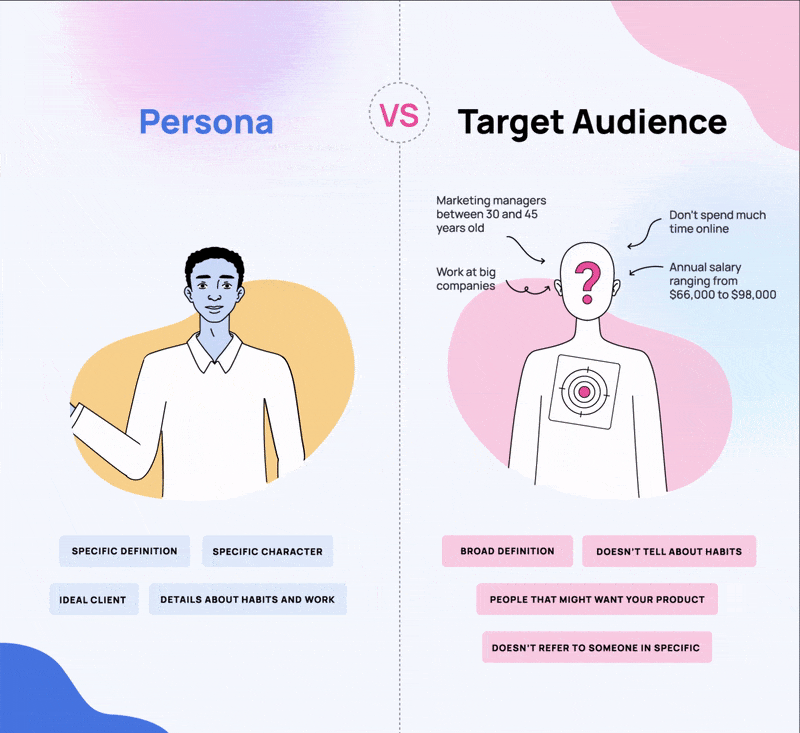
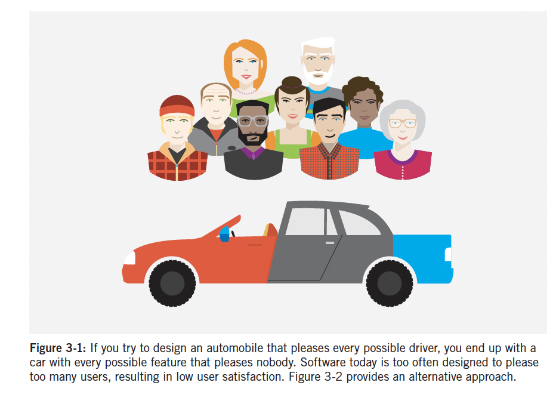
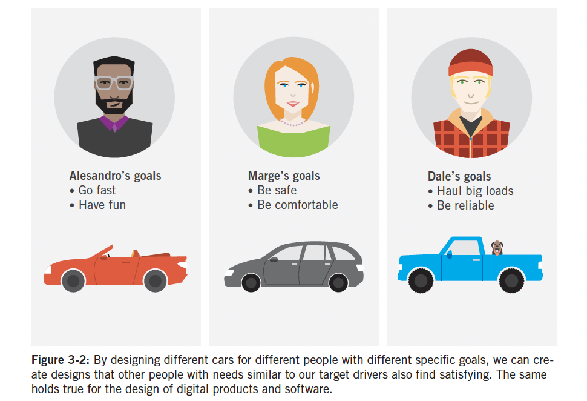
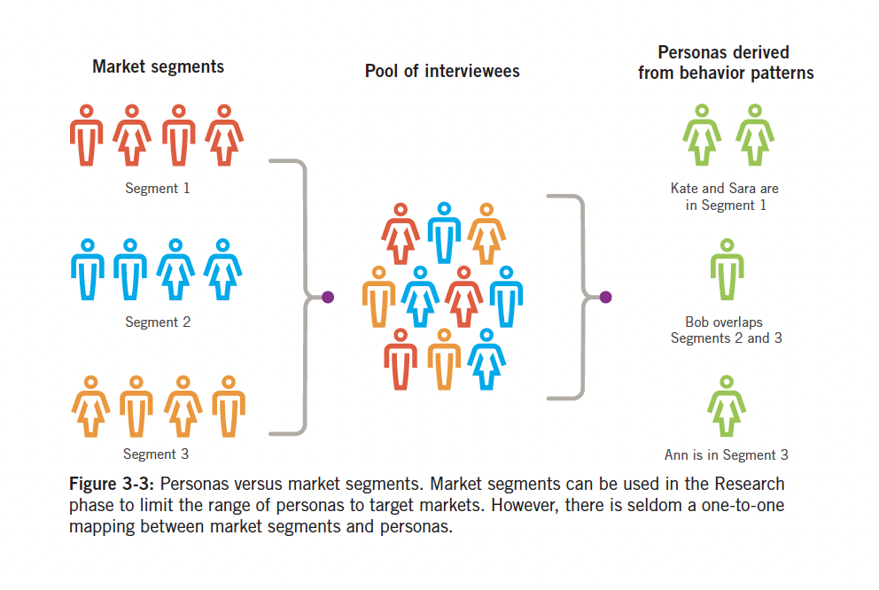
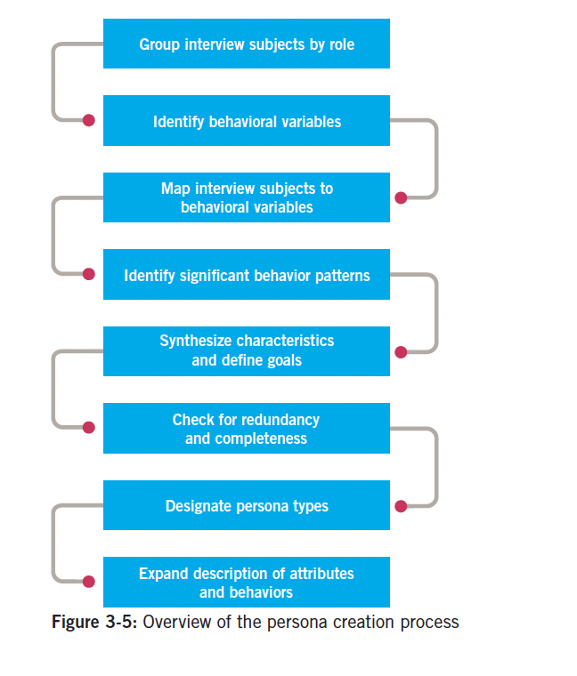
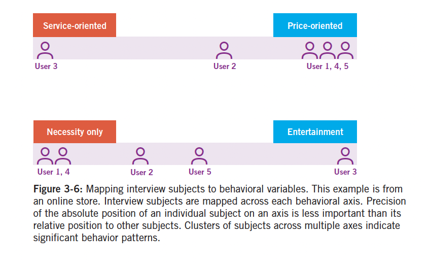
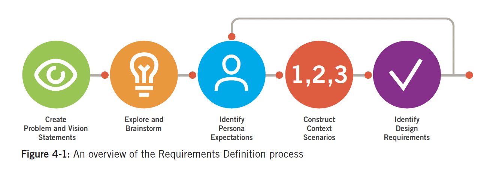

```{r setup, include=FALSE}
options(htmltools.dir.version = FALSE)
knitr::opts_chunk$set(
  fig.width=9, fig.height=3.5, fig.retina=3,
  out.width = "100%",
  cache = TRUE,
  dev = "svg",      
  echo = TRUE,
  message = FALSE, 
  warning = FALSE,
  fig.show = TRUE,
  hiline = TRUE      
)

knitr::opts_chunk$set(echo = TRUE, message = FALSE, warning = FALSE,
                      comment = "#>", highlight = TRUE,
                      fig.align = "center")
library(fontawesome)
library(icons)
```

```{r xaringan-themer, include=FALSE, warning=FALSE}
library(xaringanthemer)
style_duo_accent(
  primary_color = "#264653",
  secondary_color = "#2A9D8F",
  inverse_header_color = "#F4A261",
  base_font_size = "20px",
  code_font_size = ".8rem",
  header_font_google = google_font("Merriweather"),
  text_font_google   = google_font("Noto Merriweather", "300", "300i"),
  code_font_google   = google_font("Fira Mono"),
  extra_css = list(
    ".small" = list("font-size" = ".78rem"),
    ".big"  = list("font-size" = "1.2rem"),
    ".small-code pre code" = list("font-size" = ".72rem"),
    ".tiny-code pre code" = list("font-size" = ".6rem"),
    "li" = list("padding" = "8px 0px 0px"),
    "table th, table td" = list("padding" = "8px")
  )
)
```

```{r xaringan-extra, echo=FALSE, include=FALSE}
xaringanExtra::use_clipboard(button_text = "Copy")
xaringanExtra::use_search(show_icon = TRUE, case_sensitive = FALSE)
xaringanExtra::style_search(match_background = "#264653")
```

<style>
  table {
    font-size: 10px; /* Adjust this value to make the font smaller or larger */
  }
</style>

## Recap last week

- What research we needed? 
<br>
<br>
- What is the research workflow?
<br>
<br>
- Focus groups & interviews

---

### Before we start this week: 

- Groups of 3
- Pick a product you are familiar with (can be the applications from Assignment 1)
- Remember your groups for Wednesday's class! 

---

## What to do with this research?

.center[
<iframe src="https://giphy.com/embed/ZIzN7YWNuTUYg" width="300" height="200" style="" frameBorder="0" class="giphy-embed" allowFullScreen></iframe><p><a href="https://giphy.com/gifs/the-lizzie-bennet-diaries-tlbd-thelbd-ZIzN7YWNuTUYg">via GIPHY</a></p>
]

---

## MODEL! 

.center[
<iframe src="https://giphy.com/embed/EiUZCVhoKatKo" width="300" height="450" style="" frameBorder="0" class="giphy-embed" allowFullScreen></iframe><p><a href="https://giphy.com/gifs/fashgif-model-fashgif-EiUZCVhoKatKo">via GIPHY</a></p>
]

---

## Why model?

- Models simplify and represent complex user behaviors and environments.
<br>
<br>

--

#### Personas

--

- are user models! 
<br>
<br>
- Archetypes for design decisions: "personas are composite archetypes based on behavior patterns uncovered during the course of our research, which we formalize for the purpose of informing the product design" (Cooper, 2014, pp. 62)

---

## Personas as Tools for Design

- Provide insights into behaviors, goals, motivations.
- Based on **observed behavior patterns**.

.center[

]

GIF from: Curi, R. P. (2023, July 14). Buyer Persona: What It Is & How To Create One For Your Business. Rock Content. https://rockcontent.com/blog/buyer-persona/

---

## Power of Personas

.pull-left[
- Logic says ---- "its functionality as broad as possible to accommodate the most people" (Cooper, 2014, pp. 62)

<iframe src="https://giphy.com/embed/l4pLY0zySvluEvr0c" width="300" height="150" style="" frameBorder="0" class="giphy-embed" allowFullScreen></iframe><p><a href="https://giphy.com/gifs/hells-kitchen-kitchen-hellskitchen-l4pLY0zySvluEvr0c">via GIPHY</a></p>

#### WRONG ####

]


--

.pull-right[
- The **BEST** way is to "***design for specific types of individuals with specific needs***" (Cooper, 2014, pp. 62)

<iframe src="https://giphy.com/embed/3ca6vDENQDNlKDxOlP" width="300" height="300" style="" frameBorder="0" class="giphy-embed" allowFullScreen></iframe><p><a href="https://giphy.com/gifs/firstwefeast-hot-ones-first-we-feast-logic-3ca6vDENQDNlKDxOlP">via GIPHY</a></p>
]

---


.pull-left[

### Broad == WRONG



]

.pull-right[
 ### SPECIFIC & INDIVIDUALIZED == BETTER
 

]

---

### <span style="color: navy;"> Class Exercise </span>

### Persona Brainstorming

<br>
<br>

***In your groups, take 10 minutes to brainstorm potential users for a product of your choice. Write down at least three user types with a focus on their goals, behaviors, and what they might want to achieve with this product.***

---

## Benefits of Personas

1. Define product behavior & functionality.
    - Personas' goals form the foundation of product design.
2. Common language for teams.
    - Offer a shared understanding of user needs across stakeholders.
3. Drive consensus & design iteration.
    - Facilitates rapid design iterations and helps measure design effectiveness.
4. Reality checks for concept testing.
    - Design choices can be tested on personas to validate concepts early on.
5. Contribute to other product-related decisions.
    - Such as marketing decisions, sales plans, and others.

---

### Design pitfalls that personas help avoid:

- Avoid "elastic user" ambiguity.
  - Personas provide fixed targets, unlike the vague concept of "the user."

--

- Prevent self-referential design.
   - Ensures the product isn't based on designers’ own preferences.


--

- Reduce focus on rare edge cases.
   - Personas help focus on core users instead of exceptions.

---

## Persona's are effective -- based on research

- Rooted in:
   - Interviews
   - Information about stakeholders and SMEs
   - Market research, e.g., focus groups & surveys
   - Market segmentation models
   - Literature reviews

--

.center[
"***However, none of this supplemental data can take the place of direct user interviews and
observation. Almost every aspect of a well-developed persona can be traced back to sets
of user statements or behaviors.***" (Cooper, 2014, pp. 66)
]

---

## Persona's are effective -- represent types of users of a specific product

- Context-specific for the product domain.
   - Personas should reflect behaviors related to the specific product being designed.
<br>
<br>
- Reflect distinct behaviors, goals, motivations.
   - Personas encapsulate unique usage patterns observed during research.
   
--

**"Don’t confuse persona archetypes with stereotype"** (Cooper, 2014, pp. 68)

- Ground personas in factual data, not assumptions.
   - Well-developed personas are based on research, not on preconceived notions.
<br>
<br>
- Respectful, realistic user representation.
   - Effective personas avoid caricatures and portray real-world users with dignity.

---

## Persona's are effective -- explore ranges of behavior

- Identify behavior & motivation ranges.
   - Understanding the diversity within a target audience enhances product design.
<br>
<br>
- More effective than demographic focus.
   - Personas focus on behavior patterns over demographic averages.
   
---

## Persona's are effective -- have motivations

- Include experience, end, & life goals.
   - Goals provide context for how users want to feel, what they want to achieve, and who they aspire to be.
<br>
<br>
- Align with visceral, behavioral, reflective design.
   - These goals connect with Norman’s model of cognitive processing and emotional response.

---

## Persona's are effective -- can represent relevant nonusers

- Consider nonusers (e.g., buyers) & anti-personas (malicious users).
   - Personas can also represent individuals who don't directly interact with the product but influence its design.
   
---

## Persona's are effective -- are more appropriate design tools than other user models

- Richer approach than user roles or market segments.
   - Personas go beyond roles and segments by incorporating motivations and behavioral context.
<br>
<br>
- Capture motivations & behaviors.
   - Unlike other user models, personas include deeper insights into user goals and attitudes.
  
.center[
 
]

---

## Understanding Golas

### Goals as Drivers of Behavior
- Goals motivate user behavior; designers must address these through product functions.
<br>
<br>
- Tasks are only means to an end; goals are the actual end.
<br>
<br>

### Inferring Goals from Research
- Goals aren’t directly stated by users; they should be reconstructed from observed behaviors, nonverbal cues, and environmental clues.
<br>
<br>
- A well-identified goal is succinctly expressed in a simple sentence.

---

## Emotional Design, Norman's cognitive processing & goal types

| **Goal Type**          | **Cognitive Level** | **Description**                      |
|------------------------|---------------------|--------------------------------------|
| **Life Goals**         | Reflective          | *Who the user wants to be*           |
| **End Goals**          | Behavioral          | *What the user wants to do*          |
| **Experience Goals**   | Visceral            | *How the user wants to feel*         |

---

### <span style="color: navy;"> Class Exercise </span>

### Defining User Goals

<br>
<br>

***Choose one persona from your brainstorming session and identify their main goals. What are their life goals, end goals, and experience goals when interacting with the product? How might these influence the design decisions you would make?***


---

## Nonuser goals

- 3 types: Customer, Business & Technical
- **While important, they should not take precedence over user goals**

--

#### Customer Goals
- Consumer vs. Enterprise: Consumers care for safety & happiness; enterprises for security, maintenance, and cost.
- Align with, but not override, user end goals.

--

#### Business & Organizational Goals
- Goals: Profit, Market Share, Customer Retention, Efficiency, etc.
- Also relevant for non-business entities like museums or nonprofits, e.g., dducation, fundraising.

--

#### Technical Goals
- Ease software creation, scalability, and maintenance, e.g., cross-browser functionality, data integrity, efficiency.
- Should support user and business needs; **not hinder user experience**.

---

## Prioritize User Goals!!!

.center[
### Design focuses on user needs first—others (business, tech) serve these goals.
<br>
<br>
### Essence of good design: 
<br>
<br>
### Don't make the user feel "stupid"; ensure tasks are easy and efficient.
]

---

## Consturcting Personas

### 7 Components **(part of your persona grading rubric)**

.pull-left[
1. Group Interview Subjects by Role

2. Identify Behavioral Variables

3. Map Interview Subjects to Behavioral Variables

4. Identify Significant Behavior Patterns

5. Synthesize Characteristics and Define Goals

6. Check for Completeness and Redundancy

7. Designate Persona Types

]

.pull-right[
 

]

---

## Step 1: Group Interview Subjects by Role
- **Group interviewees by roles**: Organize the data you got into clear roles.
- **Enterprise roles**: Easier to define since they match job descriptions/titles.
- **Consumer products**: Roles here are more subtle; can include family roles, interests, and lifestyle choices.
- This helps build a base for spotting behavior patterns later on.


---

## Step 2: Identify Behavioral Variables
- **List key behaviors for each role**: Focus on behavioral stuff, not just demographics.
- **Variables can include**:
  - *Activities*: What they do, how often, how much.
  - *Attitudes*: Their thoughts on the product or tech.
  - *Aptitudes*: Education, training, & learning ability.
  - *Motivations*: Why are they doing this? What's driving them?
  - *Skills*: Abilities in the product area & tech.
- Typically find 15-30 variables per role. Compare with your initial assumptions.

--

- Consider a **Fitness Tracker App**:
    - Persona: *"Emma a Tech-Savvy Mom"*
    - **Behavioral Variables**:
        - *Activity Level*: Highly active, works out 4x per week.
        - *Motivation*: Track progress, connect with other moms for support.
        - *Tech Aptitude*: Comfortable with apps but values simplicity.
        - *Attitude*: Motivated but time-constrained.
        - *Social Interaction*: Seeks group-based challenges with friends.

---

### <span style="color: navy;"> Class Exercise </span>

### Mapping Behavioral Variables

<br>
<br>

***For your chosen persona, identify at least 5-7 behavioral variables (e.g., tech-savviness, preferred social interaction, frequency of product use). Map out where your persona stands on each variable and see if any patterns emerge.***

---

## Step 3: Map Interview Subjects to Behavioral Variables
- **Map interviewees to these variables**: Plot where they land on each behavioral axis.
- **Focus on relative placement**: Doesn't have to be precise, just see how they relate to each other.
- **Result**: See clusters form—these show patterns across subjects.

.center[
 

]

---

### Quick Reflection Break

- Now that you have mapped out behavioral variables, think about:
    - Did any surprising patterns emerge?
    - Were there any variables that seemed particularly important for your persona?
- Share one interesting pattern or key behavioral variable with your group.

---

## Step 4: Identify Significant Behavior Patterns
- **Look for clusters**: Groups of subjects behaving similarly across many variables likely form a behavior pattern.
- **Validate these patterns**: There needs to be a logical connection between behaviors, not just a correlation.
  - Like, "People who buy CDs online also download MP3s" makes sense. But "CD buyers are vegetarians"? Not so much.

---

## Step 5: Synthesize Characteristics & Define Goals
- **Build persona details**: Summarize what behaviors were seen, like:
  - Activities, environment, pain points, demographics, skills, attitudes, interactions.
- **Goals are key**: Define what drives their behaviors, must be tied to product.
- Write just enough to bring the persona to life without too much fictional fluff.

| **Details to Synthesize**                      | **Description**                                                                                     |
|-----------------------------------------------|-----------------------------------------------------------------------------------------------------|
| **Behaviors & Motivations**                   | Identify what activities the persona engages in and the reasons behind these behaviors.             |
| **Use Environment(s)**                        | Describe where and in what context the persona uses the product.                                    |
| **Frustrations & Pain Points**                | Note challenges faced by the persona when using current solutions.                                  |
| **Demographics**                              | Include any relevant demographic info like age, location, income (if it aids visualization).        |
| **Skills, Experience, & Abilities**           | Outline technical proficiency and any specific skills related to the product or domain.            |
| **Attitudes & Emotions**                      | Capture how the persona feels about the product domain and their emotional responses.              |
| **Interactions with Others**                  | Identify how the persona interacts with other people, products, or services while using the product.|
| **Alternate Solutions**                       | List other methods or tools the persona uses to achieve similar goals, especially analog methods.   |

---

<br>
<br>
<br>

| **Defining Goals**                            |                                                                                                     |
|-----------------------------------------------|-----------------------------------------------------------------------------------------------------|
| **Behavior-Based Goals**                      | Analyze persona behavior to infer goals that drive their actions and interactions with the product. |
| **End Goals**                                 | Typically, 3-5 end goals are identified, which are directly related to what the persona wants to achieve.|
| **Life Goals**                                | Relevant mostly to consumer personas; only 0-1 per persona, describing broader personal aspirations. |
| **Experience Goals**                          | Implicit for most personas (e.g., "Don’t feel stupid"); domain-specific goals may vary, 0-2 per persona.|

<br>
<br>
<br>

| **Social Relationships**                      |                                                                                                     |
|-----------------------------------------------|-----------------------------------------------------------------------------------------------------|
| **Context of Relationships**                  | Consider variations based on company size, family/social dynamic, or organization.                  |
| **Interpersonal Workflow & Interactions**     | If critical, represent how personas interact within teams, families, or social groups.              |
| **Balancing Social Dynamics**                 | Avoid forcing diverse scenarios into one relationship model; maintain distinct social dynamics when needed. |

---

## Step 6: Check for Completeness & Redundancy
- **Check your persona set**: Make sure you've covered all the major behaviors—no gaps.
- **Avoid duplicate personas**: If two personas only differ by demographics, either combine or differentiate them better.
- **Goal**: Make sure personas cover real-world behavior diversity but aren’t redundant.

---

## Step 7: Designate Persona Types
- **Pick your target personas**: Prioritize who the design should focus on.
- **Persona Types**:
  - *Primary*: Main persona(s) that the design focuses on.
  - *Secondary*: Mostly covered by primary design, but has a few extra needs.
  - *Supplemental*: Fully covered by primary & secondary personas.
  - *Customer*: Buyer-focused, not an end-user.
  - *Served*: Affected by the product, but not using it directly.
  - *Negative*: Personas that you're intentionally not designing for.

---

## Step 8: Expand the Description of Attributes & Behaviors
- **Write a narrative**: Create a story that fleshes out their key details, motivations, and struggles.
- **Keep it brief**: Shouldn’t be longer than 1-2 pages (or slides), only what's needed for design.
- **Pick a photo**: Find an image to make them more real. But keep it believable—don’t go for over-the-top or staged photos.
   - Use photos of **average people** rather than models.
   - Ensure the subject is engaged in an **appropriate activity** in a realistic environment.
   - Maintain a **consistent style and crop** across all persona photos.

--

| **Do Not**                                                                  | **Description**                                                                                                                                                     |
|-----------------------------------------------------------------------------|---------------------------------------------------------------------------------------------------------------------------------------------------------------------|
| **Do not include excessive fictional details**                              | Keep the persona’s story realistic and focused. Avoid adding unnecessary quirks or fictional backgrounds that don’t support the design goals.                        |
| **Do not add unobserved details**                                           | Only include details that were directly observed in your research. Avoid embellishing the behaviors beyond what was found in the data.                              |
| **Do not introduce design solutions**                                       | The persona narrative should describe behaviors and pain points, not how you plan to solve them. Solutions come later in the design process.                         |
| **Do not list ranges or averages**                                          | Personas are individuals, so avoid generic statistics (e.g., 1.5 kids, $35k-$45k salary). Use specific details to make them relatable.                               |
| **Do not use distracting persona photos**  

---

## Keep It Clear: Consistency & Clarity

- Make sure your personas are presented clearly:
    - Use **consistent terminology**: "Behavioral Variables," "End Goals," etc.
    - Avoid **typos or unclear language**—they can cause misunderstandings.

---

## Components of a persona summary

1. Full Name, Job Title & Photo

2. Demographics

3. Background and Story

4. Behaviors and Attitudes (Personality Traits)

5. Goals, Needs & Unmet Needs

6. Frustrations, obstacles, or challenges

7. Motivations and Triggers

8. One-line summary / Persona quote


---
### <span style="color: navy;"> Class Exercise </span>

### Persona Narrative Writing

<br>
<br>
***You can use canva to draft your personas: https://www.canva.com/templates/s/user-persona/***
***1) Write a short narrative for your persona that captures a 'day in the life' as they interact with the product. Highlight their motivations, frustrations, and how they would ideally use the product to reach their goals. 2) Choose a visual representation—either a photo or quick sketch—to bring the persona to life.***

---

## Personas in Practice

### Evolution & Critique of Personas:
- Since their introduction in 1998, personas have been debated in design circles.
Common misconceptions arise from misunderstandings of their purpose, construction, and use.

---

#### Misconception #1: Personas Are "Made Up":
- Reality: Personas are based on real user behaviors and data, synthesized into archetypes.
- Narrative elements like names are communication aids, not the actual data source.
- Red flag: If personas lack goals or are solely demographic profiles, their authenticity is questionable.

--

#### Misconception #2: Personas vs. Real Users
- Some argue for involving real users directly in design (participatory design).
- Reality: Personas aggregate patterns from many users, avoiding focus on idiosyncratic behaviors.
- Solution: Show evidence that personas are based on research (transcripts, interviews).

--

#### Misconception #3: "People Don’t Do Tasks":
- People may not always think in terms of tasks, especially in social/consumer contexts.
- H/e, personas focus on goals, not just tasks. e.g., “Be caught up on what’s happening” is a valid goal.

---

## Quantifying personas

1. Review Behaviral Variables  
    Revisit varaibles and map interviewees to them.
2. Create Diferentiating Questions  
    For each variable, desgin a multiple-choice question to distinguish between personas.
3. Validate with Additional Questions  
    Develop 2-4 additional questions for each varaible to ensure accurate reponses.
4. Randomize Question Order  
    Mix the survery questions to aviod pattern biases.
5. Conduct Survery with Proper Sample Size  
    Distribute the survey to participants, ensuring an adequete sample size.
6. Match Response to Personas  
    Track how many anwsers align with each persona, identifying the closest match for each particpant.
7. Calculate Market Size for Personas  
    Determine the percentage of particpants aligned with each persona by dividing the count by the total number.
    
---

## Organizational & Provisional Personas

Organizational Personas:
- Useful for capturing behavior patterns of organizations affiliated with individual personas.
- Reflect how business needs shape persona behaviors differently (e.g., small business vs. multinational corporation).
- Create a contextual narrative: Include company name, behavior patterns, pain points.
- Use visual elements like logos instead of photos to represent the organization.

--

Provisional Personas
- Created when resources (time, budget, data) are limited.
- Based on available data, assumptions, and expert insights.
- Pros - helps focus design, drives consensus within product teams.
- Cons - should be seen as temporary stand-ins until proper data is gathered.
- Best Practices:
   - Clearly label as provisional.
   - Use sketches for visuals, avoid detailed photos.
   - Document sources and assumptions.
   - Focus on behaviors and goals, not just demographics.

---

<br>
<br>
<br>
.center[
# Scenarios and Design Requirements
]

---

## Bridge Research to Design
- Research is great, brainstorming is fun, but how do you go from that to actual product design?
<br><br>
- There's often a gap between research insights and tangible design.
<br><br>
- Solution? Use a **narrative-driven approach** to move smoothly from understanding users to design decisions.

--

### 4 major activities (Cooper, 2014, pp. 101):

1. "Developing stories or scenarios as a means of imagining ideal user interactions
2. Using those scenarios to extract design requirements
3. Using these requirements in turn to define the product’s fundamental interaction
framework
4. Filling in that framework with ever-increasing amounts of design detail"

---

## Connecting Personas to Scenarios

- Personas give us **who** is using the product.
- Scenarios tell us **how** they will use it.

### Why Transition from Personas to Scenarios?
- Helps to visualize the persona's journey.
- Provides a **narrative** for goal-driven design.

--

### Quick Class Discussion:
- How would your persona's motivations shape their experience with your product?

---
## Scenarios -- Narrative as a Design Tool
- **Scenarios are like storytelling** for design.  
<br><br>
- Imagine how your personas interact with the product in **ideal situations**.  
<br><br>
- This method is **iterative, repeatable, and testable**.  
<br><br>
- Think [Disney Imagineers](https://sites.disney.com/waltdisneyimagineering/)! They use myths and stories to create theme park experiences—same thing here, just more digital.

---

### <span style="color: navy;"> Class Exercise </span>

### Scenario Development 

<br>
<br>

***Develop a context scenario for your persona. How do they interact with the product throughout their day? Identify key design requirements that arise from this interaction—what does the product need to do to support your persona's goals?"***

---

## Scenarios -- vs. Use Cases & User Stories
- **Scenarios** = Persona-focused stories; big picture, goal-driven, experience-centered.  
<br><br>
- **Use Cases** = Detailed system functions & transactions; treat all tasks equally (not realistic for design).  
<br><br>
- **User Stories (in agile programming)** = Short functional needs, like “As a user, I want to log in.” Not full stories, more like snippets.  
<br><br>
- Think of scenarios as **epics** in agile—a lot broader and goal-oriented.

---

## Persona-Based Scenarios: What Are They?
- **Persona-based scenarios** are narratives describing personas using your product to achieve goals.  
<br><br>
- Focus is on *ideal experience* from the persona’s perspective.  
<br><br>
- Helps to nail down how a persona *thinks*, *acts*, and *feels* during interactions.

---

## Three Types of Scenarios
1. **Context Scenarios**: The big picture! High-level user interaction before sketching the design.  
<br><br>
2. **Key Path Scenarios**: Detailed interactions once functional elements are clearer.  
<br><br>
3. **Validation Scenarios**: Testing your designs in different situations, like “what if...?” questions.

---

## Step-by-Step Design Requirements
1. **Problem & Vision Statements**  
    Start with a concise problem, then flip it to a vision.  
2. **Explore & Brainstorm**  
    Get those ideas outta your head! A few hours/days to think freely.  
3. **Persona Expectations**  
    Dive into persona’s mental models—how they see the world & your product.  
4. **Construct Context Scenarios**  
    Write story-like narratives of the persona’s typical usage.  
5. **Identify Design Requirements**  
    Extract needs (objects, actions, contexts) to drive your design.




---

## Step 1: Problem & Vision Statements
- Start by articulating a concise **problem statement**—what issue is the product solving?  
<br><br>
- Then flip it into a **vision statement** that describes the ideal outcome.  
<br><br>
- Think big picture: What should the experience be like for the user?

---

### <span style="color: navy;"> Class Exercise </span>

### Problem to vision statement

<br>
<br>

***In your groups please create a problem statement for a product, then flip it into a vision statement.***

---

## Step 2: Explore & Brainstorm
- Get all those ideas out of your head—brainstorm freely!  
<br><br>
- Spend a few hours or days thinking widely about potential solutions.  
<br><br>
- At this stage, don't worry about constraints—be as creative as possible.

---

### <span style="color: navy;"> Class Exercise </span>

### Brainstorm
<br>
<br>

***As a group pick one problem area and brainstorm as many ideas as you can in 10 minutes & share your wildest/craziest idea with the class.***


---

## Step 3: Persona Expectations
- Dive deep into the **persona's mental model**.  
<br><br>
- Understand how they see the world and your product, their pain points, and goals.  
<br><br>
- Put yourself in their shoes: How do they approach tasks, and what do they expect?

Some advise (Cooper, 2014, pp. 112)

- What do the interview subjects mention first?
- Which action words (verbs) do they use? What nouns?
- Which intermediate steps, tasks, or objects in a process don’t they mention? (Hint:
These might not be terribly important to how they think about things.)

---

### <span style="color: navy;"> Class Exercise </span>

### Role play
<br>
<br>

**Pick your persona from the user research, and act out their typical day. Discuss as a group: What expectations does your persona have when using the product?**

---

## Magic Thinking in Scenario Development

- Imagine your product is **magic**—no constraints, no limitations!
- What is the simplest, most **ideal** way your persona can achieve their goals?

### Why Do This?
- Encourages creative thinking without being bogged down by technology limitations.
- Sets up a **"best case"** scenario, which can be refined later.

---

### <span style="color: navy;"> Class Exercise </span>

### Magic
<br>
<br>

**1) Spend 5 minutes visualizing your persona's ideal interaction with the product. 2 Share your vision with your group.**


---

## Step 4: Construct Context Scenarios
- Write **story-like narratives** of how personas interact with the product.  
<br><br>
- Context scenarios describe **high-level usage** without worrying about specifics yet.  
<br><br>
- It's about understanding the persona’s journey—what they want to accomplish.

Questions (Cooper, 2014, pp. 113):
- In what setting(s) will the product be used?
- Will it be used for extended amounts of time?
- Is the persona frequently interrupted?
- Do several people use a single workstation or device?
- With what other products will it be used?
- What primary activities does the persona need to perform to meet her goals?
- What is the expected end result of using the product?
- How much complexity is permissible, based on persona skill and frequency of use?

---

### <span style="color: navy;"> Class Exercise </span>

### Scenario
<br>
<br>

**Write a short scenario (like a mini-story) describing how your persona would use the product in their day-to-day life. Share your scenario with another group and give each other feedback.**


---

## Step 5: Identify Design Requirements
- Extract **design needs** from your scenarios—objects, actions, contexts.  
- Think through what elements your personas need in order to achieve their goals.  
- These requirements form the foundation for your product's structure.

--

##### Requirements Aren't Just Features
- **Requirements = Needs**, not just a list of features.  
- Think of requirements like answering "what do users & businesses *need* this product to do?"  
- It's strategic—separate the **what** (the need) from the **how** (the solution).

--

| **Requirement Type**        | **Description**                                                                              |
|-----------------------------|----------------------------------------------------------------------------------------------|
| **Data Requirements**       | What information does the persona need? e.g., accounts, messages, contacts.                   |
| **Functional Requirements** | Actions performed on data, like calling a person from an appointment or sending a message.    |
| **Contextual Requirements** | How elements connect—consider the user's environment (on the go, office setting, etc.).       |
| **Business Needs**          | Priorities, budget considerations, and legal requirements.                                    |
| **Tech Needs**              | Consider form factors, tech constraints, and platform compatibility.                          |
| **Brand/Experience**        | The "feel" or vibe your product should communicate, aligning with brand identity.            |

--

#### Review your context scenarios and list out key requirements needed for your persona & present one design requirement to the class that you think is essential for success.

---

### <span style="color: navy;"> Class Exercise </span>

### Final Presentations 

<br>
<br>

***Each group will now present their persona and context scenario. Listen to other groups and provide feedback—are their personas realistic? Are there any gaps in their scenario or design requirements?***


---

## Final Thoughts on Scenarios & Design Requirements

- Personas and scenarios help bridge the gap between **user research** and **design decisions**.
<br><br>
- Remember to focus on **user goals** first, and let business/tech needs support those goals.
<br><br>
- Requirements make sure your product hits the right notes—user needs, business goals, and tech feasibility.  
<br><br>
- Start with **"magic" interactions**, then bring it down to earth.

.center[
<div class="tenor-gif-embed" data-postid="16921745" data-share-method="host" data-aspect-ratio="1.08844" data-width="25%"><a href="https://tenor.com/view/magic-meme-shia-labeouf-gif-16921745">Magic Meme GIF</a>from <a href="https://tenor.com/search/magic-gifs">Magic GIFs</a></div> <script type="text/javascript" async src="https://tenor.com/embed.js"></script>
]