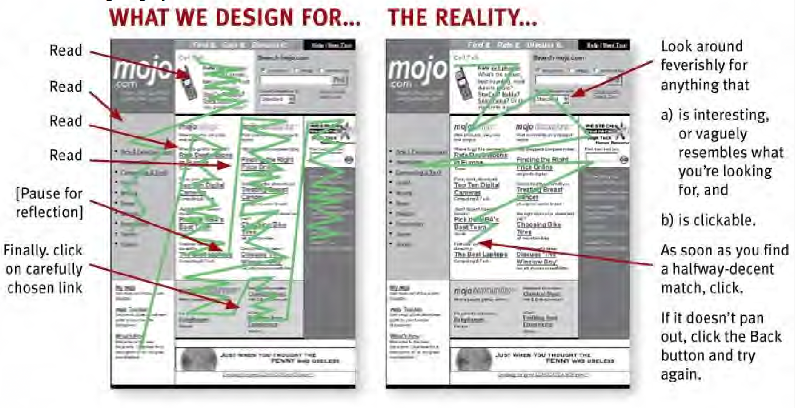
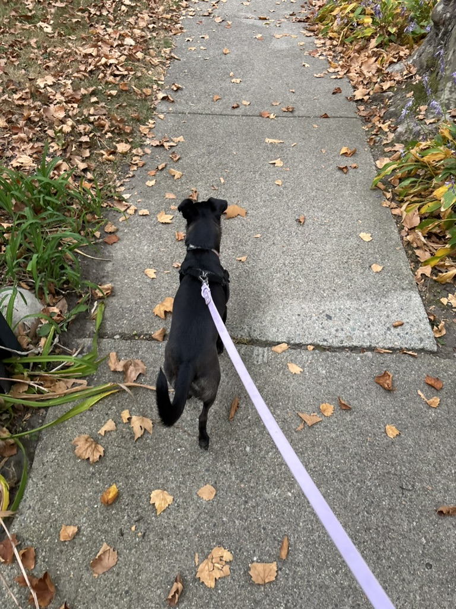

```{r setup, include=FALSE}
options(htmltools.dir.version = FALSE)
knitr::opts_chunk$set(
  fig.width=9, fig.height=3.5, fig.retina=3,
  out.width = "100%",
  cache = TRUE,
  dev = "svg",      
  echo = TRUE,
  message = FALSE, 
  warning = FALSE,
  fig.show = TRUE,
  hiline = TRUE      
)

knitr::opts_chunk$set(echo = TRUE, message = FALSE, warning = FALSE,
                      comment = "#>", highlight = TRUE,
                      fig.align = "center")
library(fontawesome)
library(icons)
```

```{r xaringan-themer, include=FALSE, warning=FALSE}
library(xaringanthemer)
style_duo_accent(
  primary_color = "#3d3d3d",
  secondary_color = "#800020",
  inverse_header_color = "#e0e0e0",
  base_font_size = "20px",
  code_font_size = ".9rem",
  header_font_google = google_font("Poppins"),
  text_font_google   = google_font("Roboto", "300", "300i"),
  code_font_google   = google_font("Fira Mono"),
  link_color = "#007acc", 
  extra_css = list(
    ".small" = list("font-size" = ".78rem"),
    ".big"  = list("font-size" = "1.2rem"),
    ".small-code pre code" = list("font-size" = ".7rem"),
    ".tiny-code pre code" = list("font-size" = ".5rem"),
    "li" = list("padding" = "8px 0px 0px"),
    "table th, table td" = list("padding" = "8px"),
    "h1" = list("line-height" = "1.3", "margin-bottom" = "15px"), 
    "h2" = list("line-height" = "1.25", "margin-bottom" = "12px"), 
    "h3" = list("line-height" = "1.2", "margin-bottom" = "10px")
  )
)
```

```{r xaringan-extra, echo=FALSE, include=FALSE}
xaringanExtra::use_clipboard(button_text = "Copy")
xaringanExtra::use_search(show_icon = TRUE, case_sensitive = FALSE)
xaringanExtra::style_search(match_background = "#264653")
```

## Recap last week

- Personas act as user models, representing archetypes based on behavior patterns found in research.
<br>
<br>
- Simplify and clarify complex user behaviors to guide design decisions.
<br>
<br>
- Personas provide insights into user behaviors, goals, and motivations, grounded in observed behavior patterns.
<br>
<br>
- Instead of broad, generic functionality, personas enable designing for specific user needs.
<br>
<br>
- "Design for specific types of individuals with specific needs" to create better user experiences (Cooper, 2014).

---

## DON'T FORGET

<br>
<br>
<br>
.center[
**GROUP PROJECT WEB PROPOSAL 1 DUE OCTOBER 14TH, MONDAY BY 11:59 PM, BLACKBOARD AND EMAIL TO ME AND YOUR TA**
<br>
<br>
**NO CLASS ON MONDAY, CLASS WILL BE TUESDAY (OCTOBER 15TH) AT 10:10 IN COM 215**
<br>
<br>
]

---

## Don't make me think

- Web pages should be self evident
<br>
<br>
- **GOAL:** Make sure users can navigate your site easily.
<br>
<br>
- Focus on reducing effort – make your site straightforward to use.

---

## What makes us think?

.pull-left[
- What is obvious? What is "truly obscure"? 
<br>
<br>
- Users should know what to do just by looking at your site.
<br>
<br>
- If they have to stop and think, your design needs work.
<br>
<br>
]

.pull-right[
Questions users should not think about.... 
- "Where am I?
- Where should I begin?
- Where did they put _____?
- What are the most important things on this page?
- Why did they call it that?
- Is that an ad or part of the site?" (Krug, 2013, pp. 17)
]

---

## Cognitive Load

- Cognitive load is how much users need to think to understand and use your site.
<br>
<br>
- Less cognitive load = better user experience.
<br>
<br>
e.g., 
- Book store examples: [Amazon](https://www.amazon.com/) or [Brookline Booksmith](https://brooklinebooksmith.com/)
<br>
- Less thinking: [Ollivere](https://ollivere.co/) or [Golde](https://golde.co/)
<br>
<br>
- Lot of thinking: [Lings Cars](https://www.lingscars.com/)

---

## FoL 1: We don't read we scan

- Users don’t read word-for-word; they quickly scan for info.
.center[
<iframe src="https://giphy.com/embed/3orifhln1wZJ7lTbyw" width="300" height="150" style="" frameBorder="0" class="giphy-embed" allowFullScreen></iframe><p><a href="https://giphy.com/gifs/season-16-the-simpsons-16x19-3orifhln1wZJ7lTbyw">via GIPHY</a></p>
]
- Design your site to match this scanning behavior - "billboard going by at 60 miles an hour" (Krug, 2013, pp. 21)

.center[

]

---

## FoL 2: We don't make optimal choices. We satisfice

- Users don't look for the "best" option – they pick the first thing that looks like it works.
<br>
<br>
   - We're in a hurry (think of mobile web scanning)
   - First guess and back options are usually faster
   - Guessing is more fun! 

.center[
<iframe src="https://giphy.com/embed/qJ2a8MnK9MutrKSFNw" width="300" height="200" style="" frameBorder="0" class="giphy-embed" allowFullScreen></iframe><p><a href="https://giphy.com/gifs/AppleTV-apple-tv-app-qJ2a8MnK9MutrKSFNw">via GIPHY</a></p>
]

---

## FoL 3: We don't figure out how things work. We muddle through.

- Most users don’t care about understanding your site deeply; they just want to get things done.
- They’ll make guesses, click around, and figure it out as they go.

*Your book references Yahoo....* 

- We are creatures of habit, if something works we don't change it. 

.center[
<iframe src="https://giphy.com/embed/ZebTmyvw85gnm" width="300" height="250" style="" frameBorder="0" class="giphy-embed" allowFullScreen></iframe><p><a href="https://giphy.com/gifs/angry-work-panda-ZebTmyvw85gnm">via GIPHY</a></p>
]
Who googles links or websites? 

---

### Therefore, design billboards...

.center[
<iframe src="https://giphy.com/embed/yrRYYMuYBwTC1RoXQf" width="480" height="480" style="" frameBorder="0" class="giphy-embed" allowFullScreen></iframe><p><a href="https://giphy.com/gifs/you-got-this-lemons-hen-life-gives-yrRYYMuYBwTC1RoXQf">via GIPHY</a></p>
]

---

## Visual Hierarchy

- The way you arrange and size elements shows users what’s important.
<br>
<br>
- Use size, color, and layout to make important stuff stand out.

### Remember (Krug, 2013, pp. 31)
1. Take advantage of conventions
2. Create effective visual hierarchies
3. Break pages up into clearly defined areas
4. Make it obvious what’s clickable
5. Eliminate distractions
6. Format content to support scanning

---

<html lang="en">
<head>
    <style>
        .hierarchy-box {
            width: 300px;
            padding: 20px;
            border: 1px solid #ccc;
            background-color: #fdf5e6;
            font-family: Arial, sans-serif;
        }
        .very-important {
            font-size: 24px;
            font-weight: bold;
            margin-bottom: 10px;
        }
        .less-important {
            font-size: 20px;
            margin-bottom: 10px;
        }
        .not-important {
            font-size: 16px;
            color: #555;
        }
    </style>
</head>
<body>
    <div class="hierarchy-box">
        <div class="very-important">Very important</div>
        <div class="less-important">A little less important</div>
        <div class="not-important">Nowhere near as important</div>
    </div>
</body>
</html>

.small-code[
```html
<html lang="en"><head>
    <style>
        .hierarchy-box { width: 300px; padding: 20px; border: 1px solid #ccc; background-color: #fdf5e6; font-family: Arial, sans-serif; }
        .very-important { font-size: 24px; font-weight: bold; margin-bottom: 10px; }
        .less-important { font-size: 20px; margin-bottom: 10px; }
        .not-important { font-size: 16px; color: #555; }
    </style>
</head><body>
    <div class="hierarchy-box">
        <div class="very-important">Very important</div>
        <div class="less-important">A little less important</div>
        <div class="not-important">Nowhere near as important</div>
    </div>
</body></html>
```
]

---

<html lang="en">
<head>
    <style>
        /* Container styling */
        .container {
            display: flex;
            font-family: Arial, sans-serif;
        }
        /* Sidebar styling */
        .sidebar {
            width: 20%;
            background-color: #6699cc; /* Blue sidebar */
            padding: 20px;
        }
        /* Main content styling */
        .main-content {
            width: 80%;
            background-color: #fbeec1; /* Light yellow content area */
            padding: 20px;
        }
        /* Section title */
        .section-title {
            background-color: #c44d29; /* Red background */
            color: white;
            padding: 10px;
            text-align: center;
            font-size: 1.5em;
            margin-bottom: 20px;
        }
        /* Book item styling */
        .book-item {
            border: 2px solid #c44d29;
            margin-bottom: 20px;
            padding: 10px;
        }
        .book-title {
            background-color: #c44d29;
            color: white;
            padding: 5px;
            font-weight: bold;
        }
        .book-description {
            margin-top: 10px;
            margin-bottom: 10px;
        }
        .book-price {
            float: right;
            font-weight: bold;
        }
        .book-image {
            width: 50px;
            height: 50px;
            background-color: #6699cc; /* Placeholder for image */
            float: left;
            margin-right: 10px;
        }
        /* Clear floats */
        .clearfix::after {
            content: "";
            display: table;
            clear: both;
        }
    </style>
</head>
<body>
    <div class="container">
        <!-- Sidebar -->
        <div class="sidebar">
            <!-- Empty sidebar for layout purposes -->
        </div>
        
        <!-- Main content -->
        <div class="main-content">
            <div class="section-title">Computer Books</div>
            
            <!-- Book 1 -->
            <div class="book-item clearfix">
                <div class="book-title">One particular computer book</div>
                <div class="book-description">
                    <div class="book-image"></div>
                    blah blah blah blah<br>
                    blah blah blah blah<br>
                    blah blah blah blah
                    <div class="book-price">$24.95</div>
                </div>
            </div>
            
            <!-- Book 2 -->
            <div class="book-item clearfix">
                <div class="book-title">Another computer book</div>
                <div class="book-description">
                    <div class="book-image"></div>
                    blah blah blah blah<br>
                    blah blah blah blah<br>
                    blah blah blah blah
                    <div class="book-price">$19.95</div>
                </div>
            </div>
        </div>
    </div>
</body>
</html>

---

.tiny-code[
```html
<html lang="en"><head>
    <style>
        .container { display: flex; font-family: Arial, sans-serif; }
        .sidebar { width: 20%; background-color: #6699cc; padding: 20px; }
        .main-content { width: 80%; background-color: #fbeec1; padding: 20px; }
        .section-title { background-color: #c44d29; color: white; padding: 10px; text-align: center; font-size: 1.5em; margin-bottom: 20px; }
        .book-item { border: 2px solid #c44d29; margin-bottom: 20px; padding: 10px; }
        .book-title { background-color: #c44d29; color: white; padding: 5px; font-weight: bold; }
        .book-description { margin-top: 10px; margin-bottom: 10px; }
        .book-price { float: right; font-weight: bold; }
        .book-image { width: 50px; height: 50px; background-color: #6699cc; float: left; margin-right: 10px; }
        .clearfix::after { content: ""; display: table; clear: both; }
    </style>
</head><body>
    <div class="container">
        <div class="sidebar"></div>
        <div class="main-content">
            <div class="section-title">Computer Books</div>
            <div class="book-item clearfix">
                <div class="book-title">One particular computer book</div>
                <div class="book-description">
                    <div class="book-image"></div> blah blah blah blah<br> blah blah blah blah<br> blah blah blah blah
                    <div class="book-price">$24.95</div>
                </div>
            </div>
            <div class="book-item clearfix">
                <div class="book-title">Another computer book</div>
                <div class="book-description">
                    <div class="book-image"></div> blah blah blah blah<br> blah blah blah blah<br> blah blah blah blah
                    <div class="book-price">$19.95</div>
                </div>
            </div>
        </div>
    </div>
</body></html>
```
]

---

## Design Conventions
### Patterns Users Recognize 

- Conventions are conventions because they WORK.
<br>
<br>
- Use familiar design conventions, like a menu at the top or cart icons for shopping.
<br>
<br>
- Don’t reinvent the wheel – stick with what works.

Let's checkout [TaoBao](https://www.taobao.com/)

---

## Content Should Be in Chunks

- Break content into bite-sized pieces.
<br>
<br>
- Headings, bullet points, short paragraphs – all these make it easier to find info quickly.

---

## Make Clickable Elements Stand Out

- Ensure all clickable items (like buttons, links) are clear and obvious.
<br>
<br>
- Use visual cues – colors, borders – to guide users.

.center[
<iframe src="https://giphy.com/embed/PwQFbIIJeyzK3JO83C" width="350" height="350" style="" frameBorder="0" class="giphy-embed" allowFullScreen></iframe><p><a href="https://giphy.com/gifs/OOZnmates-ooz-ooznmates-and-mates-PwQFbIIJeyzK3JO83C">via GIPHY</a></p>
]

---

## Keep noise down keep it clear

- Cut out any elements that don’t help the user achieve their goal.
<br>
<br>
- Avoid clutter: ads, unnecessary animations, and other distracting content.

.center[
<iframe src="https://giphy.com/embed/zsRviQEWP9SHm" width="480" height="269" style="" frameBorder="0" class="giphy-embed" allowFullScreen></iframe><p><a href="https://giphy.com/gifs/emibob-chef-chopping-cut-zsRviQEWP9SHm">via GIPHY</a></p>
]

---

## Self-Evident vs. Self-Explanatory

- **Self-Evident**: Users immediately understand what they’re looking at (ideal).
<br>
<br>
- **Self-Explanatory**: It may take a second, but they figure it out without too much effort.

### Mental models 

- 20Qs - Animals, vegetables or minerals
<br>
<br>
- Users come with expectations based on past experience.
<br>
<br>
- Your design should align with these mental models to avoid confusion.
   - They don't mind clicking - as long clicks take them somewhere

Let's analyze [Anthropologie Website](https://www.anthropologie.com/?ref=logo)

---

## Less is more

- Embrace Minimalism
.large[
- Get rid of unnecessary words
   - Reduces noise
   - Useful content more prominent
   - Shorter pages - less scrolling
]
- Strip away unnecessary design elements (i.e., happy talk & instructions must die)
- Keep only what’s essential – it helps users focus and reduces cognitive load.

Bad e.g., [Yale Art's Website](https://www.art.yale.edu/)

---

## Test Your Design with Real Users

- Watch real users interact with your site.
<br>
<br>
- Look for where they get stuck, what’s unclear, and make improvements.

.center[
<iframe src="https://giphy.com/embed/fGucWRNnJiE0jLDIbf/video" width="480" height="271" style="" frameBorder="0" class="giphy-embed" allowFullScreen></iframe><p><a href="https://giphy.com/clips/parksandrec-parks-and-recreation-rec-peacock-tv-fGucWRNnJiE0jLDIbf">via GIPHY</a></p>
]

---

## Cellphones & Tablets

- Think about how your site looks and works on mobile.
<br>
<br>
- Make sure elements are touch-friendly and content adapts to smaller screens.

e.g. Good on mobile [Airbnb](https://www.airbnb.com)
Bad on mobile [Hobby Lobby](https://www.hobbylobby.com)

---

## Don't forget accessibility!

**Design for all users, including those with disabilities.**
- High Contrast Colors
   - Use dark text on a light background (or vice versa) to ensure readability.
   - Advice: A minimum contrast ratio of **4.5:1** for normal text.
   - Use online tools like [WebAIM Contrast Checker](https://webaim.org/resources/contrastchecker/) to test your color contrast.

- Alt Text for Images
   - Descriptive text added to images to help screen readers convey what the image represents.
   - e.g.,: 

---

.pull-left[
- Clear and Consistent Navigation
   - Easy-to-use menus, consistent headers, and predictable page layouts
.small-code[
```html
<a href="#main-content" class="skip-link">Skip to main content</a>
```
]

- Keyboard Accessibility
   - for user's who doesn't have a mouse

]

.pull-right[
- Accessible Forms
   - Use clear labels and error messages.
.small-code[
   ```html
<label for="email">Email Address</label>
<input type="email" id="email" name="email" aria-required="true">
   ```
]

- Use ARIA Landmarks
   - Accessible Rich Internet Applications (ARIA) help improve accessibility for screen readers.
.small-code[
   ```html
<header role="banner">
<main role="main">
<nav role="navigation">
<footer role="contentinfo">
   ```
]
]

---

## Tools for accessibility

1. [WAVE](https://wave.webaim.org/) Accessibility Evaluation Tool: WebAIM's WAVE
<br>
<br>
2. [Lighthouse](https://developer.chrome.com/docs/lighthouse/overview#:~:text=You%20can%20run%20Lighthouse%20in,how%20to%20improve%20the%20page.): A built-in accessibility tool in Chrome DevTools for automated checks.
