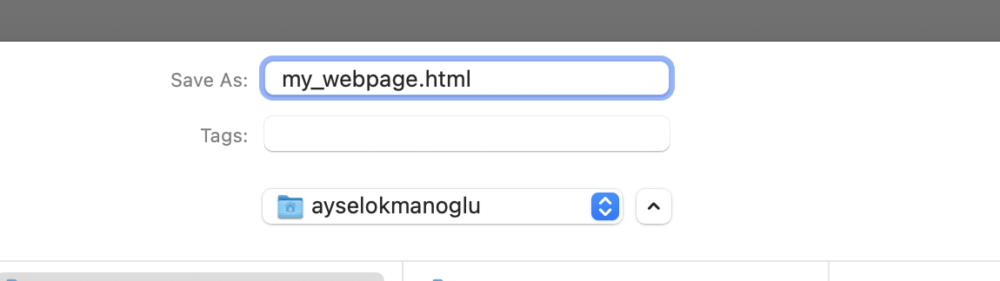
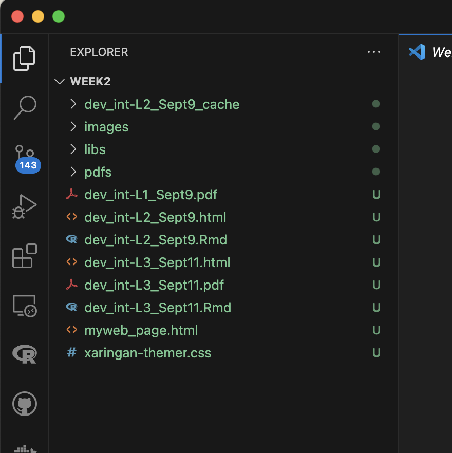

```{r setup, include=FALSE}
options(htmltools.dir.version = FALSE)
knitr::opts_chunk$set(
  fig.width=9, fig.height=3.5, fig.retina=3,
  out.width = "100%",
  cache = TRUE,
  dev = "svg",      
  echo = TRUE,
  message = FALSE, 
  warning = FALSE,
  fig.show = TRUE,
  hiline = TRUE      
)

knitr::opts_chunk$set(echo = TRUE, message = FALSE, warning = FALSE,
                      comment = "#>", highlight = TRUE,
                      fig.align = "center")
library(fontawesome)
library(icons)
```

```{r xaringan-themer, include=FALSE, warning=FALSE}
library(xaringanthemer)
style_duo_accent(
  primary_color = "#3d3d3d",
  secondary_color = "#800020",
  inverse_header_color = "#e0e0e0",
  base_font_size = "20px",
  code_font_size = ".9rem",
  header_font_google = google_font("Poppins"),
  text_font_google   = google_font("Roboto", "300", "300i"),
  code_font_google   = google_font("Fira Mono"),
  link_color = "#007acc", 
  extra_css = list(
    ".small" = list("font-size" = ".78rem"),
    ".big"  = list("font-size" = "1.2rem"),
    ".small-code pre code" = list("font-size" = ".7rem"),
    ".tiny-code pre code" = list("font-size" = ".5rem"),
    "li" = list("padding" = "8px 0px 0px"),
    "table th, table td" = list("padding" = "8px"),
    "h1" = list("line-height" = "1.3", "margin-bottom" = "15px"), 
    "h2" = list("line-height" = "1.25", "margin-bottom" = "12px"), 
    "h3" = list("line-height" = "1.2", "margin-bottom" = "10px")
  )
)
```

```{r xaringan-extra, echo=FALSE, include=FALSE}
xaringanExtra::use_clipboard(button_text = "Copy")
xaringanExtra::use_search(show_icon = TRUE, case_sensitive = FALSE)
xaringanExtra::style_search(match_background = "#264653")
```


## Recap what is HTML

- HTML stands for **HyperText Markup Language**
- It's the **language of the web**, used to structure content on web pages
- In this lecture, we'll cover:
  - Basic structure of an HTML document
  - Common HTML tags
  - How to use HTML for layout and content

.center[
### Now everyone open their VS Code from their folder
]

---

## HTML lingo

**The content and structure of information on a web page**

- Wraps text content with opening `<tag>` and closing `</tag>` pairs (think like paranthesis with text).
<br>
- The name within the tags is called an **element**.
<br>
The syntax: `<element>` content `</element>`
<br>
E.g.: `<p>This is a paragraph</p>`


---

## Recap from Lecture 3

### First let's open our working space

Open Folder and create a subfolder called images


---

### Let's open a text file


---


#### Select text file


---

### Save as html



<br>


---

### Now you see your folder on the left hand side



---

## Open a file notes

1. Click on File -> New File in VS Code.
<br>
<br>
<br>
2. Save the file with an appropriate extension (e.g., my_webpage.html).
<br>
<br>
<br>
3. Saving the file with .html triggers VS Code to assist with syntax highlighting and basic structure generation for HTML.

---

<br><br><br><br>
## Task 1: Create Your First HTML Element
- Open a new .html file.

---

## The 2 Elements of HTML

1. Block elements
<br><br><br>
2. Inline elements

---

<br><br>
##  1.Block Elements
- Represent larger sections of content, like paragraphs, lists, headings, sections, or articles.
<br>
- Take up the full width of their container and start on a **new line**.
<br>
- Browsers typically add space or margin around them by default.
<br>
- Layout and appearance can be customized with CSS.

---

## The Structure of an HTML Document

Every HTML document follows a basic structure:

.pull-left[
```html
<!DOCTYPE html>
<html>
  <head>
    <title>Page Title</title>
  </head>
  <body>
    <h1>My First Heading</h1>
    <p>My first paragraph.</p>
  </body>
</html>
```
]

--

.pull-right[
<html>
  <head>
    <title>Page Title</title>
  </head>
  <body>
    <h1>My First Heading</h1>
    <p>My first paragraph.</p>
  </body>
</html>
]

---

## Let's break it down


`<!DOCTYPE html>`
- Tells the browser to expect HTML5
<br>
<br>
`<html>` Tag
- The root element of an HTML document
<br>
- Contains the entire content of the page
<br>
<br>
`<head>` Tag
- Contains metadata and information about the document
<br>
<br>
E.g. `<title>`, `<meta>`, `<link>`


---

## `<body>` Tag

The `<body>` tag contains all the visible content:
- Headings
- Paragraphs
- Images
- Links

.pull-left[
```html
<body>
  <h1>Welcome to My Webpage</h1>
  <p>Learning HTML is fun!</p>
</body>
```
]

--

.pull-right[
<body>
  <h1>Welcome to My Webpage</h1>
  <p>Learning HTML is fun!</p>
</body>
]

---

<br><br><br><br>
## Task 2: Create Your First HTML Element
- Write a `<p>` tag with some text content inside.
- Save and open the file in a browser to see how it displays.

---

## Headings in HTML

Use `<h1>` to `<h6>` for headings, with `<h1>` being the most important

.pull-left[
```html
<h1>Main Heading</h1>
<h2>Subheading</h2>
<h3>Sub-subheading</h3>
<h4>Sub-sub-subheading</h4>
<h5>Sub-sub-sub-subheading</h5>
<h6>Sub-sub-sub-sub-subheading</h6>
```
]

--

.pull-right[
<h1>Main Heading</h1>
<h2>Subheading</h2>
<h3>Sub-subheading</h3>
<h4>Sub-sub-subheading</h4>
<h5>Sub-sub-sub-subheading</h5>
<h6>Sub-sub-sub-sub-subheading</h6>
]

---

<br><br><br><br>
### Task 3: Build the Basic Structure
- Change the `<title>` to your own custom page title.
- Add another `<h2>` heading under the `<h1>`.

--

### Task 4: Create a Heading Hierarchy
- Add at least three headings of different levels (`<h1>`, `<h2>`, `<h3>`) to your page.
- Use the headings to structure different sections of your content.

---

## 2.Inline Elements
- Represent smaller chunks of content, such as bold text, code, images, or links.
- Stay on the **same line** with other inline elements (do not trigger line breaks).
- Must be nested within a **block element**.
- Occupy only as much space as their content requires.
- *CSS can be used to modify their default styles.*


```html
<p>
    Observe how this <mark>highlighted text</mark> 
    seamlessly blends into the paragraph.
    You can also include interactive elements like 
    <input type="radio" name="preference" /> and 
    <input type="checkbox" name="agree" />, which are inline and align 
    effortlessly within the text flow.
</p>
```

--

<p>
    Observe how this <mark>highlighted text</mark> 
    seamlessly blends into the paragraph.
    You can also include interactive elements like 
    <input type="radio" name="preference" /> and 
    <input type="checkbox" name="agree" />, which are inline and align 
    effortlessly within the text flow.
</p>


---

## Paragraphs and Text

- Use the `<p>` tag to create paragraphs:

```html
<p>This is a paragraph of text.</p>
```

You can add formatting with elements like:
- `<strong>` for bold text
- `<em>` for italicized text

.pull-left[
```html
<p>This is a <strong>paragraph</strong> of <em>text</em>.</p>
```
]

--

.pull-right[
<p>This is a <strong>paragraph</strong> of <em>text</em>.</p>
]

---

## Other common inline elements


```html
<p>
The term <abbr title="Cascading Style Sheets">CSS</abbr> is widely used 
in web design. You can use a <span style="color: red;">span</span> tag to 
apply custom  styles to part of your text.
I like to use the <kbd>Ctrl</kbd> + <kbd>C</kbd> keys to copy text.
This is <mark>highlighted text</mark> in HTML.
Computer output is often displayed in a <code>code</code> tag.
</p>
```

--


<p>
The term <abbr title="Cascading Style Sheets">CSS</abbr> is widely used in web design.
You can use a <span style="color: red;">span</span> tag to apply custom styles to part of your text.
I like to use the <kbd>Ctrl</kbd> + <kbd>C</kbd> keys to copy text.
This is <mark>highlighted text</mark> in HTML.
Computer output is often displayed in a <code>code</code> tag.
</p>

---

<br><br><br><br>
## Task 5: Add Content to the Body
- Create an additional `<h2>` heading and a `<p>` paragraph under the `<body>`.
- Add two paragraphs with content about yourself or any topic.
- Make part of the text bold using `<strong>`, and another part italicized using `<em>`.

---

## Comments or notes to self

- HTML comments are written as `<!-- comment content -->`.
- They are used to document your HTML file or to "comment out" sections of code temporarily.

```html
<!-- This section will be hidden -->
<!-- <h2>Under Construction</h2>
<p>This part of the site is coming soon!</p> -->

<p>Welcome to my webpage!</p>
```
--

**Output:**

<!-- This section will be hidden -->
<!-- <h2>Under Construction</h2>
<p>This part of the site is coming soon!</p> -->

<p>Welcome to my webpage!</p>

--

.pull-left[
**Why Use Comments?**
- Comments can help you explain code functionality to yourself or others.
- They can be used to disable code while testing or debugging without deleting it.
]

.small[
.pull-right[
**Note:**
- Remember that comments are not visible to users when viewing the page in a browser.
- Avoid adding comments with sensitive information, as they are still visible in the HTML source code.
- Do not use --- inside your comments, only for opening and closing the comment.
]
]

---

<br><br><br><br>
## Task 6: Add Comments to Your HTML
- Add a comment at the top of your HTML file to describe the purpose of the page.
- Try commenting out a section of your HTML code and observe the changes in the browser.

---

## Lists in HTML

.pull-left[
### Unordered Lists
- Use `<ul>` for bulleted lists

```html
<ul>
  <li>First item</li>
  <li>Second item</li>
</ul>
```
]

.pull-right[
### Ordered Lists
- Use `<ol>` for numbered lists

```html
<ol>
  <li>Step one</li>
  <li>Step two</li>
</ol>

```
]

---

## Nested Lists
- A list that contains another list

.pull-left[
```html
<ul>
  <li>Cats are domesticated animals</li>
  <li>Cats have a wide range of breeds
    <ul>
      <li>Siamese</li>
      <li>Persian</li>
      <li>Maine Coon</li>
    </ul>
  </li>
</ul>
```
]

.pull-right[
<ul>
  <li>Cats are domesticated animals</li>
  <li>Cats have a wide range of breeds
    <ul>
      <li>Siamese</li>
      <li>Persian</li>
      <li>Maine Coon</li>
    </ul>
  </li>
</ul>
]

---

## Nested tags

- We can also nest tags inside tags
- **H/e be careful top open and close them correctly**

**Incorrect version**

```html
<body>
  <p>
    Learning to code is <em>extremely <strong>valuable</em></strong> 
    in today's world. 
    Here's a quick to-do list:
  </p>
  <ol>
    <li>Finish HTML tutorial</li>
  </ol>
</body>
```
--

**Output**

<body>
  <p>
    Learning to code is <em>extremely <strong>valuable</em></strong> 
    in today's world. 
    Here's a quick to-do list:
  </p>
  <ol>
    <li>Finish HTML tutorial</li>
  </ol>
</body>

---

**Correct version**

```html
<body>
  <p>
    Learning to code is <em>extremely <strong>valuable</strong></em> 
    in today's world. 
    Here's a quick to-do list:
  </p>
  <ol>
    <li>Finish HTML tutorial</li>
  </ol>
</body>
```
--

**Output**
<body>
  <p>
    Learning to code is <em>extremely <strong>valuable</strong></em> 
    in today's world. 
    Here's a quick to-do list:
  </p>
  <ol>
    <li>Finish HTML tutorial</li>
  </ol>
</body>

---

<br><br><br><br>
## Task 7: Create a List
- Add an unordered list (`<ul>`) of your favorite foods.
- Add an ordered list (`<ol>`) of steps to complete a task (like cooking a recipe).

---

## HTML Tag Attributes

- Tags can have additional information in the form of **attributes**.

```html
<element attribute="value" attribute="value"> content </element>
```

---

### Images

- Either do it from your computer (I recommend an images folder)
- Attributes:
   - src: Specifies the image URL.
   - alt: Provides alternative text for accessibility and for cases when the image cannot be
   displayed.
   - title: Gives a tooltip when the mouse hovers over the image.

.tiny-code[
```html

```
]


---

## Images continued

- Or from the internet 
- Don't forget to cite your images! Check [HTML Charactr Entity References](https://en.wikipedia.org/wiki/List_of_XML_and_HTML_character_entity_references)

.tiny-code[
```html

```
]

.small[

]

---

<br><br><br><br>
## Task 8: Add an Image
- Download an image to your project folder.
- Add the image to your HTML using the `` tag.
- Or, use an image from an online URL.

---

### Links (or anchors)

- Use the `<a>` tag to create hyperlinks
- Attributes: href (Hypertext REFerence): Specifies the destination URL.
- Absolute URLs: Links to an external site (e.g., "http://www.google.com").
- Relative URLs: Links to another page within the same site (e.g., "my-other-page.html").


.small-code[
```html
<a href="https://2024.philemerge.com/section_a/assignment/Demo/index.html">Visit Our Class Website</a>
```
]

.small[
<a href="https://2024.philemerge.com/section_a/assignment/Demo/index.html">Visit Our Class Website</a>
]

---

<br><br><br><br>
## Task 9: Create Links
- Add a link to your favorite website using the `<a>` tag.
- Add an email link using mailto: as the href.


---

### Forms

- Forms allow user input and data submission
- Common form elements include:
   - `<input>`: text boxes, checkboxes, radio buttons
   - `<label>`: labels for form elements
   - `<button>`: buttons for form actions

.
.pull-left[
small-code[
```html
<form action="/submit" method="post">
  <label for="name">Name:</label>
  <input type="text" id="name" name="name">
  <button type="submit">Submit</button>
</form>
```
]
]

.pull-right[

<form action="/submit" method="post">
  <label for="name">Name:</label>
  <input type="text" id="name" name="name">
  <button type="submit">Submit</button>
</form>

]

---

<br><br><br><br>
## Task 10: Create a Simple Form
- Add a form to your HTML file with an `<input>` for the user's name.
- Add a submit button to the form.

---

## Self-Closing Tags (Void Elements)

- Some tags do not contain content and are self-closing, like break `<br>`.

```html
<br>
<hr>
```

- ***Note: You may see `<br />` or `<hr />` in some HTML versions. In HTML5, the `/` is optional and ignored.***


---
Now let's see your own website!

--

```html
<!DOCTYPE html>
<html>
  <head>
    <title>My Simple HTML Page</title>
  </head>
  <body>
    <h1>Hello World!</h1>
    <p>This is my first HTML page.</p>
    
    <h2>About Me</h2>
    <ul>
      <li>Web Developer</li>
      <li>HTML Enthusiast</li>
    </ul>
    
    <h2>Contact</h2>
    <p>Email me at <a href="mailto:example@example.com">example@example.com</a></p>
  </body>
</html>
```
---

<br><br>
## Creating Multiple Pages in HTML
- To create a multi-page website, create separate `.html` files (e.g., `index.html`, `about.html`, `contact.html`).
<br><br>
- Each page has its own HTML structure but shares a consistent navigation.

---

<br><br><br><br>
## Task 11: Create simple multiple pages
- Create one for index.html, about.html and contact.html 
- Use all the information from previous slides

---

## Adding a Navigation Bar
- A navigation bar helps users move between different pages on your site.
- Elements:
   - `<nav>`: Container for navigation links.
   - `<ul>`: Unordered list for navigation items.
   - `<a href="...">`: Links to different pages.

```html
<nav>
  <ul>
    <li><a href="index.html">Home</a></li>
    <li><a href="about.html">About</a></li>
    <li><a href="contact.html">Contact</a></li>
  </ul>
</nav>
```

--

<nav>
  <ul>
    <li><a href="index.html">Home</a></li>
    <li><a href="about.html">About</a></li>
    <li><a href="contact.html">Contact</a></li>
  </ul>
</nav>


---

## Task 12: Add navigation bar to all your pages
- Add the same `<nav>` element to top of each HTML file (index.html, about.html, contact.html).
- This will allow users to easily navigate between pages.

.small-code[
```html
<html>
<head>
  <title>Home</title>
</head>
<body>
  <nav>
    <ul>
      <li><a href="index.html">Home</a></li>
      <li><a href="about.html">About</a></li>
      <li><a href="contact.html">Contact</a></li>
    </ul>
  </nav>
  
  <h1>Welcome to My Website</h1>
  <p>This is the home page.</p>
</body>
</html>
```
]

---

## HTML Elements Cheat Sheet

- HTML elements are the building blocks of HTML pages
- Elements are represented by tags
- Tags are enclosed in angle brackets
- Tags usually come in pairs: opening tag and closing tag

For full list: [MDN Web Docs](https://developer.mozilla.org/en-US/docs/Web/HTML/Element)

---

### The `<a>` Element

- Represents a hyperlink, linking to another resource
- Can be used for navigation within a page or to other pages

```html
<a href="https://example.com">Visit Example</a>
```

---

### The `<div>` Element
- A block-level container for other elements
- Used for layout and grouping content without semantic meaning

```html
<div class="container">
  <p>This is inside a div.</p>
</div>
```

---

### The `<p>` Element
- Represents a paragraph of text
- A block-level element that contains regular text content

```html
<p>This is a paragraph.</p>
```

---

### The `` Element
- Embeds an image in the document
- Uses the src attribute to specify the image path and alt for alternative text

```html

```

---

### The `<ul>` and `<ol>` Elements

- <ul>: Creates an unordered (bulleted) list
- <ol>: Creates an ordered (numbered) list

```html
<ul>
  <li>Item 1</li>
  <li>Item 2</li>
</ul>

<ol>
  <li>First item</li>
  <li>Second item</li>
</ol>
```

---

### The `<table>` Element
- Creates a table for displaying tabular data
- Uses <tr> for rows, <th> for headers, and <td> for data cells

```html
<table>
  <tr>
    <th>Header 1</th>
    <th>Header 2</th>
  </tr>
  <tr>
    <td>Data 1</td>
    <td>Data 2</td>
  </tr>
</table>
```

---

### The `<form>` Element
- Creates a form for user input and submission
- Contains form elements like <input>, <label>, <button>

```html
<form action="/submit" method="post">
  <label for="name">Name:</label>
  <input type="text" id="name" name="name">
  <button type="submit">Submit</button>
</form>
```

---

### The `<section>` Element
- Represents a thematic grouping of content, such as chapters, headers, or articles
- Can be nested within other sections for better content organization

```html
<section>
  <h2>Section Title</h2>
  <p>Section content goes here.</p>
</section>
```

---

### The `<header>` Element
- Represents introductory content for a section or page
- Typically contains headings, navigation links, or other relevant intro content

```html
<header>
  <h1>Welcome to My Website</h1>
  <nav>
    <a href="/home">Home</a>
    <a href="/about">About</a>
  </nav>
</header>
```

---

### The `<footer>` Element
- Represents a footer for a section or the entire page
- Typically contains information like author, copyright, and contact details

```html
<footer>
  <p>&copy; 2024 My Website</p>
</footer>
```

---

### The `<span>` Element
- A generic inline container for phrasing content
- Used to style or manipulate parts of text without affecting its structure

```html
<p>This is <span style="color: red;">highlighted</span> text.</p>
```

---

### The `<h1>` to `<h6>` Elements
- Represent headings in descending order of importance (`<h1>` being the highest)
- Used to structure the hierarchy of content on the page

```html
<h1>Main Heading</h1>
<h2>Subheading</h2>
<h3>Sub-subheading</h3>
```

---

### The `<em>` and `<strong>` Elements
- `<em>`: Emphasizes text, typically rendered in italics
- `<strong>`: Strongly emphasizes text, typically rendered in bold

```html
<p>This is <em>important</em> and this is <strong>very important</strong>.</p>
```

---

### The <blockquote> and <q> Elements
`<blockquote>`: For block-level quotations, displayed as a separate block
`<q>`: For inline quotations within text

```html
<blockquote>
  <p>“This is a blockquote.”</p>
</blockquote>

<p>The raven said <q>“Nevermore.”</q></p>
```

---

### The `<code>` and `<pre>` Elements
- `<code>`: For inline code snippets, usually in a monospace font
- `<pre>`: For preformatted text with preserved whitespace and line breaks

```html
<p>Use <code>&lt;div&gt;</code> to create a division.</p>

<pre>
function helloWorld() {
  console.log("Hello, world!");
}
</pre>
```
