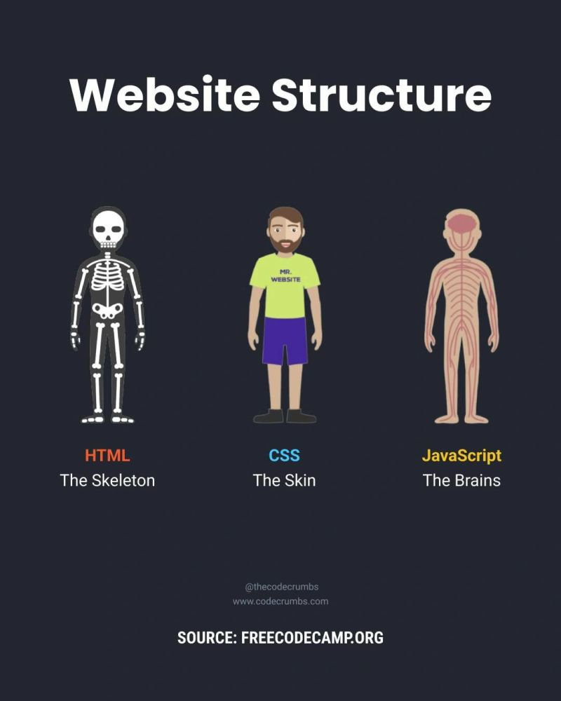
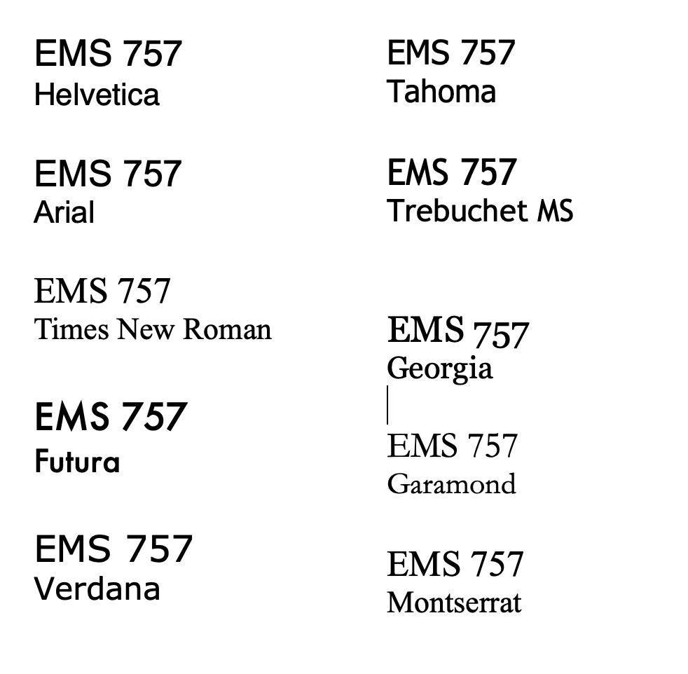
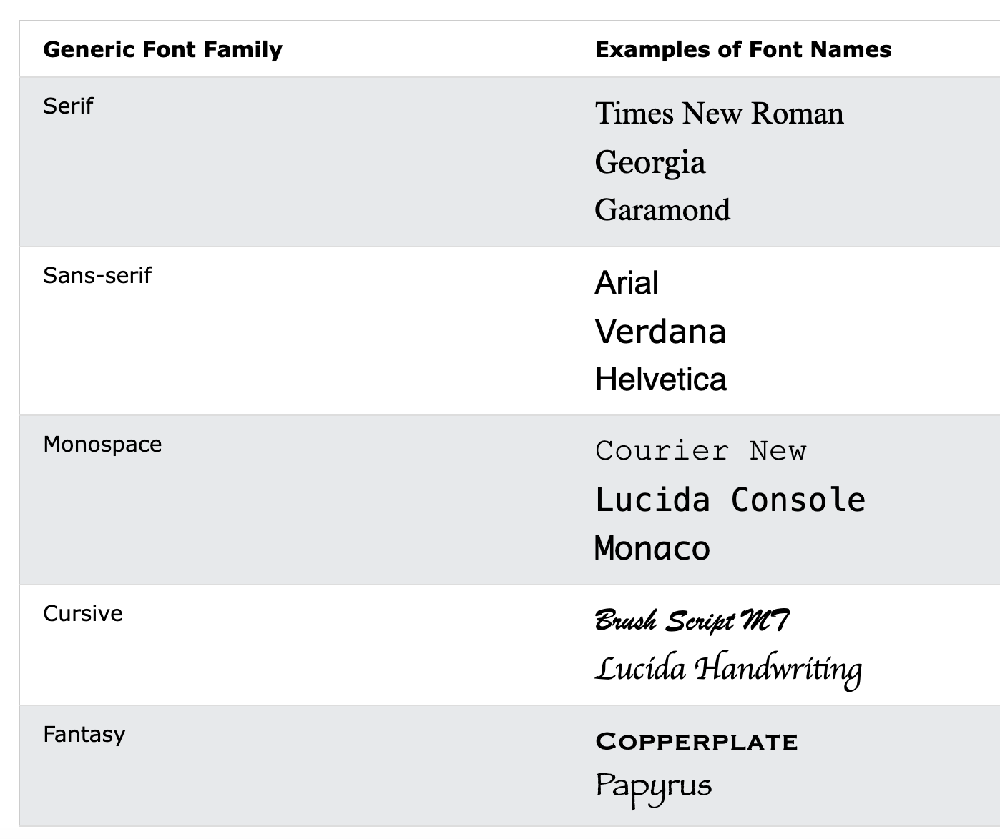
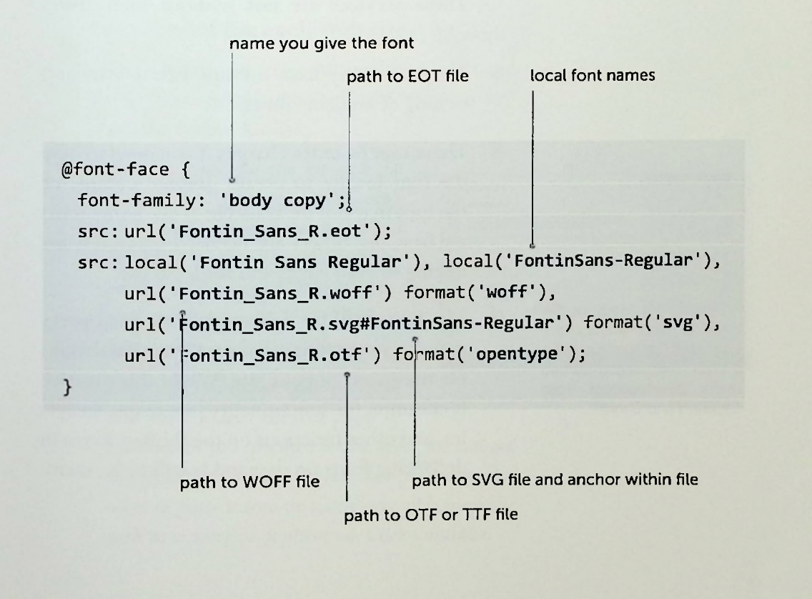

```{r setup, include=FALSE}
options(htmltools.dir.version = FALSE)
knitr::opts_chunk$set(
  fig.width=9, fig.height=3.5, fig.retina=3,
  out.width = "100%",
  cache = TRUE,
  dev = "svg",      
  echo = TRUE,
  message = FALSE, 
  warning = FALSE,
  fig.show = TRUE,
  hiline = TRUE      
)

knitr::opts_chunk$set(echo = TRUE, message = FALSE, warning = FALSE,
                      comment = "#>", highlight = TRUE,
                      fig.align = "center")
library(fontawesome)
library(icons)
```

```{r xaringan-themer, include=FALSE, warning=FALSE}
library(xaringanthemer)
style_duo_accent(
  primary_color = "#3d3d3d",
  secondary_color = "black",
  inverse_header_color = "#e0e0e0",
  base_font_size = "18px",
  code_font_size = ".8rem",
  header_font_google = google_font("Poppins"),
  text_font_google   = google_font("Roboto", "300", "300i"),
  code_font_google   = google_font("Fira Mono"),
  link_color = "#007acc", 
  extra_css = list(
    ".small" = list("font-size" = ".78rem"),
    ".big"  = list("font-size" = "1.2rem"),
    ".small-code pre code" = list("font-size" = ".7rem"),
    ".tiny-code pre code" = list("font-size" = ".5rem"),
    "li" = list("padding" = "8px 0px 0px"),
    "table th, table td" = list("padding" = "8px"),
    "h1" = list("line-height" = "1.3", "margin-bottom" = "15px"), 
    "h2" = list("line-height" = "1.25", "margin-bottom" = "12px"), 
    "h3" = list("line-height" = "1.2", "margin-bottom" = "10px")
  )
)
```

```{r xaringan-extra, echo=FALSE, include=FALSE}
xaringanExtra::use_clipboard(button_text = "Copy")
xaringanExtra::use_search(show_icon = TRUE, case_sensitive = FALSE)
xaringanExtra::style_search(match_background = "#264653")
```

<style>
  table {
    font-size: 10px; /* Adjust this value to make the font smaller or larger */
  }
</style>

## Recap from last week

- Personas
   - Represent archetypes based on behavior patterns from research, helping simplify complex user behaviors for design decisions.
   - Design for specific user needs to create better experiences, rather than broad functionality.
- Web design principles:
   - Make pages self-evident so users can navigate easily without thinking too much.
   - Focus on reducing cognitive load to improve user experience (examples: Amazon vs. Lings Cars).
- Users' behaviors:
   - Billboards! Users scan rather than read in detail.
   - They satisfice, choosing the first option that seems to work (remember we Google rather than write websites addresses).
   - Users muddle through websites rather than figuring out how everything works.

### Deadline Reminders

GWP #2: User research and modeling report 10/28 (Monday!)

---

## Let's talk about fonts and CSS! 

<br><br>

.center[

 

#####  Class quesiton: Who uses what fonts? 

]


---

## Most people use the same fonts

- Arial, Times, and Georgia
- More "expert" ... Verdana and Trebuchet MS

<blockquote class="tiktok-embed" cite="https://www.tiktok.com/@elle.cordova/video/7327418230866201899" data-video-id="7327418230866201899" style="max-width: 605px;min-width: 325px;" > <section> <a target="_blank" title="@elle.cordova" href="https://www.tiktok.com/@elle.cordova?refer=embed">@elle.cordova</a> Fonts hanging out <a title="typography" target="_blank" href="https://www.tiktok.com/tag/typography?refer=embed">#typography</a> <a title="graphicdesign" target="_blank" href="https://www.tiktok.com/tag/graphicdesign?refer=embed">#graphicdesign</a> <a title="typedesign" target="_blank" href="https://www.tiktok.com/tag/typedesign?refer=embed">#typedesign</a> <a title="fonts" target="_blank" href="https://www.tiktok.com/tag/fonts?refer=embed">#fonts</a> <a target="_blank" title="♬ original sound - Elle Cordova" href="https://www.tiktok.com/music/original-sound-7327418400915868458?refer=embed">♬ original sound - Elle Cordova</a> </section> </blockquote> <script async src="https://www.tiktok.com/embed.js"></script>

---

## Let's guess the class presentation font!

--

```r
  header_font_google = google_font("Poppins"),
  text_font_google   = google_font("Roboto", "300", "300i"),
  code_font_google   = google_font("Fira Mono")
```

---

## We have a lot of fonts!

- [Google Fonts](https://fonts.google.com/) offers over 1,500 free and open-source fonts.
<br><br>
- [Adobe Fonts](https://fonts.adobe.com/) includes thousands of fonts, with access to over 20,000 fonts.
<br><br>
- Teague (2010, pp. 52) says there are over 100,000 fonts available on the internet...

---

## Some most common fonts



---

## Generic font family names

.pull-left[
- CSS font family classifications help browsers identify the type of font used in a design.
- Defining a generic font family ensures a similar type of font will be substituted when the preferred font is not available.
- If a specific font (e.g., Arial) is unavailable, a generic font family (e.g., sans-serif) is used as a fallback.
<br>

]

.pull-right[
CSS generic font family names from [W3Schools](https://www.w3schools.com/css/css_font.asp): 
1. Serif fonts have a small stroke at the edges of each letter. They create a sense of formality and elegance.
2. Sans-serif fonts have clean lines (no small strokes attached). They create a modern and minimalistic look.
3. Monospace fonts - here all the letters have the same fixed width. They create a mechanical look. 
4. Cursive fonts imitate human handwriting.
5. Fantasy fonts are decorative/playful fonts.
]

---

## Font-stack & typefaces

- The list of typefaces is called the font-stack.
- The typefaces are tried in sequence, with each one checked on the user's computer.
- If the browser does not find the first font (e.g., Helvetica), the next one in the list (e.g., Arial) is used as a fallback.
- This process continues until a font is found or the list is exhausted.

---

## 4 Different fonts

1. Web safe fonts
2. Linked web fonts
3. Web font service bureaus
4. Web font embedding technologies

---

## 1.Web safe fonts

- Web typography relies on available fonts; 

--

   - if a font isn’t on the user’s computer, it won’t display.

--

- **Web-safe fonts are widely available on most users' computers.**

- Most websites use ***nine core Web-safe fonts*** because they are almost universally accessible.

---

#### History note:
- In 1996, Microsoft introduced the TrueType Core Fonts for the Web project to create a standard set of fonts optimized for legibility and internationalization. The project ended in 2002, but most of the original fonts are still included in Windows and Mac OS.

--

- The TrueType Core fonts still dominate Web typography, as they are present on about 96% of computers.

- However, are we over using them? 

---

### Best Web Safe Fonts for HTML and CSS from W3School

[Link](https://www.w3schools.com/cssref/css_websafe_fonts.php)

| Font              | Generic Font Family |
|-------------------|---------------------|
| Arial             | sans-serif           |
| Verdana           | sans-serif           |
| Tahoma            | sans-serif           |
| Trebuchet MS      | sans-serif           |
| Times New Roman   | serif                |
| Georgia           | serif                |
| Garamond          | serif                |
| Courier New       | monospace            |
| Brush Script MT   | cursive              |

---

### Updated fonts in OS & Windows

- OS, see [wikipedia article](https://en.wikipedia.org/wiki/List_of_typefaces_included_with_macOS)

<br><br><br>

- Windows, see [wikipedia article](https://en.wikipedia.org/wiki/List_of_typefaces_included_with_Microsoft_Windows)

---

## 2.Linked web fonts


- In theory web browsers should be able to download font files from a server, similar to how they download images.
- And...font linking has been part of the CSS standard for over 10 years.
- However, Intellectual property (IP) and digital rights management (DRM) have slowed the adoption of downloaded fonts.

--

Let's talk solutions?

--

- So...

.small[
| Category      | Description                                                                 |
|---------------|-----------------------------------------------------------------------------|
| **Linking**   | All major browsers support linking to font files (TTF, OTF, EOT, WOFF/WOFF2, SVG).|
| **Services**  | Web font service providers offer easy licensing and deployment.             |
| **Technologies** | Google fonts and Adobe techniques have evolved to support font embedding.   |
| **File Formats** | Common formats include OpenType (OTF) and TrueType (TTF), with web-specific formats for protection and sub-setting. |
]

---

### Font formats (updated to the 21st century)

.pull-left[
- OTF and TTF (OpenType and TrueType): 
   - Widely supported across modern browsers (Chrome, Firefox, Safari, Edge) and are still commonly used for both web and print projects. They continue to serve as foundational formats for font usage on the web.
   
- EOT (Embedded OpenType): 
   - Although developed by Microsoft in the late 1990s, EOT is now largely obsolete. It is primarily supported by older versions of Internet Explorer.
]

.pull-right[
- SVG (Scalable Vector Graphics): 
   - Once used for web fonts, SVG fonts have mostly been deprecated for web typography purposes. Modern browsers support SVG for vector images, but for fonts, it's no longer the recommended format due to better alternatives

- WOFF and WOFF2: 
   - These formats have become the standard for web fonts due to their compression capabilities, faster loading times, and broad browser support. WOFF2, in particular, is favored for its improved performance and smaller file size compared to WOFF, making it the most widely recommended format for modern web typography
]

---

### Uploading fonts to a web server

- Uploading fonts is similar to uploading other files using FTP (remember you will use it for your assignments). Place font files in a designated folder (e.g., /fonts) for better organization.
Common Issues:
- Ensure the file path is correct (**REMEMBER: relative vs. absolute paths**).
- Cross-domain restrictions: 
   - Fonts often need to be served from the same domain as the HTML requesting them.
- MIME types: 
   - Ensure the server supports the proper MIME types for fonts (e.g., .eot, .ttf, .woff).
- Font File Size Considerations:
   - Caching: Fonts are cached between pages for faster loading once downloaded.
   - Size Factors:
      - Number of glyphs: More characters increase file size.
      - Complexity of font shapes: More detailed shapes require more data.
      - Metadata: Additional hinting and kerning data increase size.
      - Font Example: A set of Fontin Sans fonts (regular, bold, italic, small caps) totals around 140-150 KB.

---

#### Video Example

[Link](https://youtu.be/lDip-1VnaOA?si=zGz5l7Z1dLnWv-QI)

.center[
<iframe width="560" height="315" src="https://www.youtube.com/embed/lDip-1VnaOA?si=l20Ud4WL8q8a98nS&amp;start=105" title="YouTube video player" frameborder="0" allow="accelerometer; autoplay; clipboard-write; encrypted-media; gyroscope; picture-in-picture; web-share" referrerpolicy="strict-origin-when-cross-origin" allowfullscreen></iframe>
]

---

### Linking fonts to a Web page

**Key Components:**
1. Font-family name:
   - Defines a name for the font that you will use in your CSS. You decide the name, but it needs to remain consistent throughout your code.
2. Source (src):
   - Specifies the URL where the font file is hosted. This can be a relative or absolute path and allows you to include multiple formats (WOFF2, WOFF, TTF, etc.) to ensure browser compatibility.
3. Local name (optional):
   - You can specify a local name to check if the user already has the font installed on their computer, saving download time.
   .small-code[
   ```css
   src: local('Arial'), url('/fonts/CustomFont.woff2') format('woff2');
   ```
   ]

---

### Linking fonts to a Web page

<ol start="4">
  <li>Format hinting (optional):
    <ul>
      <li>Identifies the file format (e.g., 'woff2', 'truetype'). This helps browsers load the correct file type. Some older browsers (like Internet Explorer) may ignore this value.</li>
    </ul>
  </li>
  <li>Weight, style, or variant (optional):
    <ul>
      <li>Allows you to define specific attributes such as font weight (<code>font-weight</code>), style (<code>font-style</code>), or variant (e.g., <code>small-caps</code>).</li>
    </ul>
  </li>
</ol>

E.g. syntax:

.small-code[
```css
@font-face {
  font-family: 'CustomFont';
  src: url('/fonts/CustomFont.woff2') format('woff2'),
       url('/fonts/CustomFont.woff') format('woff'),
       url('/fonts/CustomFont.ttf') format('truetype');
  font-weight: 400;
  font-style: normal;
  font-display: swap;
}
```
]

---

### Best practices for linking fonts

- Use the `@font-face` rule to link external font files to your web project. This requires defining the font-family (your custom name) and src (the file's location). Always prioritize the WOFF2 format for best performance and browser compatibility:
   .small-code[
   ```css
   @font-face {
  font-family: 'CustomFont';
  src: url('/fonts/CustomFont.woff2') format('woff2'),
       url('/fonts/CustomFont.woff') format('woff'),
       url('/fonts/CustomFont.ttf') format('truetype');
       }
   ```
   ]

- **Naming Font Families**: Name font families based on their function or role (e.g., 'header', 'body', 'display') rather than the typeface name itself (like 'Roboto'). This makes it easier to swap fonts later without changing all instances in your CSS:
   - E.g.,: Instead of `font-family: 'Roboto';`, use `font-family: 'header';`.

- **Multiple Formats for Cross-Browser Support**: Provide multiple font formats like WOFF2, WOFF, and TTF to ensure compatibility across different browsers. Modern browsers favor WOFF2, while older browsers may still require TTF or EOT.


---

### Best practices for linking fonts continued

- Local Fonts Optimization: Use the `local()` function to check if the user already has the font installed locally, which prevents unnecessary downloads:
   .small-code[
   ```css
   src: local('Arial'), url('/fonts/CustomFont.woff2') format('woff2');
   ```
   ]

   - ***Be cautious when testing locally installed fonts, as you might not notice issues with the online version if it's already installed on your system***
   
- **Preload** essential fonts using the `<link rel="preload">` tag for faster rendering, especially if fonts are critical to your site’s layout. This ensures that the browser prioritizes font loading:
   .small-code[
   ```html
   <link rel="preload" href="/fonts/CustomFont.woff2" as="font" type="font/woff2" crossorigin="anonymous">

   ```
   ]

- **Separate Font Files for Different Weights and Styles** each weight or style (e.g., bold, italic) should have its own @font-face rule. This ensures that the correct font file is loaded when needed and optimizes load times by only downloading required styles:

   .small-code[
   ```css
   @font-face {
  font-family: 'CustomFont';
  src: url('/fonts/CustomFont-Bold.woff2') format('woff2');
  font-weight: bold;}

   ```
   ]

---

### Best practices for linking fonts continued

- Fonts are **cached** across pages, so once a user downloads a font, it will load instantly on subsequent pages. This reduces load times, especially on larger websites.

- Ensure your server is configured with proper **MIME types** for fonts (e.g., font/woff2, application/font-woff) to prevent issues with font loading:

   `AddType application/font-woff2 .woff2`

- Let's play with this link, [(MDN, 2024)](https://developer.mozilla.org/en-US/docs/Web/CSS/font)

---

### Cross-platform compatability

[Font Squirrel Webfont Generator](https://www.fontsquirrel.com/)

- Font Squirrel provides an easy method for converting fonts (from OTF/TTF) to multiple formats: 
   - EOT (for Internet Explorer), 
   - SVG (for older Chrome versions),  
   - WOFF, WOFF2, and TTF (Chrome, Safari, Firefox and others)
   
- To convert:
  - Use the Font Squirrel Webfont Generator to upload your font and generate the required formats (EOT, SVG, WOFF, etc.).
  - Download the Webfont Kit with CSS code and font files.

---

### Paul Irish's Bulletproof Bulletproof `@font-face` Rule

   .tiny-code[
   ```css
   @font-face {
    font-family: 'CustomFont';
    src: url('/fonts/CustomFont.eot'); /* IE9 Compat Modes */
    src: url('/fonts/CustomFont.eot?#iefix') format('embedded-opentype'), /* IE6-IE8 */
         url('/fonts/CustomFont.woff2') format('woff2'), /* Modern browsers */
         url('/fonts/CustomFont.woff') format('woff'), /* Support for older browsers */
         url('/fonts/CustomFont.ttf') format('truetype'), /* Safari, Android, iOS */
         url('/fonts/CustomFont.svg#CustomFont') format('svg'); /* Legacy iOS */
    font-weight: normal;
    font-style: normal;
    }
   ```
   ]


.small[
- EOT: Used first for Internet Explorer (old and new versions).
- WOFF2: The most efficient format for modern browsers like Chrome, Firefox, and Edge.
- WOFF: A fallback for older browsers that don’t support WOFF2.
- TTF: Provides compatibility with Safari and other systems that might not support WOFF.
- SVG: Legacy format for older mobile devices, particularly iOS.
]


from: Teague, 2010, pg 83

---

### Font Subsetting & Optimization
   - Font Subsetting: When converting fonts using Font Squirrel, select **Subset Fonts** to reduce file sizes by only including glyphs (characters) necessary for your project. Include common glyphs like uppercase, lowercase, numbers, and punctuation.
   - Auto-Hint Glyphs: Only use this option if there are problems with the font's appearance, as auto-hinting can modify how fonts display.
 - Testing Local and Downloaded Fonts
    - When using the local() function, make sure to test your website on systems where the font is not already installed. Internet Explorer doesn’t support `local()` and ignores it, but this is manageable by adding other font formats like EOT

---

***Same video the beginning part***

<iframe width="560" height="315" src="https://www.youtube.com/embed/lDip-1VnaOA?si=Wks89fxhQgDOMQDN&amp;start=105" title="YouTube video player" frameborder="0" allow="accelerometer; autoplay; clipboard-write; encrypted-media; gyroscope; picture-in-picture; web-share" referrerpolicy="strict-origin-when-cross-origin" allowfullscreen></iframe>

---

## 3.Web font service bureaus

- This is more old school
- Web font service bureaus:
   - have emerged as a promising solution in web typography, 
   - allowing designers to easily license fonts and add them to websites. 
   - They handle:
      - font licensing,  
      - provide fonts in formats supported by the widest range of browsers.

---

### 3.Web font service bureaus continued

Advantages:
1. Simplified Licensing - by purchasing a license through these services, web designers avoid the legal complications of EULAs (End User License Agreements) while getting access to fonts that are ready for web use.
2. Cross-Browser Support - these services ensure the font is provided in multiple formats (WOFF, TTF, etc.), allowing for seamless integration across different browsers.
3. Ease of Use - they provide pre-generated code snippets to easily integrate the font into your website.

Disadvtanges:
- Limited Catalos - some services still have a small selection of fonts, though this is expanding.
 - Extra Costs - Licensing for local use might come with additional fees, and some fonts may not allow both web and local use.
- Third-Party Hosting - fonts are hosted on third-party servers, meaning website speed depends on their bandwidth and performance. This adds a layer of dependency similar to third-party services like analytics or maps

Summary: Google Fonts and Adobe Fonts offer more established services with similar features for free or very low cost.

---

## 4. Web font embedding technologies 

***Note: We will not be doing Java in class***

- Cufon is a JavaScript-based solution for embedding fonts on web pages as an alternative to the `@font-face` rule.
- It converts font files into JavaScript text files, which are smaller in size than their OpenType or TrueType counterparts, and it is primarily used for headlines or short blocks of text.
- Cufon was once a popular solution but has largely been replaced by modern web font services like Google Fonts and `@font-face` embedding with WOFF and WOFF2 formats for performance and simplicity.

---

Basic Steps:

.small[
1. Download cufon-yui.js file from  [Cufon website](https://www.cufonfonts.com/) and upload it to your server.
2. Convert your font files (e.g., Regular, Bold, Italic) to JavaScript files using Cufon’s font generator. *Ensure you comply with font licensing agreements (EULA).*
3. Subset the fonts to **reduce file size** by including only necessary glyphs.
4. Simplify (rename) file names to something meaningful, such as Fontin_Sans-RBIBI.js, where "RBIBI" indicates Regular, Bold, Italic, and Bold/Italic versions.
5. Add the JavaScript font files and the Cufon script in the `<head>` section of your HTML page.
    ```html
    <script src="cufon-yui.js" type="text/javascript"></script>
    <script src="Fontin_Sans-RBIBI.js" type="text/javascript"></script>
    ```
6. CSS backup:
    ```css
    <style>
    h1, h2 { font-family: impact, sans-serif; }
    p { font-family: 'franklin gothic book', serif; }
    </style>
    ```
7. Apply Styles with JavaScript `Cufon.replace()`
   ```javascript
   Cufon.replace('h1', { fontFamily: 'Diavlo' });
   Cufon.replace('p', { fontFamily: 'Fontin Sans' });
   ```
]

---

## Which method should you use?

.small[
.pull-left[
1. **Browser Support**:
   - `@font-face`: Supported by nearly all modern browsers (e.g., Chrome, Firefox, Safari, Edge).
   - **JavaScript/Flash-based embedding**: Limited, especially on mobile devices & not widely used anymore.

2. **Available Fonts**:
   - `@font-face`: Use any TTF/OTF font (license required).
   - **Web font services** (e.g., Google Fonts, Adobe Fonts): Limited to library fonts, but libraries are extensive (e.g., Google Fonts offers 1,500+ free fonts).

3. **Speed**:
   - **Web-safe fonts**: Instant load time as they are pre-installed on user devices.
   - **WOFF2**: Best for performance, as it compresses fonts for faster load times.
   - **Font services**: Dependent on third-party servers; performance can vary with server traffic.
]

.pull-right[
<ol start="4">
  <li>Licensing:
    <ul>
      <li>Web font services (e.g., Google Fonts, Adobe Fonts): Licensing included.</li>
      <li><code>@font-face</code>: Must check font EULAs for web embedding.</li>
    </ul>
  </li>
  <li>CSS Compatibility:
    <ul>
      <li><code>@font-face</code>: Full CSS support.</li>
      <li>JavaScript-based: Requires JS for styling, which may complicate integration.</li>
    </ul>
  </li>
  <li>Local Use:
    <ul>
      <li><code>@font-face</code> & Services: Some fonts allow local use; check licensing for graphic comps.</li>
      <li>Web font services: Typically don’t allow local installation without additional licensing.</li>
    </ul>
  </li>
</ol>
]
]

---

## Let's compare them all

From Teague, 2010, pg 98 - with additions from the current day tools. 

| Tech          | Browser Support                   | # Typefaces/File Type | Sub-setting | License Required |
|---------------|------------------------------------|-----------------------|-------------|------------------|
| Web Safe      | FF1, Sa1, Op3, IE3, GC3           | 68¹                   | NA          | NA               |
| @font-face    | FF3.5, Sa3.1, Op10                | TTF or OTF            | Yes²        | Web linking      |
| @font-face    | IE4                               | EOT                   | Yes²        | Web linking      |
| @font-face    | Sa3.1, Op10, GC3                  | SVG                   | Yes²        | Web linking      |
| @font-face    | FF3.6                             | WOFF                  | Yes²        | Web linking      |
| Typekit       | IE4, FF3.5, Sa3.1, Op10           | 300+                  | Not yet     | Provided         |
| Kernest       | IE4, FF3.5, Sa3.1, Op10           | 600+                  | No          | Provided         |
| Typotheque    | IE4, FF3.5, Sa3.1, Op10           | 25+                   | Yes         | Provided         |
| Cufón         | JavaScript enabled                | TTF or OTF            | Yes         | Web linking      |
| **Google Fonts** | All modern browsers (FF, Sa, IE, Chrome) | ~1,500 free fonts     | Yes         | Free             |
| **Adobe Fonts** | All modern browsers              | 20,000+ premium fonts  | Yes         | Subscription     |
| **WOFF2 (Preferred)** | All modern browsers      | WOFF2 format           | Yes         | Web linking      |

¹ Dependent on availability on the end user's machine. 131 fonts on Windows, 125 fonts on Mac. 68-font overlap.
² Only if processed through a service like Font Squirrel.

---

Class slide CSS

.tiny-code[
```css
:root {
  /* Fonts */
  --text-font-family: Roboto;
  --text-font-is-google: 1;
  --text-font-family-fallback: -apple-system, BlinkMacSystemFont, avenir next, avenir, helvetica neue, helvetica, Ubuntu, roboto, noto, segoe ui, arial;
  --text-font-base: sans-serif;
  --header-font-family: Poppins;
  --header-font-is-google: 1;
  --header-font-family-fallback: Georgia, serif;
  --code-font-family: 'Fira Mono';
  --code-font-is-google: 1;
  --base-font-size: 18px;
  --text-font-size: 1rem;
  --code-font-size: .8rem;
  --code-inline-font-size: 1em;
  --header-h1-font-size: 2.75rem;
  --header-h2-font-size: 2.25rem;
  --header-h3-font-size: 1.75rem;

  /* Colors */
  --text-color: #000000;
  --header-color: #3d3d3d;
  --background-color: #FFFFFF;
  --link-color: #007acc;
  --text-bold-color: black;
  --code-highlight-color: rgba(255,255,0,0.5);
  --inverse-text-color: #FFFFFF;
  --inverse-background-color: black;
  --inverse-header-color: #e0e0e0;
  --inverse-link-color: #007acc;
  --title-slide-background-color: #3d3d3d;
  --title-slide-text-color: #FFFFFF;
  --header-background-color: #3d3d3d;
  --header-background-text-color: #FFFFFF;
  --primary: #3d3d3d;
  --secondary: black;
  --white: #FFFFFF;
  --black: #000000;
}

html {
  font-size: var(--base-font-size);
}

body {
  font-family: var(--text-font-family), var(--text-font-family-fallback), var(--text-font-base);
  font-weight: 300;
  color: var(--text-color);
}
h1, h2, h3 {
  font-family: var(--header-font-family), var(--header-font-family-fallback);
  font-weight: 600;
  color: var(--header-color);
}
```
]
