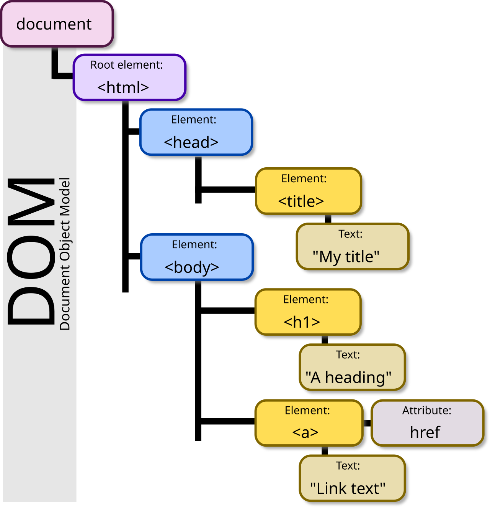

```{r setup, include=FALSE}
options(htmltools.dir.version = FALSE)
knitr::opts_chunk$set(
  fig.width=9, fig.height=3.5, fig.retina=3,
  out.width = "100%",
  cache = TRUE,
  dev = "svg",      
  echo = TRUE,
  message = FALSE, 
  warning = FALSE,
  fig.show = TRUE,
  hiline = TRUE      
)

knitr::opts_chunk$set(echo = TRUE, message = FALSE, warning = FALSE,
                      comment = "#>", highlight = TRUE,
                      fig.align = "center")
library(fontawesome)
library(icons)
```

```{r xaringan-themer, include=FALSE, warning=FALSE}
library(xaringanthemer)
style_duo_accent(
  primary_color = "#3d3d3d",
  secondary_color = "black",
  inverse_header_color = "#e0e0e0",
  base_font_size = "18px",
  code_font_size = ".8rem",
  header_font_google = google_font("Poppins"),
  text_font_google   = google_font("Roboto", "300", "300i"),
  code_font_google   = google_font("Fira Mono"),
  link_color = "#007acc", 
  extra_css = list(
    ".small" = list("font-size" = ".78rem"),
    ".big"  = list("font-size" = "1.2rem"),
    ".small-code pre code" = list("font-size" = ".7rem"),
    ".tiny-code pre code" = list("font-size" = ".5rem"),
    "li" = list("padding" = "8px 0px 0px"),
    "table th, table td" = list("padding" = "8px"),
    "h1" = list("line-height" = "1.3", "margin-bottom" = "15px"), 
    "h2" = list("line-height" = "1.25", "margin-bottom" = "12px"), 
    "h3" = list("line-height" = "1.2", "margin-bottom" = "10px")
  )
)
```

```{r xaringan-extra, echo=FALSE, include=FALSE}
xaringanExtra::use_clipboard(button_text = "Copy")
xaringanExtra::use_search(show_icon = TRUE, case_sensitive = FALSE)
xaringanExtra::style_search(match_background = "#264653")
```

<style>
  table {
    font-size: 10px; /* Adjust this value to make the font smaller or larger */
  }
</style>

## What is CSS? 

**Cascading** Style Sheet

- Styling language for web pages

- Integrates with HTML

--

 

---

## Some important notes

### Document Object Model 

-  "A tree structure wherein each node is an object representing a part of the document"

 
from: [Wikipedia](https://en.wikipedia.org/wiki/Document_Object_Model#/media/File:DOM-model.svg)

---

## CSS Syntax Basics

#### Properties
- The style attributes you want to apply to elements
   - [List of properties >200](https://developer.mozilla.org/en-US/docs/Web/CSS/Reference)
   - Eg,, font-size, color, margin
   
#### Values
- The settings assigned to the properties
   - Eg., 16 px, black, 20px

.small-code[
```css
/* styles.css */

p {
  font-size: 16px;    /* Property: font-size */
  color: black;       /* Property: color */
  margin: 20px;       /* Property: margin */
}
```
]

---

## CSS Selectors

- Selectors are rules used to target specific elements on a page for applying styles.
   - [W3School CSS Selector Test](https://www.w3schools.com/cssref/trysel.php)
  
.small-code[
```css
/* styles.css */

.button {
  background-color: blue;
  color: white;
  padding: 10px 20px;
  border-radius: 5px;
}
```
]


---

## Common type of selectors


1\. Tag (Type) Selectors:
   - Targets all elements of a specific HTML tag
   - Tip: To style the entire body of your page, use a selector targeting the body element. This ensures the styles apply globally, without needing to manually style each individual element.
   - E.g., every <p> (paragraph) element on the page will have blue text
   
   .small-code[
   ```css
   /* styles.css */
   
   p {
  color: blue;
  }
   ```
]

2\. Class Selectors:
   - Target elements that have a specific class attribute. ***Class names are preceded by a period (.) in CSS***
   - E.g., Any element with the class card will have a light gray background and 10px padding
   
   .small-code[
   ```css
   /* styles.css */
   
   .card {
  background-color: lightgray;
  padding: 10px;
  }
   ```
]

---

## Common type of selectors continued

3\. ID Selectors:
   - Target a single element with a specific ID attribute. ***IDs are unique and are preceded by a hash (#) in CSS.***
   - E.g., Only the element with the ID header will have a font size of 24px and green text.
   
   .small-code[
   ```css
   /* styles.css */
   
   #header {
  font-size: 24px;
  color: green;
  }
   ```
]

---

### <span style="color:navy">[Class Activity]</span>

- Open your VS Code
- Start a new text sheet and label is NAME.css
- Then start adding some style to your html pages
   - Style elements using tag, class, and ID selectors
   
---

## Common type of selectors continued


4\. Grouping Selectors:
   - Allow you to apply the same styles to multiple selectors, reducing repetition.
   - E.g., Apply the same font-family to all `<h1>`, `<h2>`, and `<h3>` elements.
   
   .small-code[
   ```css
   /* styles.css */
   
   h1, h2, h3 {
  font-family: Arial, sans-serif;
  }
   ```
   ]


5\. Nesting (Descendant) Selectors:
   - Target elements that are inside other elements.
   - E.g., only the `<p>` elements that are nested inside a `<div>` element will have red text
   
   .small-code[
   ```css
   /* styles.css */
   
   div p {
  color: red;
  }
   ```
   ]

---


6\. Pseudo Class Selectors:
   - Target elements based on their state or interaction, such as when a user hovers over a link or focuses on an input field. ***Pseudo-classes are preceded by a colon (:) in CSS.***
   - E.g., any `<a>` (link) element will be red when unvisited, green visited and pink when mouse hovers over.
   
   .small-code[
   ```css
   /* styles.css */
   
   a:link {
  color: #FF0000; /* unvisited link */
  }
  
  a:visited {
  color: #00FF00; /* visited link */
  }
  
  a:hover {
  color: #FF00FF; /* mouse over link */
  cursor: pointer; /* changes cursor to a pointer (usually a "hand") */
  }
  ```
]

---


7\. nth child pseudo selectors
   - Selects elements based on their position in a parent container. You can use numbers, keywords, or formulas inside the parentheses to target specific children.
   - E.g., the second `<li>` element in any list will be styled with blue text.
   
   .small-code[
   ```css
   /* styles.css */
   
   li:nth-child(2) {
  color: blue;
  }
   ```
]

  - Also to target repeating elements
  - E.g., all odd-numbered list items will have a light gray background, while even-numbered items will have a white background.
  
  .small-code[
  ```css
  /* styles.css */
  
  li:nth-child(odd) {
  background-color: lightgray;
  }
  
  li:nth-child(even) {
  background-color: white;
  }
  ```
]


---

## Selector summary table (you can use your [Google Inspect Selector](https://developer.chrome.com/docs/devtools/inspect-mode))

| Classification                  | Description                                                | Example              |
|----------------------------------|------------------------------------------------------------|----------------------|
| **Type Selector**                | Selects all elements of the specified HTML tag             | `h1`                 |
| **Class Selector**               | Selects all elements with the specified class attribute    | `.nav-item`          |
| **ID Selector**                  | Selects the single element with the specified ID attribute | `#main-header`       |
| **Grouping Selector**            | Selects multiple elements by grouping selectors together   | `h1, h2, p`          |
| **Nesting (Descendant) Selector**| Selects elements nested inside other elements              | `div p`              |
| **Pseudo-Class Selector**        | Selects elements based on their state or position          | `a:hover`, `input:focus` |
| **nth-child Selector**           | Selects elements based on their position in a parent       | `li:nth-child(2)`    |

---

### <span style="color:navy">[Class Activity]</span>

- Now play with grouping, nesting and pseudo-class selectors! 

---

## `display` properties

1. `inline`
2. `block`
3. `none`
4. `grid`
5. `flex`

---

## Block elements

- Block elements take up the full width of their container and always start on a new line. They create a "block" around the content.
- Common block elements: `<div>`,`<p>`, `<h1>` to `<h6>`, `<section>`, `<header>`, `<body>`, etc.

```css
/* styles.css */

div {
  display: block;
  width: 100%; /* Takes up the full width */
}
```

- Block elements push other content down to the next line.
- They can have width and height set explicitly, and padding, margin, and borders all work as expected.

---

## Inline elements

- Inline elements only take up as much width as their content requires and do not start on a new line.
- Common inline elements: `<span>`, `<a>`, `<strong>`, `<em>`, etc.

```css
/* styles.css */

span {
  display: inline;
  width: 100px; /* This WON'T work on inline elements */
}
```

- Inline elements remain in the same line as other elements, and width/height cannot be applied.
- Padding and margin work horizontally, but vertical padding and margins won't affect the flow.

---

## Inline-Block Elements

- Inline-block elements combine the best of both block and inline elements. They behave like inline elements but can have width, height, padding, margin, and borders.
- This is useful for creating flexible layouts while keeping elements aligned on the same line.

```css
/* styles.css */

div {
  display: inline-block;
  width: 150px;
  height: 100px;
  margin: 10px;
  padding: 10px;
  border: 1px solid black;
}
```
- Inline-block elements allow you to size the elements with width and height, while still allowing them to remain inline with other elements.
- Padding, margin, and borders all work as expected.


---

## Block & Inline Example

.pull-left[
.small-code[
```html
<!DOCTYPE hmtl>

<p id="EMS">
  I love <strong>EMS</strong> classes!
</p>

<p id="BU">
  BU is fun as well.
</p>

```
]
]

.pull-right[
.small-code[
```css
/* styles.css */

#EMS {
  background-color: purple;
}

#BU {
  background-color: blue;
}

strong {
  background-color: red;
}

```
]
]

<p style="background-color: purple">
I love <strong style="background-color: red;">EMS</strong> classes!
</p>
<p style="background-color: blue">
BU is fun as well.
</p>


---

### Height & Width: Block Elements

.pull-left[
.small-code[
```html
<!DOCTYPE html>

<p id="EMS">
  I love <strong>EMS</strong> classes!
</p>

<p id="BU">
  BU is fun as well.
</p>

```
]
]

.pull-right[
.small-code[
```css
/* styles.css */

#EMS {
width: 70%;
height: 50px;
}

strong {
width: 100px; /* this doesn't work */
height: 30px; /* this doesn't work */
}
```
]
]

<p style="background-color: purple; white; width: 70%; height: 50px">
I love <strong style="background-color: red; width: 70%; height: 50px">EMS</strong> classes!
</p>
<p style="background-color: blue">
BU is fun as well.
</p> 


---

### Height & Width: Inline Elements 

.pull-left[
.small-code[
```html
<!DOCTYPE html>

<p id="EMS">
  I love <strong>EMS</strong> classes!
</p>

<p id="BU">
  BU is fun as well.
</p>

```
]
]

.pull-right[
.small-code[
```css
/* styles.css */

#EMS {
width: 70%;
height: 50px;
}

strong {
display: inline-block; /*WE NEED TO ADD INLINE DISPLAY */
width: 100px; /* this doesn't work */
height: 30px; /* this doesn't work */
}
```
]
]

<p style="background-color: purple; white; width: 80%; height: 60px">
I love <strong style="background-color: red; display: inline-block; width: 100px; height: 50px">EMS</strong> classes!
</p>
<p style="background-color: blue">
BU is fun as well.
</p> 

---

### <span style="color:navy">[Class Activity]</span>

Add colors to your inline and block elements and play with it! 

---

## Layout

**Layout is important!**

[Video Link](https://youtu.be/07efSFKC8XY?si=6gZvrPPw5fNCmzEY)
<iframe width="560" height="315" src="https://www.youtube.com/embed/07efSFKC8XY?si=o7G0Jjdataz4gRCc" title="YouTube video player" frameborder="0" allow="accelerometer; autoplay; clipboard-write; encrypted-media; gyroscope; picture-in-picture; web-share" referrerpolicy="strict-origin-when-cross-origin" allowfullscreen></iframe>

---

## CSS Box Model and Layouts

- The Box Model is a fundamental concept in CSS that defines how the size and spacing of elements are calculated.


[Link to image](https://www.geeksforgeeks.org/css-box-model/)

---

1\. Content - this is the innermost box where actual content inside the element, such as text or images. 
   
   .small-code[
   ```html
   <!DOCTYPE html>
   
   <div>This is the content</div>
   ```
   ]

2\. Padding - is the space between the content and the element's border.

   .small-code[
   ```css
   /* styles.css */
   
   div {
  padding: 20px;
  }
   ```
   ]

3\. Border - surrounds the padding and content. It can be styled with thickness, color, and type (e.g., solid, dashed)

   .small-code[
   ```css
   /* styles.css */
   
   div {
  border: 2px solid black;
  }
   ```
   ]


4\. Margin - is the space outside the element’s border, separating it from other elements

   .small-code[
   ```css
   /* styles.css */
   
   div {
  margin: 15px;
  }
   ```
   ]
   
---

### Example of box model components

.pull-left[
.small-code[
```html
<!DOCTYPE html>

<div class="box">
  This is the content area.
</div>
```
]

.small-code[
```css
/* styles.css */

  .box {
    width: 200px;               /* Content width */
    height: 100px;              /* Content height */
    padding: 20px;              /* Space inside the border */
    border: 5px solid blue;     /* Border thickness and color */
    margin: 30px;               /* Space outside the border */
    background-color: lightgray;/* Background color of content area */
  }
```
]
]

.pull-right[
<html>
<head>
<style>
  .box {
    width: 200px;               /* Content width */
    height: 100px;              /* Content height */
    padding: 20px;              /* Space inside the border */
    border: 5px solid blue;     /* Border thickness and color */
    margin: 30px;               /* Space outside the border */
    background-color: lightgray;/* Background color of content area */
  }
</style>
</head>
<body>

<div class="box">
  This is the content area.
</div>

</body>
</html>

.small[
- Content Area: width: 200px; height: 100px; defines the size of the content.
- Padding: padding: 20px; adds 20 pixels of space around the content inside the border.
- Border: border: 5px solid blue; creates a 5-pixel thick blue border around the padding and content.
- Margin: margin: 30px; adds 30 pixels of space outside the border, separating this element from others.
]

]

---

### Calculate total height & width

Sum of content, padding, border, and margin

.center[
**Total Width** = Content Width + Left Padding + Right Padding + Left Border + Right Border + Left Margin + Right Margin
<br>
**Total Height** = Content Height + Top Padding + Bottom Padding + Top Border + Bottom Border + Top Margin + Bottom Margin
]

e.g.,

.pull-left[
.small-code[
```css
/* styles.css */

div {
  width: 200px; /* Content width */
  padding: 20px;
  border: 5px solid black;
  margin: 15px;
}

```
]
]

.pull-right[
Content Width: 200px
<br>
Padding: 20px (left and right, so 40px in total)
<br>
Border: 5px (left and right, so 10px in total)
<br>
Margin: 15px (left and right, so 30px in total)
<br>
Total Width = 200px (content) + 40px (padding) + 10px (border) + 30px (margin)
<br><br>
**Total Width = 280px**
]
---

## Boxes!

Boxes are a goodway to test your CSS layout!
- You can first do boxes than add elements inside them

.pull-left[
.small-code[
```html
<!DOCTYPE html>

<div id="container">
  <div>1</div>
  <div>2</div>
  <div>3</div>
  <div>4</div>
  <div>5</div>
  <div>6</div>
</div>
```
]

.small-code[
```css
/* styles.css */

#container { background-color: blue; width: 150px; height: auto; padding: 10px; } 
#container div { background-color: white; border: 2px red; color: black; width: 50px; height: 50px; line-height: 50px; text-align: center; margin: 5px; }
```
]
]

.pull-right[
<div id="container">
  <div>1</div>
  <div>2</div>
  <div>3</div>
  <div>4</div>
  <div>5</div>
  <div>6</div>
</div>
<style> #container { background-color: blue; width: 150px; height: auto; padding: 10px; } #container div { background-color: white; border: 2px red; color: black; width: 50px; height: 50px; line-height: 50px; text-align: center; margin: 5px; } </style>
]

---

### <span style="color:navy">[Class Activity]</span>

1\. Create a web page with a few div elements styled using the box model.
2\. Adjust padding, margins, and borders to see how they affect the layout.

.pull-left[
.small-code[
```html
<!DOCTYPE html>

  <div class="box">Box 1</div>
  <div class="box">Box 2</div>
  <div class="box">Box 3</div>

```
]
]


.pull-right[
```css
/* styles.css */

.box {
  width: 200px;
  height: 100px;
  background-color: lightblue;
  padding: 20px;
  margin: 15px;
  border: 5px solid black;
}
```
]

3\. Increase padding 
.tiny-code[
```css
padding: 40px;
```
]

4\. Change margin 
.tiny-code[
```css
margin: 30px;
```
]

5\. Modify border
.tiny-code[
```css
border: 5px dashed red;
```
]

---

## Flexbox

- Flexbox is a layout model in CSS designed to provide more efficient ways to align and distribute space among items in a container, even when their size is unknown or dynamic.
- The container needs to have `display: flex;` to apply the Flexbox model.

Properties
.small[
1. Container Properties:
   - `display: flex;`: Enables flexbox on a container.
   - `flex-direction`: Determines the direction of the flexible items (row or column).
   - `justify-content`: Aligns items horizontally (start, center, space-between).
   - `align-items`: Aligns items vertically (stretch, center, flex-start).
   - `flex-wrap`: Wrap lines

2. Item Properties:
   - `flex-grow`: Specifies how much a flex item should grow relative to others.
   - `flex-shrink`: Specifies how much a flex item should shrink relative to others.
   - `flex-basis`: Specifies the initial size of a flex item.
]

---

#### Eg

.tiny[
- Each `.box` has a content width of 200px, padding of 20px, and a margin of 15px.
- The border property adds a 5px solid black border around the box.
- This will create three boxes stacked vertically, each separated by margins and padded within.
]

.pull-left[
.small-code[
```css
/* styles.css */

.container {
  display: flex;
  justify-content: space-around;
  align-items: center;
}

.box {
  width: 100px;
  height: 100px;
  background-color: lightblue;
  margin: 10px;
}
```
]
]

.pull-right[

<head>
  <meta charset="UTF-8">
  <meta name="viewport" content="width=device-width, initial-scale=1.0">
  <title>Flexbox Example</title>
  <style>
    /* Flexbox container */
    .container {
      display: flex; /* Makes the container a flexbox */
      justify-content: space-around; /* Evenly distributes space around the boxes */
      align-items: center; /* Aligns boxes vertically in the center of the container */
      background-color: lightgray; /* Adds a background color for the container */
      height: 200px; /* Height for visual representation */
    }

    /* Individual boxes */
    .box {
      width: 100px; /* Sets the width of the box */
      height: 100px; /* Sets the height of the box */
      background-color: lightblue; /* Box background color */
      margin: 10px; /* Adds space between the boxes */
      text-align: center; /* Centers the text inside the box */
      line-height: 100px; /* Vertically centers the text within the box */
      border: 2px solid #000; /* Optional: adds a border for clearer visibility */
    }
  </style>
</head>
<body>
  <!-- Flexbox container -->
  <div class="container">
    <!-- Each box inside the flex container -->
    <div class="box">Box 1</div>
    <div class="box">Box 2</div>
    <div class="box">Box 3</div>
  </div>
</body>
</html>
]

---

### <span style="color:navy">[Class Activity]</span>

- Add Flexbox for Layout 
   - to align and distribute the boxes horizontally
   - Wrap boxes

.tiny-code[
```css
/* styles.css */

body {
  display: flex;
  justify-content: space-around;
  flex-wrap: wrap;
}
```
]


- Vertical layout
.tiny-code[
```css
/* styles.css */
.about {
  display: flex;
  flex-direction: column;
  justify-content: flex-start;
};
```
]

---

## Making your layout adapt to screensizes

- Use **media queries** to shift from a multi-column layout to a single-column layout for smaller screens.
- Flexbox’s `flex-wrap` allows items like project cards to wrap onto the next line

.small-code[
```css
/* styles.css */
@media (max-width: 600px) {
  .header, .projects {
    flex-direction: column;
  }
}

```
]

---


### <span style="color:navy">[Class Activity]</span>

Let's build a portfolio page

1. Structure the layout using Flexbox for the header, about section, project gallery, and contact section.
2. Apply Flexbox properties to the individual components.
3. Ensure the design is responsive using media queries.

---

## Important Notes 

- **Styles Cascade:**
  - All styles "cascade" from the top of the stylesheet to the bottom, meaning the order of styles matters. Later styles can override earlier ones if they target the same elements.

- **Overwriting Styles with Multiple Stylesheets:**
  - When multiple stylesheets are used, the styles in the second (or last) stylesheet can overwrite styles from the first. Always ensure the correct styles are loaded in the proper order to avoid conflicts.

- **Be Cautious of Unintentional Overrides:**
  - Be careful when re-declaring styles, as you might unintentionally override existing styles. Specificity and cascading order play a huge role in determining which styles are applied.

- **Page-Specific Stylesheets:**
  - If you have page-specific styles, use a second stylesheet that's linked after the shared/global stylesheet. This ensures that the page-specific styles are applied without affecting other pages.

---

## Important Notes continued

- **Specificity Matters:**
  - CSS uses specificity to determine which styles to apply when multiple rules target the same element. For example, ID selectors (`#header`) are more specific than class selectors (`.header`), and inline styles (e.g., `<div style="color: red;">`) override everything else. Learn the specificity rules to avoid style conflicts.

- **Use External Stylesheets for Reusability:**
  - It’s best practice to separate CSS into external stylesheets (`<link rel="stylesheet" href="styles.css">`). This allows for code reusability and cleaner HTML. Internal and inline CSS should be avoided unless necessary.

- **Box Model Awareness:**
  - Understand the **CSS Box Model**, which consists of content, padding, border, and margin. Changing one part of the box model affects the overall size of an element, and improper use can disrupt layouts.

---

## Important Notes continued

- **Use `rem` and `em` for Scalable Layouts:**
  - Instead of using fixed units like `px`, consider using `rem` and `em` units for sizing. These units allow for better scalability, especially when building responsive designs that need to adapt to different screen sizes.

- **Use Flexbox and Grid for Layouts:**
  - Instead of relying on `float` or `inline-block` for complex layouts, use **Flexbox** and **CSS Grid**. These modern layout techniques simplify creating responsive and flexible layouts.


