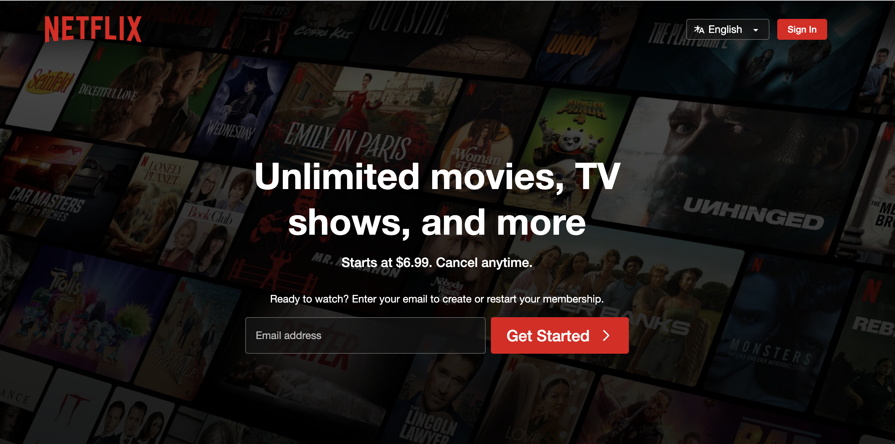

```{r setup, include=FALSE}
options(htmltools.dir.version = FALSE)
knitr::opts_chunk$set(
  fig.width=9, fig.height=3.5, fig.retina=3,
  out.width = "100%",
  cache = TRUE,
  dev = "svg",      
  echo = TRUE,
  message = FALSE, 
  warning = FALSE,
  fig.show = TRUE,
  hiline = TRUE      
)

knitr::opts_chunk$set(echo = TRUE, message = FALSE, warning = FALSE,
                      comment = "#>", highlight = TRUE,
                      fig.align = "center")
library(fontawesome)
library(icons)
```

```{r xaringan-themer, include=FALSE, warning=FALSE}
library(xaringanthemer)
style_duo_accent(
  primary_color = "#3d3d3d",
  secondary_color = "black",
  inverse_header_color = "#e0e0e0",
  base_font_size = "18px",
  code_font_size = ".8rem",
  header_font_google = google_font("Poppins"),
  text_font_google   = google_font("Roboto", "300", "300i"),
  code_font_google   = google_font("Fira Mono"),
  link_color = "#007acc", 
  extra_css = list(
    ".small" = list("font-size" = ".78rem"),
    ".big"  = list("font-size" = "1.2rem"),
    ".small-code pre code" = list("font-size" = ".7rem"),
    ".tiny-code pre code" = list("font-size" = ".5rem"),
    "li" = list("padding" = "8px 0px 0px"),
    "table th, table td" = list("padding" = "8px"),
    "h1" = list("line-height" = "1.3", "margin-bottom" = "15px"), 
    "h2" = list("line-height" = "1.25", "margin-bottom" = "12px"), 
    "h3" = list("line-height" = "1.2", "margin-bottom" = "10px")
  )
)
```

```{r xaringan-extra, echo=FALSE, include=FALSE}
xaringanExtra::use_clipboard(button_text = "Copy")
xaringanExtra::use_search(show_icon = TRUE, case_sensitive = FALSE)
xaringanExtra::style_search(match_background = "#264653")
```

<style>
  table {
    font-size: 10px; /* Adjust this value to make the font smaller or larger */
  }
</style>

## Continuing CSS

- From Krug, web pages layout matter!! 

--

How do you prefer navigating websites: through search bars or by browsing?

--

- **Effective navigation is crucial** - Users will leave if they can't navigate.
- **Two main types of users**:
  - **Search-dominant**: Prefer search bars.
  - **Link-dominant**: Prefer browsing through links.

---

## Navigation Design Essentials

- **Navigation serves multiple purposes**:
  - Helps users find their way.
  - Shows them what’s available.
  - Provides confidence in the site’s organization.

e.g., Compare [Apple’s](https://www.apple.com/apple-news/) clean, organized navigation with a cluttered news website (e.g. [Huff Post](https://www.huffpost.com/). How does each make you feel about using the site?

---

## Web Navigation Conventions

- Use **persistent navigation** on all pages:
  - Includes Site ID, Home link, main sections, and utilities.
- Exception: Forms should have minimal navigation.

e.g., On an e-commerce checkout page, you often won’t see the usual full navigation bar. This reduces distractions during purchasing.

--

Why might it be beneficial to reduce navigation options on a checkout page?

---

## Important Navigation Elements

- **Site ID or Logo** - Should be in the upper left corner on every page.
- **Primary Sections** - Main site areas should be clearly accessible.
- **Utilities** - Important functions like “Help,” “My Account,” etc.

e.g., Home link in your social media sites, let's check [WeChat](https://www.wechat.com/)

---

## The Role of Breadcrumbs

- **Breadcrumbs** help users know where they are within the site.
  - Placed at the top.
  - Use “>” separators. 
     - e.g., Home > Arts > Visual Arts > Photography > YOU ARE HERE
  - Bold the current page.
  - Color code tabs
  
  
E.g., On an e-commerce site like Best Buy, breadcrumbs often show you’re in "Home > Electronics > Laptops."


---

## Trunk Test (Krug, 2013, pg. 85)

- "What site is this? (Site ID)
- What page am I on? (Page name)
- What are the major sections of this site? (Sections)
- What are my options at this level? (Local navigation)
- Where am I in the scheme of things? (“You are here” indicators)
- How can I search?"

---

## Let's do the trunk test

1. Choose a page anywhere in the site at random, and print it.
2. Hold it at arm’s length or squint so you can’t really study it
closely.
3. As quickly as possible, try to find and circle each of these items:
   - Site ID
   - Page name
   - Sections (Primary navigation)
   - Local navigation
   - “You are here” indicator(s)
   - Search

---


## The Big Bang Theory of Web Design

- **Home page is critical** - It must:
  - Show site identity and mission.
  - Provide easy access to major sections.
  - Contain search, promos, and updates.

e.g., [Wikipedia](https://www.wikipedia.org/) and [IMDb](https://www.imdb.com/) clearly state their purpose on the homepage.

---

## Home Page Elements

- **Key components**:
  - Site identity and tagline.
  - Brief welcome blurb.
  - Frequently updated content and promos.
  
Let's look at a webpage! 

---

## The "Big Picture" Rule - similar to Trunk Test

- The Home page should **quickly answer these questions**:
  - What is this site?
  - What can I find here?
  - Why should I stay?
  - Where do I start?

---

## Taglines

- A good tagline should:
  - Be clear, informative, and concise.
  - Differentiate the site and convey its value.
  - Avoid generic or vague language.

e.g., Netflix




---

## Avoiding Home Page Overload

- **Home page overload** leads to clutter.
- **Stakeholder pressure** can add unnecessary items.
- Educate on the "tragedy of the commons" - prioritize only essential content.
- Remember [Yale Arts](https://www.art.yale.edu/) 

---

<br><br><br>
.center[
## Now let's go back to CSS and HTML and use these!!! 

]

---

## Flexbox

- Flexbox is a layout model in CSS designed to provide more efficient ways to align and distribute space among items in a container, even when their size is unknown or dynamic.
- The container needs to have `display: flex;` to apply the Flexbox model.

Properties
.small[
1. Container Properties:
   - `display: flex;`: Enables flexbox on a container.
   - `flex-direction`: Determines the direction of the flexible items (row or column).
   - `justify-content`: Aligns items horizontally (start, center, space-between).
   - `align-items`: Aligns items vertically (stretch, center, flex-start).
   - `flex-wrap`: Wrap lines

2. Item Properties:
   - `flex-grow`: Specifies how much a flex item should grow relative to others.
   - `flex-shrink`: Specifies how much a flex item should shrink relative to others.
   - `flex-basis`: Specifies the initial size of a flex item.
]

---

## How to make boxes in a row rather than a column?

1. `Float` the boxes left or right. 

2. `display: inline;`

- Test colors with [MDN](https://developer.mozilla.org/en-US/docs/Web/CSS/border-block-color)


---

### 1\. `float: left;` or `float: right;`

- **Usage**: Floats are the older approach to create horizontal layouts.
- Apply `float: left;` or `float: right;` to the `.box` elements to align them in a row.
- **Limitations**: Floats were originally designed for flowing text around images, so they lack flexibility in modern layouts. They also require manual clearing of floats.

.pull-left[
.small-code[
```css
/* Using float for horizontal layout */
.box {
  float: left; /* or float: right; */
  width: 100px;
  height: 100px;
  background-color: lightblue;
  margin: 10px;
}
```
]
]


.pull-right[
<html lang="en">
<head>
  <meta charset="UTF-8">
  <meta name="viewport" content="width=device-width, initial-scale=1.0">
  <title>Float Layout Example</title>
  <style>
    /* Style for each box */
    .box {
      float: left; /* Aligns boxes side by side */
      width: 100px;
      height: 100px;
      background-color: lightblue;
      margin: 10px;
      text-align: center;
      line-height: 100px; /* Centers text vertically */
      border: 2px solid black; /* Optional: adds a border */
    }

    /* Optional: Clear float after the boxes */
    .container::after {
      content: "";
      display: table;
      clear: both;
    }
  </style>
</head>
<body>
  <!-- Container for floating boxes -->
  <div class="container">
    <div class="box">Box 1</div>
    <div class="box">Box 2</div>
    <div class="box">Box 3</div>
  </div>
</body>
</html>

]
---

## 2\. `display: inline-block;`
- **Usage**: `inline-block` allows elements to sit side-by-side like inline elements but maintain block-like properties such as width and height.
 - **Pros**: No need for float clearing.
- **Cons**: `inline-block` elements are sensitive to whitespace, which can create unwanted gaps between boxes.

.pull-left[
.small-code[
```css
/* Using inline-block for horizontal layout */
.container .box {
  display: inline-block;
  width: 100px;
  height: 100px;
  background-color: lightblue;
  margin: 10px;
  vertical-align: top; /* Ensures alignment on the top of the row */
}

```
]

]

.pull-right[
<html lang="en">
<head>
  <meta charset="UTF-8">
  <meta name="viewport" content="width=device-width, initial-scale=1.0">
  <title>Inline-Block Layout Example</title>
  <style>
    /* Style for each box using inline-block */
    .container .box {
      display: inline-block; /* Allows boxes to be displayed in a row */
      width: 100px;
      height: 100px;
      background-color: lightblue;
      margin: 10px;
      vertical-align: top; /* Aligns boxes at the top */
      text-align: center;
      line-height: 100px; /* Centers text vertically */
      border: 2px solid black; /* Optional: adds a border */
    }
  </style>
</head>
<body>
  <!-- Container for inline-block boxes -->
  <div class="container">
    <div class="box">Box 1</div>
    <div class="box">Box 2</div>
    <div class="box">Box 3</div>
  </div>
</body>
</html>

]

---

## 3\. `display: flex;`

- **Usage**: Flexbox is a modern and robust way to create responsive rows and columns.
- Add `display: flex;` to the container to align boxes horizontally by default.
- Use `justify-content` to control horizontal spacing and align-items for vertical alignment.

.pull-left[
.small-code[
```css
/* Using flexbox for horizontal layout */
.container {
  display: flex; /* Enables flex layout */
  justify-content: space-around; /* Spaces boxes evenly */
  align-items: center; /* Centers boxes vertically */
  background-color: lightgray;
  padding: 10px;
}

.box {
  width: 100px;
  height: 100px;
  background-color: lightblue;
  margin: 10px;
  text-align: center;
  line-height: 100px; /* Vertically centers text within box */
  border: 2px solid #000; /* Optional: Adds a border */
}

```
]
]


.pull-right[
<html lang="en">
<head>
  <meta charset="UTF-8">
  <meta name="viewport" content="width=device-width, initial-scale=1.0">
  <title>Flexbox Layout Example</title>
  <style>
    /* Flexbox container styles */
    .container {
      display: flex; /* Enables flex layout */
      justify-content: space-around; /* Spaces boxes evenly */
      align-items: center; /* Centers boxes vertically */
      background-color: lightgray; /* Adds background color to container */
      padding: 10px;
      height: 200px; /* Optional: height for visual representation */
    }

    /* Individual box styles */
    .box {
      width: 100px;
      height: 100px;
      background-color: lightblue; /* Box background color */
      margin: 10px;
      text-align: center; /* Centers text horizontally */
      line-height: 100px; /* Centers text vertically */
      border: 2px solid #000; /* Optional: Adds a border */
    }
  </style>
</head>
<body>
  <!-- Flexbox container -->
  <div class="container">
    <div class="box">Box 1</div>
    <div class="box">Box 2</div>
    <div class="box">Box 3</div>
  </div>
</body>
</html>

]

---

## Another example for vertical boxes
.tiny[
- Each `.box` has a content width of 200px, padding of 20px, and a margin of 15px.
- The border property adds a 5px solid black border around the box.
- This will create three boxes stacked vertically, each separated by margins and padded within.
]

.pull-left[
.small-code[
```css
/* styles.css */

.container {
  display: flex;
  justify-content: space-around;
  align-items: center;
}

.box {
  width: 100px;
  height: 100px;
  background-color: lightblue;
  margin: 10px;
}
```
]
]

.pull-right[

<head>
  <meta charset="UTF-8">
  <meta name="viewport" content="width=device-width, initial-scale=1.0">
  <title>Flexbox Example</title>
  <style>
    /* Flexbox container */
    .container {
      display: flex; /* Makes the container a flexbox */
      justify-content: space-around; /* Evenly distributes space around the boxes */
      align-items: center; /* Aligns boxes vertically in the center of the container */
      background-color: lightgray; /* Adds a background color for the container */
      height: 200px; /* Height for visual representation */
    }
    /* Individual boxes */
    .box {
      width: 100px; /* Sets the width of the box */
      height: 100px; /* Sets the height of the box */
      background-color: lightblue; /* Box background color */
      margin: 10px; /* Adds space between the boxes */
      text-align: center; /* Centers the text inside the box */
      line-height: 100px; /* Vertically centers the text within the box */
      border: 2px solid #000; /* Optional: adds a border for clearer visibility */
    }
  </style>
</head>
<body>
  <!-- Flexbox container -->
  <div class="container">
    <!-- Each box inside the flex container -->
    <div class="box">Box 1</div>
    <div class="box">Box 2</div>
    <div class="box">Box 3</div>
  </div>
</body>
</html>
]

---

## You can see your page layout using boxes

.pull-left[
.tiny-code[
```css
/* Specific styles for the 5-box layout */
.header-5box-container {
  display: flex;
  flex-direction: column;
  align-items: center;
  width: 100%;
  max-width: 600px;
  margin: 0 auto;
  padding: 20px;
}
.header-row {
  display: flex;
  width: 100%;
  justify-content: space-around;
  margin: 10px 0;
}
.header-box {
  width: 100px;
  height: 100px;
  background-color: lightblue;
  display: flex;
  align-items: center;
  justify-content: center;
  border: 2px solid #333;
  font-weight: bold;
  color: #333;
}
/* Style for the middle box to center it */
.header-middle {
  display: flex;
  justify-content: center;
  width: 100%;
  margin: 10px 0;
}
/* Media query to stack boxes in a column on smaller screens */
@media (max-width: 600px) {
  .header-5box-container .header-row,
  .header-5box-container .header-middle {
    flex-direction: column;
    align-items: center;
  }
}

```

]
]

.pull-right[
<html lang="en">
<head>
  <meta charset="UTF-8">
  <meta name="viewport" content="width=device-width, initial-scale=1.0">
  <title>5-Box Header Layout</title>
  <style>
    /* Specific styles for the 5-box layout */
    .header-5box-container {
      display: flex;
      flex-direction: column;
      align-items: center;
      width: 100%;
      max-width: 600px;
      margin: 0 auto;
      padding: 20px;
    }
    .header-row {
      display: flex;
      width: 100%;
      justify-content: space-around;
      margin: 10px 0;
    }
    .header-box {
      width: 100px;
      height: 100px;
      background-color: lightblue;
      display: flex;
      align-items: center;
      justify-content: center;
      border: 2px solid #333;
      font-weight: bold;
      color: #333;
    }
    /* Style for the middle box to center it */
    .header-middle {
      display: flex;
      justify-content: center;
      width: 100%;
      margin: 10px 0;
    }
    /* Media query to stack boxes in a column on smaller screens */
    @media (max-width: 600px) {
      .header-5box-container .header-row,
      .header-5box-container .header-middle {
        flex-direction: column;
        align-items: center;
      }
    }
  </style>
</head>
<body>

  <!-- 5-Box Header Layout -->
  <div class="header-5box-container">
    <!-- Top row with 2 boxes -->
    <div class="header-row">
      <div class="header-box">Box 1</div>
      <div class="header-box">Box 2</div>
    </div>
    <!-- Middle row with 1 centered box -->
    <div class="header-middle">
      <div class="header-box">Box 3</div>
    </div>
    <!-- Bottom row with 2 boxes -->
    <div class="header-row">
      <div class="header-box">Box 4</div>
      <div class="header-box">Box 5</div>
    </div>
  </div>

</body>
</html>

]

---

## Flexbox tips

1. Aligning items:
   - Use `justify-content: space-between;` to place boxes at the edges of the container, or `space-evenly` to distribute boxes with equal space between them.
2. Responsive Design:
   - To wrap items in rows when space runs out, add `flex-wrap: wrap;` to the container. This makes the layout responsive, with boxes moving to a new row on smaller screens.
3. Fixed vs. Flexible Widths:
   - You can set a `width` for `.box`, or use `flex-grow` to make the boxes expand and fill available space.
   
---

## Making your layout adapt to screensizes

- Use **media queries** to shift from a multi-column layout to a single-column layout for smaller screens.
- Flexbox’s `flex-wrap` allows items like project cards to wrap onto the next line

.small-code[
```css
/* styles.css */
@media (max-width: 600px) {
  .header, .projects {
    flex-direction: column;
  }
}

```
]

---

## Using Flexbox in Navigation Bars

.pull-left[
.small-code[
```css
.navbar {
  display: flex;
  justify-content: space-around;
  background-color: #333;
}

.nav-item {
  color: white;
  padding: 15px;
}
```
]
]

.pull-right[
<html lang="en">
<head>
  <meta charset="UTF-8">
  <meta name="viewport" content="width=device-width, initial-scale=1.0">
  <title>Flexbox Navbar Example</title>
  <style>
    /* Navbar container */
    .navbar {
      display: flex;
      justify-content: space-around; /* Evenly spaces items across the navbar */
      background-color: #333; /* Dark background color */
      padding: 10px 0; /* Adds vertical padding */
    }

    /* Individual navigation items */
    .nav-item {
      color: white; /* White text color for items */
      padding: 15px; /* Padding around each item for spacing */
      text-decoration: none; /* Removes underline from links */
      font-size: 18px; /* Font size adjustment */
    }

    /* Optional: Hover effect for nav items */
    .nav-item:hover {
      background-color: #555; /* Darkens background on hover */
      border-radius: 5px; /* Adds rounded corners on hover */
    }
  </style>
</head>
<body>
  <!-- Navigation bar with links -->
  <nav class="navbar">
    <a href="#" class="nav-item">Home</a>
    <a href="#" class="nav-item">About</a>
    <a href="#" class="nav-item">Services</a>
    <a href="#" class="nav-item">Contact</a>
  </nav>
</body>
</html>

]


---

## Color Theory Basics

- Primary Colors: 
   - Red, blue, and yellow. These are the foundation of all other colors.
- Secondary Colors: 
   - Orange, green, and purple. These are created by mixing primary colors.
- Tertiary Colors: 
   - Created by mixing primary and secondary colors, resulting in six additional colors like red-orange and blue-green.

.center[

]

---

## Color tips

1. Complementary Colors: 
   - Opposite colors on the color wheel, like red and green. They create high contrast and energy.
2. Analogous Colors: 
   - Colors next to each other on the color wheel, like blue, blue-green, and green. They create harmony and are pleasing to the eye.
3. Triadic Colors: 
   - 3 colors evenly spaced on the color wheel, like red, yellow, and blue. They create a vibrant and balanced palette.
4. Limit Your Color Palette: 
   - Stick to 3-5 colors (primary, secondary, and accent colors) to keep your design cohesive.
5. Consider Accessibility: 
   - Ensure there’s enough contrast between text and background colors for readability. 
   - [WebAIM Contrast Checker](https://webaim.org/resources/contrastchecker/)
6. Use Color to Guide Attention: 
   - Bright colors draw attention, while muted colors recede. Use this to guide users' focus to important elements.

---

## CSS & Colors

Some ways to add colors to your CSS

.small-code[
```css
.header {
  background-color: lightblue; /* Named color */
}
/* Hexadecimal */
.text-primary {
  color: #007acc;
}

/* RGB */
.background-secondary {
  background-color: rgb(255, 87, 51);
}

/* RGBA with opacity */
.transparent-box {
  background-color: rgba(255, 87, 51, 0.5); /* 50% opacity */
}

/* HSL */
.highlight {
  background-color: hsl(240, 100%, 50%); /* Pure blue */
}
```
]

---

## CSS: Define Color Platte

```css
:root {
  --primary-color: #007acc;
  --secondary-color: #ff5733;
  --accent-color: #3d3d3d;
}

.button {
  background-color: var(--primary-color);
  color: var(--secondary-color);
}

```
---

## Customize colors


Test high contrast mode
.small-code[
```css
/* Testing high-contrast mode */
.high-contrast {
  color: #FFFFFF;
  background-color: #000000;
}
```
]


Blend colors
.small-code[
```css
.overlay {
  background-color: rgba(255, 0, 0, 0.5); /* Red overlay with opacity */
  mix-blend-mode: multiply; /* Blends with background */
  ```
}

]


---

## Remember Hover & Active states

```css
.button {
  background-color: var(--primary-color);
  color: #ffffff;
  transition: background-color 0.3s ease;
}

.button:hover {
  background-color: var(--secondary-color); /* Changes color on hover */
}

```
---

## Combine them all together

<html lang="en">
<head>
  <meta charset="UTF-8">
  <meta name="viewport" content="width=device-width, initial-scale=1.0">
  <title>Color Theory and Testing</title>
  <style>
    :root {
      --custom-primary-color: #007acc;
      --custom-secondary-color: #ff5733;
      --custom-accent-color: #3d3d3d;
      --custom-background-color: #f4f4f4;
    }
    /* General page styles */
    .custom-body {
      background-color: var(--custom-background-color);
      font-family: Arial, sans-serif;
      color: var(--custom-accent-color);
    }
    /* Header style */
    .custom-header {
      background-color: var(--custom-primary-color);
      color: white;
      padding: 20px;
      text-align: center;
    }
    /* Highlighted area style */
    .custom-highlight {
      background-color: var(--custom-secondary-color);
      color: white;
      padding: 10px;
      margin: 10px 0;
    }
    /* Button with hover effect */
    .custom-button {
      background-color: var(--custom-primary-color);
      color: white;
      padding: 10px 20px;
      border: none;
      cursor: pointer;
      transition: background-color 0.3s ease;
    }
    .custom-button:hover {
      background-color: var(--custom-secondary-color);
    }
    /* High contrast test section */
    .custom-high-contrast {
      background-color: #000;
      color: #fff;
      padding: 10px;
      margin: 10px 0;
    }
  </style>
</head>
<body class="custom-body">
  <!-- Header section for color theory and testing -->
  <div class="custom-header">Color Theory & Testing Example</div>

  <!-- Highlighted area example -->
  <div class="custom-highlight">
    This is a highlighted area with a secondary color.
  </div>
  <!-- Button with a hover effect -->
  <button class="custom-button">Hover Me</button>
  <!-- High contrast section for accessibility testing -->
  <div class="custom-high-contrast">
    This is a high-contrast section for accessibility testing.
  </div>
</body>
</html>

---

### <span style="color:navy">[Class Activity]</span>

- Play around with your navigation bar, add colors for you are here (hint you can use id (#) to set different colors for the pages you are in CSS)
- Adapt it to mobile screens

---


### <span style="color:navy">[Class Activity]</span>

Let's build a portfolio page

1. Structure the layout using Flexbox for the header, about section, project gallery, and contact section.
2. Apply Flexbox properties to the individual components.
3. Ensure the design is responsive using media queries.

---

## Important Notes 

- **Styles Cascade:**
  - All styles "cascade" from the top of the stylesheet to the bottom, meaning the order of styles matters. Later styles can override earlier ones if they target the same elements.

- **Overwriting Styles with Multiple Stylesheets:**
  - When multiple stylesheets are used, the styles in the second (or last) stylesheet can overwrite styles from the first. Always ensure the correct styles are loaded in the proper order to avoid conflicts.

- **Be Cautious of Unintentional Overrides:**
  - Be careful when re-declaring styles, as you might unintentionally override existing styles. Specificity and cascading order play a huge role in determining which styles are applied.

- **Page-Specific Stylesheets:**
  - If you have page-specific styles, use a second stylesheet that's linked after the shared/global stylesheet. This ensures that the page-specific styles are applied without affecting other pages.

---

## Important Notes continued

- **Specificity Matters:**
  - CSS uses specificity to determine which styles to apply when multiple rules target the same element. For example, ID selectors (`#header`) are more specific than class selectors (`.header`), and inline styles (e.g., `<div style="color: red;">`) override everything else. Learn the specificity rules to avoid style conflicts.

- **Use External Stylesheets for Reusability:**
  - It’s best practice to separate CSS into external stylesheets (`<link rel="stylesheet" href="styles.css">`). This allows for code reusability and cleaner HTML. Internal and inline CSS should be avoided unless necessary.

- **Box Model Awareness:**
  - Understand the **CSS Box Model**, which consists of content, padding, border, and margin. Changing one part of the box model affects the overall size of an element, and improper use can disrupt layouts.

---

## Important Notes continued

- **Use `rem` and `em` for Scalable Layouts:**
  - Instead of using fixed units like `px`, consider using `rem` and `em` units for sizing. These units allow for better scalability, especially when building responsive designs that need to adapt to different screen sizes.

- **Use Flexbox and Grid for Layouts:**
  - Instead of relying on `float` or `inline-block` for complex layouts, use **Flexbox** and **CSS Grid**. These modern layout techniques simplify creating responsive and flexible layouts.


