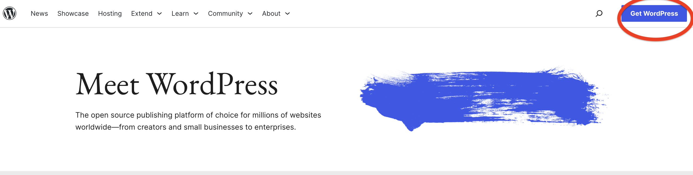
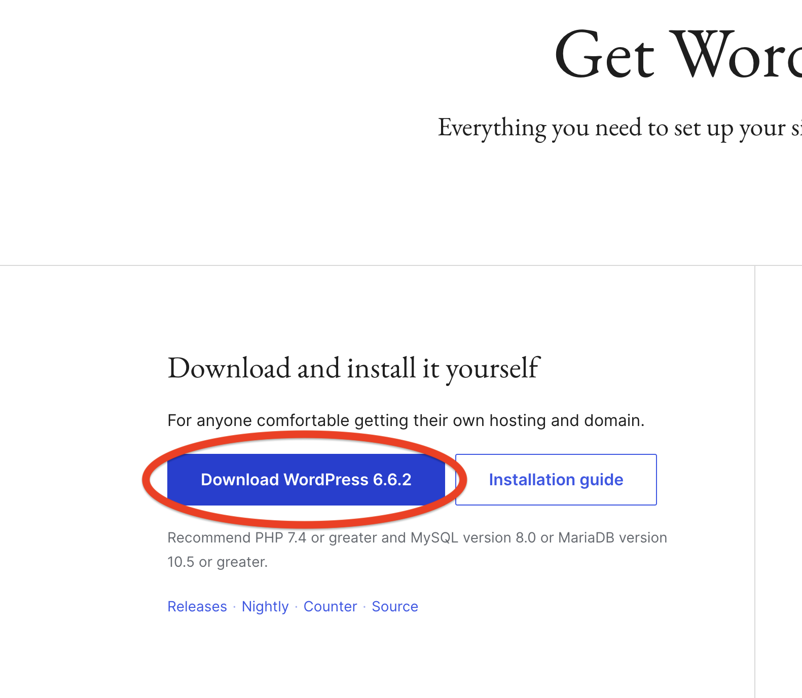
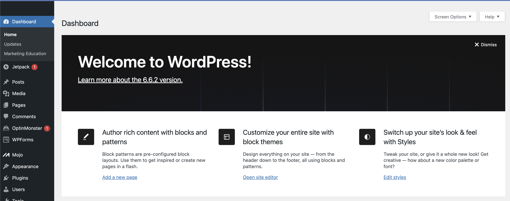
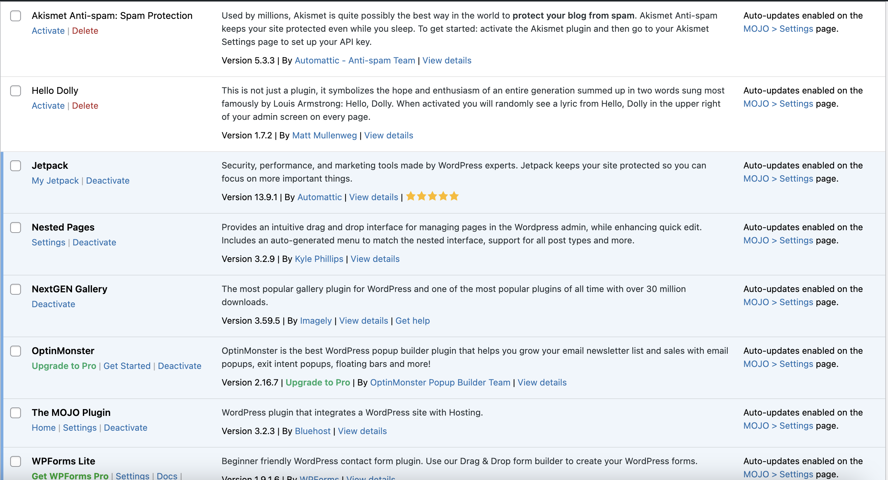

```{r setup, include=FALSE}
options(htmltools.dir.version = FALSE)
knitr::opts_chunk$set(
  fig.width=9, fig.height=3.5, fig.retina=3,
  out.width = "100%",
  cache = TRUE,
  dev = "svg",      
  echo = TRUE,
  message = FALSE, 
  warning = FALSE,
  fig.show = TRUE,
  hiline = TRUE      
)

knitr::opts_chunk$set(echo = TRUE, message = FALSE, warning = FALSE,
                      comment = "#>", highlight = TRUE,
                      fig.align = "center")
library(fontawesome)
library(icons)
```

```{r xaringan-themer, include=FALSE, warning=FALSE}
library(xaringanthemer)
style_duo_accent(
  primary_color = "#3d3d3d",
  secondary_color = "black",
  inverse_header_color = "#e0e0e0",
  base_font_size = "18px",
  code_font_size = ".8rem",
  header_font_google = google_font("Poppins"),
  text_font_google   = google_font("Roboto", "300", "300i"),
  code_font_google   = google_font("Fira Mono"),
  link_color = "#007acc", 
  extra_css = list(
    ".small" = list("font-size" = ".78rem"),
    ".big"  = list("font-size" = "1.2rem"),
    ".small-code pre code" = list("font-size" = ".7rem"),
    ".tiny-code pre code" = list("font-size" = ".5rem"),
    "li" = list("padding" = "8px 0px 0px"),
    "table th, table td" = list("padding" = "8px"),
    "h1" = list("line-height" = "1.3", "margin-bottom" = "15px"), 
    "h2" = list("line-height" = "1.25", "margin-bottom" = "12px"), 
    "h3" = list("line-height" = "1.2", "margin-bottom" = "10px")
  )
)
```

```{r xaringan-extra, echo=FALSE, include=FALSE}
xaringanExtra::use_clipboard(button_text = "Copy")
xaringanExtra::use_search(show_icon = TRUE, case_sensitive = FALSE)
xaringanExtra::style_search(match_background = "#264653")
```

<style>
  table {
    font-size: 10px; /* Adjust this value to make the font smaller or larger */
  }
</style>

## WordPress

### 1\. install [Wordpress](https://wordpress.org/)




---

### 2\. Open your wordpress account with your group




---

### 3 Optional\. Upload WordPress to Your Server

- I use [FileZilla](https://filezilla-project.org/)
- Download FileZilla
- Connect to the server using the following settings:
- You can usually set it up through File --->  Site manager; or through “Quickconnect”
   - Domain/Host: 2024.philemerge.com
   - Port: 21
  - Username and password in the [google doc]((https://docs.google.com/spreadsheets/d/1higBc6s4X7gOxslW2SvmVBFUVVkSrIV6tvxb1YclcYI/edit?usp=sharing)! 
  
---

### 3\. Start editing your word press document

- Appearance themes 
- Install and Activate a Theme


---

### 4\. Customizing the Theme

- Appearance --> Customize to adjust your site’s appearance, like colors, fonts, and logo.
- Appearance ---> Widgets to add or remove widgets from your sidebar, footer, or other widget areas.
- Appearance ---> Menus to create and arrange your site’s navigation


---

### 5\. Creating Pages

-  Pages ---> Add New to create a static pag


---

### 6\. Adding Custom CSS

-  Appearance ---> Customize ---> Additional CSS
   - **If you add it with Additional CSS it does not effect your theme files directly, which is SAFER**
   - Eg., 
   
   .small-code[
   ```css
   body {
    background-color: #f3f4f6;
    font-family: Arial, sans-serif;
    }
    
    h1, h2, h3 {
    color: #333;
    font-weight: bold;
    }
   ```
]

---

### 6b\. Adding custom CSS to theme files

- You can add custom CSS to theme files - but only do it if you are sure
- Appearance ---> Theme Editor
   - Open the **style.css** file in your active theme’s folder and add CSS directly.
   - Caution: Avoid making changes in the main theme files, as updates can override
   them. Consider creating a child theme if you plan to make extensive customizations.


---

### 7a\. Adding Custom HTML

- Go to any post or page, and add a Custom HTML block.
- Insert your HTML code directly into the block
- E.g.,
.tiny-code[
```html
<div class="custom-section">
    <h2>Welcome to EMS</h2>
    <p>This is a custom section with a unique style that I created.</p>
</div>
```
]

- You can style this HTML block by adding CSS in the Additional CSS section of the Customizer.

---

### 7b\. Adding HTML to Widget Areas
- Appearance ---> Widgets.
- Add a Custom HTML widget to a widget area like the sidebar or footer.
- Insert your HTML code here to customize these sections.
   - In the widget area, click + Add Block and select Custom HTML from the options. This widget allows you to directly enter HTML code
- Eg., Let's add contact us to footer area

.tiny-code[
```html
<div class="contact-widget">
    <h3>Contact Us</h3>
    <p>Email: <a href="mailto:info@example.com">info@example.com</a></p>
    <div class="social-icons">
        <a href="https://facebook.com/yourpage" target="_blank">
            
        </a>
        <a href="https://twitter.com/yourprofile" target="_blank">
            
        </a>
        <a href="https://instagram.com/yourprofile" target="_blank">
            
        </a>
    </div>
</div>
```
]

- Then let's add to CSS, remember Appearance --> Customize --> Additional CSS

.tiny-code[
```css
.contact-widget {
    padding: 15px;
    background-color: #f7f7f7;
    border-radius: 5px;
}

.contact-widget h3 {
    font-size: 18px;
    margin-bottom: 10px;
}

.social-icons img {
    margin: 0 5px;
    transition: transform 0.3s ease;
}

.social-icons img:hover {
    transform: scale(1.1);
}
```
]

---

### 8\. Plugings

- I use [NextGenGallery](https://en-ca.wordpress.org/plugins/nextgen-gallery/) for image presentations in the Demo
- [Nested Pages](https://wordpress.org/plugins/wp-nested-pages/) for dropdown of pages
- And others...
 
